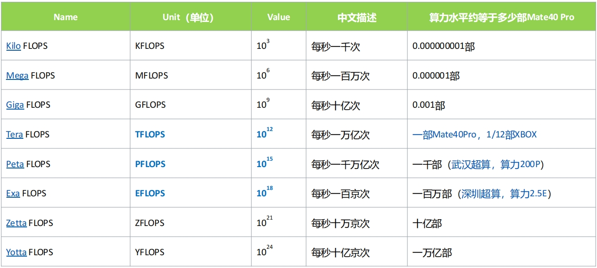
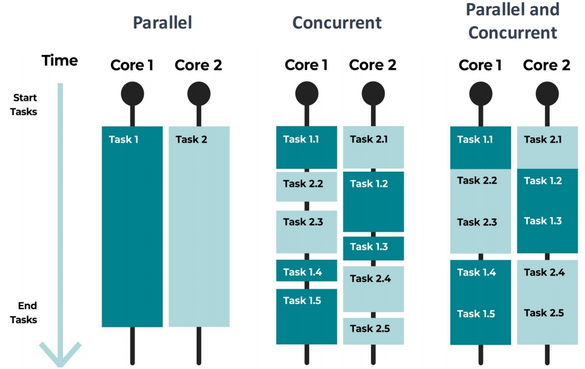
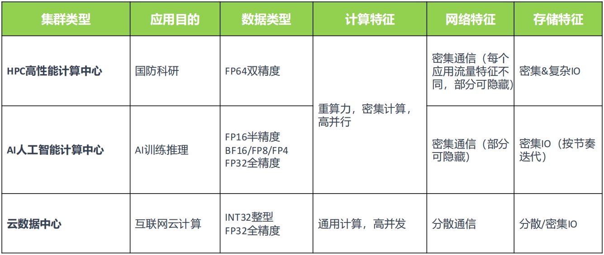

<!--Copyright © ZOMI 适用于[License](https://github.com/Infrasys-AI/AIInfra)版权许可-->

# 高性能计算 HPC 定义

Author by: 陈悦孜

习总书记在 2018 年关于自主创新重要讲话中提出“数字经济不能建设在沙滩上”，中国需要掌握创新和发展主动权，促进中国产业迈向全球价值链高端，同时需要掌握核心技术，加快推进国产自主可控替代。除此之外，中国发达的基建能力也要延展到新基建，包括数字新基建（数据中心）和智能新基建（人工智能），他同时在 2022 年 4 月 26 日主持召开的中央财经委员会第十一次会议中提出要加强信息、科技、物流等产业升级基础设施建设，布局建设新一代超算、云计算、人工智能平台、宽带基础网络等设施，推进重大科技基础设施布局建设，“要适度超前，布局有利于引领产业发展和维护国家安全的基础设施”。
>>>>>>>>>>>>>>>
ZOMI: 这里放书记的导语不合适，放下面文章要介绍的内容，大概 200 字。

## 高性能计算定义

>>>>>>>>>>>>>>>
ZOMI：这里大纲如果没有更好的想法，大纲按照 PPT 和视频的来。先讲解算力、再到 HPC 定义、再到 HPC 的作用，大纲我梳理的很清楚，这里一级二级有点乱。

这部分我们将从算力、高性能计算、集群计算这几个部分展开介绍。

## 什么是算力

>>>>>>>>>>>>>>>>
ZOMI: XXXX

### 算力衡量单位

算力水平用单位 FLOPS(Floating point Operations Per Second)每秒浮点计算次数来衡量。HPC 一般数据类型为 64 位双字长精度（FP64），所以 FLOPS 一般采用 FP64 的算力水平来评估。

这里 64 位双字长精度（FP64）为 IEEE-754 标准双精度浮点数 $D = (-1)s \times 1.f \times 2^{e-1023}$。其中 $s$ 是符号位（0 为正 1 为负），$f$ 是（52 位二进制）尾数，$e$ 是（11 位二进制）指数。

算力水平是如何衡量的？

>>>>>>>>>>>>>>>>
图片命名要规范

### 算力增长情况

数字经济时代，算力是国家间的核心竞争力，中国人均算力当前仅为美国的 1/5，提升空间巨大；预计到 2026 年，中国算力市场将持平甚至超越美国。

工信部数据显示，截至 2024 年三季度末，中国算力总规模达 268FLOPS（每秒百亿亿次浮点运算，以 FP32 单精度计算），算力应用项目超过 1.3 万个，在用算力中心机架总规模超过 880 万架标准机架，算力总规模世界前列。

同时，全球算力规模将持续增长，算力需求由于 AI 的应用将持续增长。1961 年，AI 之父 John McCarthy 提出：“算力服务将成为未来的公共基础设施”，同电话网络一样重要。预计 2030 年，全球产生数据量年均复合增长 29.6%，通用算力需求将增长 10 倍，AI 算力需求将增长 500 倍。

>>>>>>>>>>>>>>>>
ZOMI：PPT 有的图不应该漏掉，文章展开要比 PPT 和视频深入，而不是比 PPT 和视频还要浅显，内容要读厚

## 高性能计算 HPC

>>>>>>>>>>>>>>>>
ZOMI：介绍 XXXX

### 数值分析

数值分析是高性能计算重要应用领域之一。北大有名的韦神研究方向就是 N-S 方程。N-S 方程是描述流体运动的基础方程，但其复杂的数学特性（非线性、多变量耦合、复杂边界条件）导致解析解（精确的数学表达式）在绝大多数实际情况下无法获得。因此，必须依赖数值分析方法来获得近似解。数值分析是求解 N-S 方程的核心工具，当解析解不存在或难以获得时，提供可靠、高效的数值解方案。高性能计算可以处理超大规模问题，并行化计算帮助实现数值分析算法

>>>>>>>>>>>>>>>>
深入再深入

### 并发计算 vs 并行计算

并发计算 Concurrent Computing：是一种程序计算形式，在系统中，至少有两个以上的计算任务在同时运作，计算结果可能同时发生。并发概念强调的是单个处理器在单位时间内完成多个任务，类似“一个人同时吃三个馒头”。

并行计算 Parallel Computing：一般是指许多指令得以同时进行的计算模式。在同时进行的前提下，可以将计算的过程分解成小部分，之后以并发方式来加以解决。并行概念强调的是多个处理器同时完成多个任务。

>>>>>>>>>>>>>>>>
深入再深入

## 集群计算

计算机集群简称集群，是一种计算机系统，它通过一组松散集成的计算机软件或硬件连接起来高度紧密地协作完成计算工作。集群是一个完整系统，而非多个计算机系统，可以被看作是一整台计算机（类似于“蚁群”/“蜂群”社会系统），是主要的算力基础设施建设方式。

### 算力基础设施建设

算力基础设施建设从分层堆叠走向集群全栈优化，达成规模系统最优。

在传统数据中心中，服务器部署人工连线耗时长，故障率高，施工维护复杂；散热系统以风冷为主，系统能效差。计算、散热、电源网络松耦合集成，算力利用率低、算力密度低。

集群计算规模应用场景有高性能计算中心、人工智能计算中心和云数据中心。

计算中心是面向特定计算需求的高性能并行计算的专用集群。主要面向国防、科研等重算力超算场景，以及人工智能大模型训练场景，算力和功耗惊人，它的体系架构专为特定应用算力定制优化。计算中心又分为高性能计算中心和人工智能计算中心。

高性能计算中心顾名思义用于高性能计算的计算集群。高性能计算是衡量和体现国家科技核心竞争力和综合国力重要标志，各国公认支撑科学技术发展战略技术。科研三大范式有理论、实验、计算，计算是科研的三大范式之一。高性能计算适用领域广泛，上可算天，算来人类第二张黑洞照片；下可算地，算得全球水循环变化；算人算物，分别在生命科学和战略装备都有突出的应用成果。

人工智能计算中心由于人工智能计算的需求爆发而应运而生。AI 成为新形势下中美科技竞争的新赛道，大数据和大模型驱动的训练和推理应用场景使得智能算力爆发增长。大模型算力需求远超硬件算力供给，前者每 2 年增长 750 倍而后者每 2 年仅增长 3 倍。基于 FFN 前馈神经网络和 Attention 注意力机制的 Transformer 通用大模型架构让模型规模和训练算力都变大，使得算力需求更为高。

数据中心是面向通用计算的大规模并发处理的集群。面向大众商用，提供互联网 IT 服务，并行处理规模惊人，计算相对简单，强调高性价比和高兼容性，对可靠性、可用性、可服务性（RAS）要求高。云数据中心采用高并发通用云计算。它有以下特点：（1）资源按需分配，资源全面虚拟化，不同粒度按需弹性分配。（2）服务无处不在，服务通过网络公开，随时随地接入/控制。（3）绿色节能，降低能耗、提高算效、降低 OPEX。（4）集约化建设：降低 TTM 和 CAPEX。

总结这三种计算集群的特点和区别如下。

### XXXXX

>>>>>>>>>>>>>>>>
视频有的东西不要都漏掉了，差太远了哈，继续努力

## 本节视频

<html>
<iframe src="https://player.bilibili.com/player.html?isOutside=true&aid=114750084095236&bvid=BV1s5KfzzEbo&cid=30712332864&p=1&as_wide=1&high_quality=1&danmaku=0&t=30&autoplay=0" width="100%" height="500" scrolling="no" border="0" frameborder="no" framespacing="0" allowfullscreen="true"> </iframe>
</html>
