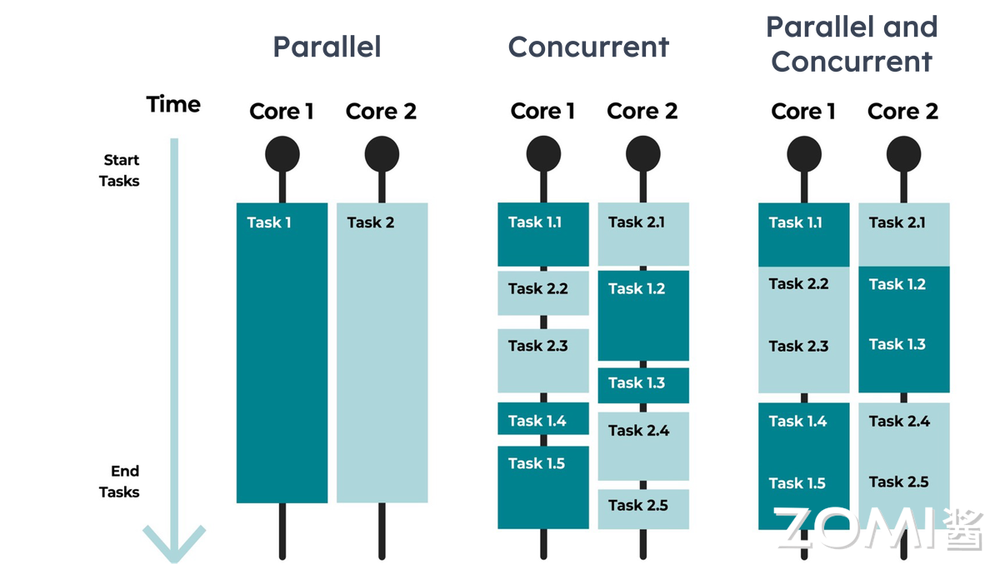
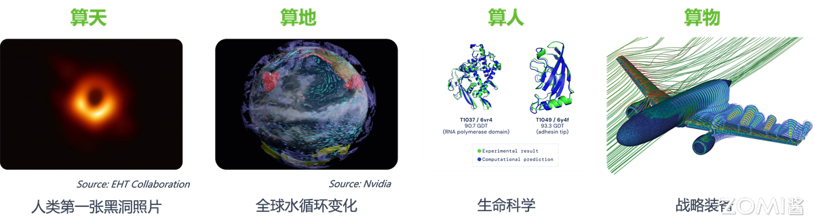

<!--Copyright © ZOMI 适用于[License](https://github.com/Infrasys-AI/AIInfra)版权许可-->

# 高性能计算HPC定义

Author by: 陈悦孜

AI大模型的运行离不开强大算力的支撑，这种算力的实现高度依赖于由众多处理器互联而成的AI算力集群和具备顶尖计算能力的超级计算机。 在这些复杂系统的背后，高性能计算（High Performance Computing， HPC）是构建AI算力集群和驱动超级计算机的基石。它通过并行处理、高速互联网络和先进架构，将海量计算资源整合起来，提供远超单机的处理能力。算力（Computational Power），作为衡量计算系统单位时间内处理信息能力的核心指标，正是评估高性能计算效能的重要标尺。

这里介绍计算集群之路的介绍将从高性能计算定义、高性能计算的发展趋势、集群计算的发展历程、集群计算的系统挑战和集群计算的系统架构几个方面进行展开。本文将介绍高性能计算相关的内容，从介绍什么是算力、高性能计算相关的应用和集群计算及其相关计算中心三个部分着手，开启计算集群之路的序章。

## 什么是算力

算力是衡量计算机处理信息能力的核心单位。首先这里先介绍高性能计算相关的概念和单位，算力增长的情况和相关背景。

### 算力衡量单位

算力水平是如何衡量的？

算力水平用单位FLOPS(Floating point Operations Per Second)每秒浮点计算次数来衡量。HPC一般数据类型为64位双字长精度（FP64），所以FLOPS一般采用FP64的算力水平来评估。

这里64位双字长精度（FP64）为IEEE-754标准双精度浮点数$D = (-1)s \times 1.f \times 2^{e-1023}$。

其中$s$是符号位（0为正1为负），$f$是（52位二进制）尾数，$e$是（11位二进制）指数。

以下是更多不同数量级的浮点运算单位。

|Name | Unit（单位）|Value |中文描述|算力水平约等于多少部Mate40 Pro |
|-|-|-|-|-|
|Kilo FLOPS|KFLOPS| $10^{3}$ |每秒一千次|0.000000001部|
|Mega FLOPS |MFLOPS|$10^{6}$|每秒一百万次|0.000001部|
|Giga FLOPS |GFLOPS|$10^{9}$|每秒十亿次|0.001部|
|Tera FLOPS | TFLOPS |$10^{12}$|每秒一万亿次|一部Mate40Pro，$\frac{1}{12}$部XBOX|
|Peta FLOPS |PFLOPS|$10^{15}$|每秒一千万亿次|一千部（武汉超算，算力200P）|
|Exa FLOPS | EFLOPS | $10^{18}$|每秒一百京次|一百万部（深圳超算，算力2.5E）|
|Zetta FLOPS | ZFLOPS |  $10^{21}$|每秒十万京次|十亿部|
|Yotta FLOPS | YFLOPS |  $10^{24}$|每秒十亿京次|一万亿部|

在AI流行的当今，在AI大模型应用的场景里常用的算力水平衡量单位繁多，因为在大模型训练和推理用到的精度种类很多，这里来介绍这些精度单位，即算力衡量单位。

浮点数精度有双精度（FP64）、单精度（FP32、TF32）、半精度（FP16、BF16）、8位精度（FP8）、4位精度（FP4、NF4）。

| 格式 | 符号位 | 指数位 |小数位 | 总位数 |
|-|-|-|-|-|
|FP64|1|11|52|64|
|FP32|1	|8|23|32|
|TF32|1|8|10|19|
|BF16|1|8|7|16|
|FP16|1|5|10|16|
|FP8 E4M3|1|4|3|8|
|FP8 E5M2|1|5|2|8|
|FP4|1|2|1|4|

量化精度有INT8、INT4 （也有INT3/INT5/INT6的）。

| 格式 | 符号位 | 整数位 | 总位数 |
|-|-|-|-|
|INT8|1|7|8|
|INT4|1|3|4|

另外，实际使用场景中，还有多精度和混合精度的概念。

### 算力增长情况

数字经济时代，算力是国家间的核心竞争力，中国人均算力当前仅为美国的1/5，提升空间巨大；预计到2026年，中国算力市场将持平甚至超越美国。

习总书记在 2018 年关于自主创新重要讲话中提出“数字经济不能建设在沙滩上”，中国需要掌握创新和发展主动权，促进中国产业迈向全球价值链高端，同时需要掌握核心技术，加快推进国产自主可控替代。除此之外，中国发达的基建能力也要延展到新基建，包括数字新基建（数据中心）和智能新基建（人工智能），他同时在 2022 年 4 月 26 日主持召开的中央财经委员会第十一次会议中提出要加强信息、科技、物流等产业升级基础设施建设，布局建设新一代超算、云计算、人工智能平台、宽带基础网络等设施，推进重大科技基础设施布局建设，“要适度超前，布局有利于引领产业发展和维护国家安全的基础设施”。

工信部数据显示，截至2024年三季度末，中国算力总规模达268FLOPS（每秒百亿亿次浮点运算，以FP32单精度计算），算力应用项目超过1.3万个，在用算力中心机架总规模超过880万架标准机架，算力总规模世界前列。

DeepSeek系列模型发布，人们对AI大模型的应用需求激增，这将实质性地带动算力需求的增长，中国智能算力发展增速高于预期。2024年，中国通用算力规模达71.5EFLOPS（EFLOPS指每秒百亿亿次浮点运算次数），同比增长20.6%；智能算力规模达725.3EFLOPS，同比增长74.1%。2025年，中国通用算力规模预计达85.8EFLOPS，增长20%；智能算力规模将达1037.3EFLOPS，增长43%，远高于通用算力增幅。总体来看，2023—2028年中国智能算力规模和通用算力规模的五年年复合增长率预计分别达46.2%和18.8%。

全球算力规模将持续增长，算力需求由于AI的应用将持续增长。1961年，AI之父John McCarthy提出：“算力服务将成为未来的公共基础设施”，同电话网络一样重要。预计2030年，全球产生数据量年均复合增长29.6%，通用算力需求将增长10倍，AI算力需求将增长500倍。

## 高性能计算的应用

高性能计算（HPC）作为强大的问题求解引擎。在科学研究方面，它支撑着气候精准预测、宇宙演化模拟、新药研发（如蛋白质折叠、虚拟筛选）以及新材料探索（原子级模拟），极大地拓展了人类认知边界。工程与工业领域则依赖HPC进行复杂的产品设计与优化（如飞机气动、汽车碰撞、芯片设计）、石油勘探地震成像以及制造工艺仿真，显著提升了效率并降低了成本。高性能计算在数值分析和并行计算的突出应用，使其在处理海量数据、进行极度复杂的模拟与计算发挥重要作用，从而驱动众多关键领域的突破与创新。

### 数值分析

数值分析是高性能计算重要应用领域之一。数值计算是数学的近似求解方法，专注于设计算法，将连续数学问题（如微分方程、积分、优化等）转化为离散的数值运算（如矩阵计算、迭代逼近），通过计算机有限精度实现近似解。

数值分析在多个领域有广泛的应用，为问题的解决提供算法，而高性能计算提供算力和解决工具。对于我们日常接触的天气预报，全球气候模拟就用到数值计算的有限元法离散大气方程，高性能计算的万核并行计算在10天内就能完成百年气候模拟；在药品研发领域，蒙特卡洛模拟分子动力学的数值分析方法用GPU集群加速10万次分子相互作用计算。

北大有名的韦神研究方向就是N-S方程，数值分析是求解N-S方程的核心方法。N-S方程是描述流体运动的基础方程，但其复杂的数学特性（非线性、多变量耦合、复杂边界条件）导致解析解（精确的数学表达式）在绝大多数实际情况下无法获得。因此，必须依赖数值分析方法来获得近似解。当解析解不存在或难以获得时，数值分析提供可靠、高效的数值解方案。高性能计算可以处理超大规模问题，并行化计算帮助实现数值分析算法。

### 并发计算和并行计算

HPC = 大规模并行 × 高效并发

并发计算和并行计算是实现高性能计算的重要方法。并行计算提供横向扩展能力，将问题拆分到海量计算单元，实现算力质变。并发计算在硬件层面纵向优化资源利用，通过任务调度减少空闲等待。二者协同实现高性能计算的高算力。

并发计算(Concurrent Computing)是一种程序计算形式，在系统中，至少有两个以上的计算任务在同时运作，计算结果可能同时发生。并发概念强调的是单个处理器在单位时间内完成多个任务，类似“一个人同时吃三个馒头”。高性能计算在单节点内，并发技术（如多线程） 充分压榨硬件性能。

并行计算(Parallel Computing)一般是指许多指令得以同时进行的计算模式。在同时进行的前提下，可以将计算的过程分解成小部分，之后以并发方式来加以解决。并行概念强调的是多个处理器同时完成多个任务。高性能计算通过大规模并行化突破单机算力极限。

## 集群计算

根据 WIKI 百科的定义：计算机集群（computer cluster）是一组松散或紧密连接在一起工作的计算机。由于这些计算机协同工作，在许多方面它们可以被视为单个系统。与网格计算机不同，计算机集群将每个节点设置为执行相同的任务，由软件控制和调度。集群的组件通常通过快速局域网相互连接，每个节点（用作服务器的计算机）运行自己的操作系统实例。部署集群通常是为了提高单台计算机的性能和可用性，集群也通常比速度或可用性相当的单台计算机的成本效益要高。

其实，计算机集群的出现是许多计算趋势汇聚的结果，这些趋势包括低成本微处理器、高速网络以及用于高性能分布式计算软件的广泛使用。集群使用和部署广泛，从小型企业集群到世界上最快超级电脑（如IBM的Sequoia）。在集群出现之前，人们采用具有三重模块冗余的单元容错主机；但是，集群的前期成本较低，网络结构速度提高，这助推了人们采用集群这种方式。与高可靠性的大型机集群相比，扩展成本更低，但也增加了错误处理的复杂性，是现在主要的算力基础设施建设方式。

### 算力基础设施建设

计算集群从分层堆叠走向集群全栈优化，达成规模系统最优。

计算系统一开始是单节点单板载的形态，一种简约高集成度的独立形态，有着分层和堆叠的特点。这是传统的构建大规模系统的方式。分层是指系统被划分为多个逻辑层，每一层负责特定的功能，层与层之间通过标准化的接口通信。而堆叠是指为了获得更大的处理能力，简单地将更多的单节点（或少量节点构成的服务器） 堆叠（连接）在一起，形成一个集群。现代大规模系统架构走向集群全栈优化，广度覆盖从底层硬件（CPU、内存、存储、网络、加速器）到固件、操作系统、虚拟化/容器平台、中间件、调度系统、分布式框架，一直到上层应用的整个技术栈，深度不再满足于各层独立优化，而是打破传统的严格分层界限，进行跨层协同设计和优化，来建设成百上千甚至上万个节点构成的大规模计算系统集群。

在传统数据中心中，服务器部署人工连线耗时长，故障率高，施工维护复杂；散热系统以风冷为主，系统能效差。计算、散热、电源网络松耦合集成，算力利用率低、算力密度低。

由下图可见服务器形态演进，服务器先由主板裸机形态，在不同场景下组装成不同样式的服务器节点，在云场景下有标准公有云计算服务器，在大数据应用场景下数据服务器节点、在高密计算场景下有HPC服务器，在AI应用场景下有AI服务器节点。不管是什么业务，这些服务器发展演进都有向标准的服务器机柜内堆叠发展的趋势，最终到现在的集群时代。

### 集群计算应用场景

集群计算规模应用场景有高性能计算中心、人工智能计算中心和云数据中心。

计算中心是面向特定计算需求的高性能并行计算的专用集群。主要面向国防、科研等重算力超算场景，以及人工智能大模型训练场景，算力和功耗惊人，它的体系架构专为特定应用算力定制优化。计算中心又分为高性能计算中心和人工智能计算中心。

高性能计算中心顾名思义用于高性能计算的计算集群。高性能计算是衡量和体现国家科技核心竞争力和综合国力重要标志，各国公认支撑科学技术发展战略技术。科研三大范式有理论、实验、计算，计算是科研的三大范式之一。高性能计算适用领域广泛，上可算天，算来人类第二张黑洞照片；下可算地，算得全球水循环变化；算人算物，分别在生命科学和战略装备都有突出的应用成果。

人工智能计算中心由于人工智能计算的需求爆发而应运而生。AI成为新形势下中美科技竞争的新赛道，大数据和大模型驱动的训练和推理应用场景使得智能算力爆发增长。大模型算力需求远超硬件算力供给，前者每2年增长750倍而后者每2年仅增长3倍。基于FFN前馈神经网络和Attention注意力机制的Transformer通用大模型架构让模型规模和训练算力都变大，使得算力需求更为高。

云数据中心是面向通用计算的大规模并发处理的集群。面向大众商用，提供互联网IT服务，并行处理规模惊人，计算相对简单，强调高性价比和高兼容性，对可靠性、可用性、可服务性（RAS）要求高。云数据中心采用高并发通用云计算。它有以下特点：

- 资源按需分配，资源全面虚拟化，不同粒度按需弹性分配

数据中心通过虚拟化技术（如KVM、容器）将物理资源（CPU/内存/存储）池化。用户按需申请资源，系统动态分配，同时云数据中心支持秒级扩容/缩容）。如此可以减少资源闲置（避免传统服务器的低利用率）， 降低用户成本（仅为实际用量付费，无需预先采购硬件）。

- 服务无处不在，服务通过网络公开，随时随地接入/控制

全球分布式节点和多可用区（AZ）容灾架构保障服务可接入性和连续性。公有云服务（如AWS/Azure/阿里云）通过互联网开放API和控制台，用户可通过Web、手机App、命令行随时管理资源。云数据中心的服务打破地域限制，有较高的业务敏捷性。

- 绿色节能，降低能耗、提高算效、降低OPEX

OPEX，Operational Expenditure，指企业日常运营产生的持续性支出（如电费、带宽费、维护费、人力成本）的运营支出。

云数据中心降低OPEX的能源成本，在硬件层使用低功耗CPU（如ARM架构）、液冷散热来降低电费成本，在软件层使用智能调度算法（将任务迁移到空闲服务器）减少算力浪费，在架构层使用高压直流供电（HVDC）、自然冷却（新风系统）降低机房制冷成本。

- 集约化建设：降低TTM和CAPEX

TTM，Time to Market，指产品/服务从概念设计到正式上市商用所需的时间，即上市时间。

CAPEX，Capital Expenditure，指企业为长期资产投入的一次性大额支出（如服务器采购、机房建设、硬件购置），即资本支出。

对于建设成本（CAPEX）的优化，云数据中心集中采购服务器/交换机/存储设备，规模效应降低采购成本，用户无需采购；至于缩短上市时间（TTM），相比于传统部署需要采购部署，用户租用云资源可以立即开通使用；运维工作也由云厂商统一管理运维，用户无需考虑。

### 计算集群特点区分

总结这三种计算集群的特点和区别如下：

| 集群类型             | 应用目的   | 数据类型                  | 计算特征       | 网络特征                          | 存储特征          |
| :------------------- | :--------- | :------------------------ | :---------------------------- | :-------------------------------- | :---------------- |
| **HPC高性能计算中心** (高度专用) | 国防科研   | FP64双精度                | 重算力，密集计算，高并行 | • 密集通信 • 流量特征各异 • 部分通信可隐藏 | • 密集&复杂IO     |
| **AI人工智能计算中心** (训练/推理) | AI训练推理 | • FP16半精度 • BF16/FP8/FP4 • FP32全精度 | 重算力，密集计算，高并行                    | • 密集通信 • 部分通信可隐藏      | • 密集IO • 按节奏迭代 |
| **云数据中心**  (通用计算)      | 互联网云计算 | • INT32整型 • FP32全精度 | • 通用计算 • 高并发        | • 分散通信                        | • 分散/密集IO     |

HPC集群高度专用化，主要面向国防科研等需要极高精度的科学计算场景，采用FP64双精度浮点运算，强调密集计算和高并行性，其网络通信密集且模式多样，存储访问呈现密集且复杂的IO特征。

AI计算中心专注于AI训练和推理任务，使用混合精度计算（FP16/BF16/FP8等），同样需要强大的算力和高并行处理能力，网络通信密集但可通过流水线等技术部分隐藏延迟，存储IO密集且呈现规律性的迭代访问模式。

而通用云数据中心支撑多样化的互联网应用，处理整型（INT32）和全精度浮点（FP32）数据，以通用计算和高并发为特点，网络通信相对分散，存储IO模式既有分散也有密集型访问。

面向不同应用场景的专用化设计取向决定三类集群在精度要求、计算模式、通信特性和存储访问模式上的差异，HPC高性能计算中心追求极致计算能力，AI人工智能计算中心采用优化AI工作负载的专用架构，云数据中心是适应多元化需求的弹性云计算平台。

## 总结与思考

本文介绍算力、高性能计算相关的应用和集群计算及其相关计算中心相关内容。

- 算力部分，HPC 场景衡量算力单位以FP64为主，在AI应用场景下衡量算力用到FP32，FP16和BF16等各种精度格式。
- 高性能计算在数值分析、并发计算和并行计算的应用使其在各个行业发挥突出作用。
- 集群计算从分层堆叠走向集群全栈优化，在超算中心、智算中心和云数据中心有专门的应用。

## 本节视频

<html>
<iframe src="https://player.bilibili.com/player.html?isOutside=true&aid=114750084095236&bvid=BV1s5KfzzEbo&cid=30712332864&p=1&as_wide=1&high_quality=1&danmaku=0&t=30&autoplay=0" width="100%" height="500" scrolling="no" border="0" frameborder="no" framespacing="0" allowfullscreen="true"> </iframe>
</html>

## 引用与参考

- https://zh.wikipedia.org/wiki/%E8%AE%A1%E7%AE%97%E6%9C%BA%E9%9B%86%E7%BE%A4
- https://www.news.cn/tech/20250218/0c42a29782c34054b4e7d46861ea54bc/c.html
