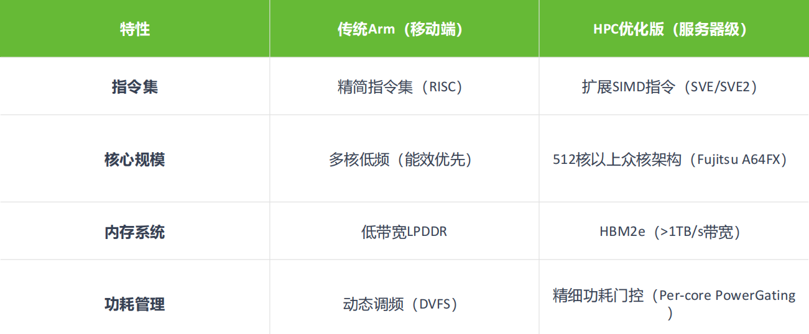

<!--Copyright © ZOMI 适用于[License](https://github.com/Infrasys-AI/AIInfra)版权许可-->

# HPC 硬件发展趋势

Author by: 陈悦孜

承接上文我们介绍了高性能计算和集群的定义，这章我们介绍高性能计算发展的趋势。我们将从核心硬件、基础软件和应用软件三个维度来分析高性能计算发展的趋势。

>>>>>>>>>>>>>>>>>>>
一定要图文并茂，文字不能比视频的字幕少，多找相关资料，不一定完全是自己写

高性能计算硬件发展历程和未来趋势从高性能网络、处理器、服务器、存储器四个核心维度展开分析。其演进逻辑始终围绕性能突破、能效优化与场景适配展开：

- 高性能处理器：从通用多核到异构计算。
- 高性能网络：从低延迟到高带宽互联。
- 高性能存储器：从容量扩展到存算协同。
- 高性能服务器：从单机性能到绿色化集群。

>>>>>>>>>>>>>>>>>>>
注意 markdown 的格式，目录结构一定要回头审视看看是否均衡

## 高性能处理器

### CPU 主导时代

早期高性能计算依赖于并行 CPU 集群，比如 Intel Xeon, AMD Opteron 系列，通过提升主频、增加核心数量（多核/众核）和优化指令集实现性能增长。

Intel Xeon 系列自 1998 年诞生起专注服务器市场，早期通过 Pentium Pro 微架构奠定基础（超纯量、超管线设计），2006 年后以 Merom 微架构统一服务器与桌面产品线，提升能耗比。而 2003 年推出的 AMD Opteron 系列（K8 架构）首次集成内存控制器，采用 HyperTransport 总线，支持低成本 64 位计算并兼容 32 位软件，颠覆了 RISC 服务器的垄断地位。

Intel Xeon 系列第五代至强（Emerald Rapids）支持单 CPU 64 核心，三级缓存容量扩大近 3 倍，通过 DDR5 内存和 UPI 2.0 互连提升并行吞吐量，AI 推理性能提升 42%。2010 年代 Opteron 6100 系列推出 12 核型号（如 6180 SE），在 2.5GHz 主频下实现高密度计算（如戴尔 PowerEdge C6145 服务器支持单机柜 96 核）。

#### 主频提升达瓶颈

2000 年代初，Intel Prescott 核心尝试通过 90nm 工艺提升主频，但功耗突破 100W，导致“高频低效”问题，最终转向多核架构随着工艺微缩接近物理极限，单核主频停滞在 3-4GHz 范围，性能增长转而依赖多核并行和指令级并行（ILP）优化。

早期代表性 HPC CPU 参数对比

|系列|代表型号|	发布时间|核心数|主频|关键技术特点 |
|-|-|-|-|-|-|
AMD Opteron|	Opteron 6180 SE	|2010|	12|	2.5GHz|	集成内存控制器，HyperTransport 总线|
Intel Xeon|	Xeon E5-2600 v4	|2016|	22|	2.2GHz|	超线程，AVX2 指令集|
AMD Opteron|	Opteron 6166 HE|	2010|	12	|1.8GHz|	低功耗设计（65W）|
Intel Xeon	|Xeon Platinum 8380	|2021|	40|	2.3GHz|	支持 PCIe 4.0，8 通道 DDR4|

#### 协处理器兴起

协处理器是一种辅助处理器，设计用于与主 CPU 协同工作，专门处理特定类型的任务以提高系统整体性能。协处理器是计算机系统中与主处理器（CPU）配合工作的专用处理单元，它能够分担 CPU 的特定计算任务、提高特定类型运算的效率，并且优化系统整体性能。
协处理器可用于专用加速，比如 Intel Xeon Phi（MIC 架构，2012-2020）尝试众核路线。以下为 Phi 初期型号及其参数。

型号|	核心数|	浮点性能|	内存容量|	内存带宽|	TDP|	售价|
|-|-|-|-|-|-|-|
Phi 3100|	57|	1 TFlops|	6 GB|	240 GB/s|	300W	|<=$2,000|
Phi 5110P|	60|	1.01 TFlops|	8 GB|	320 GB/s|	225W|	$2,649|
Phi 7120|	61|	1.2 TFlops|	16 GB|	352 GB/s	|300W|	$4,129|

​​GPU 加速​​也属于协处理器范畴，NV CUDA 革命性地将 GPU 用于通用计算， Tesla 成为通用并行计算标杆。首代 Tesla 架构（如 G80）引入统一着色器设计，将矢量计算单元拆分为标量核心（CUDA Core），支持 C 语言编程，实现 SIMT（单指令多线程）执行模型，奠定通用计算基础，将 GPU 从图形协处理器升级为通用计算引擎，定义“CPU+GPU”异构标准。

#### 国产 CPU 突破

中国自主研发的申威 SW26010 处理器，凭借其创新的异构众核架构（包含 256 个高性能计算核心和 1 个管理核心），实现了单芯片高达每秒 3 万亿次（3 TFlops）的峰值浮点计算能力。这一突破性设计，成为支撑中国首台、也是世界首批 E 级（Exascale， 百亿亿次）超级计算机——“神威·太湖之光”的核心动力源泉。

尤为关键的是，申威 SW26010 采用了完全独立自主的申威指令集架构（SW ISA），彻底摆脱了对国外主流指令集的依赖，确保了核心技术自主可控的安全性与战略意义。

搭载了超过 40,000 颗申威 SW26010 处理器的“神威·太湖之光”超级计算机，于 2016 年 6 月在全球超级计算机 TOP500 排行榜上震撼登顶，终结了美国超算长达 23 年的榜首垄断地位。它不仅以 93 PFlops（每秒 9.3 亿亿次）的 Linpack 实测持续性能创造了当时的世界纪录，更是全球首台突破 10 亿亿次/秒（100 PFlops）大关的超级计算机，标志着人类正式迈入百亿亿次计算时代（E 级超算时代） 的门槛。

#### Arm 高性能计算突破

NVIDIA Grace CPU 实现内存子系统革新。​​LPDDR5X 和纠错码​​的设计使得能效提升 2 倍；CPU-GPU 一致性缓存的机制和​NVLink-C2C 直连使​​延迟降至 1/10。
鲲鹏 920ARM-based 处理器采用 7nm 工艺，ARM 架构授权，华为自主设计。通过优化分支预测算法、提升运算单元数量、改进内存子系统架构等一系列微架构设计，提高处性能。

以下表格对比传统 Arm（移动端）和高性能计算优化版（服务器级）的架构对比。

### 处理器发展趋势

GPU 主导加速市场，国产力量野蛮生长​。NVIDIA H100/AMD MI300X 成为 AI/HPC 核心算力，国产替代（e.g. 寒武纪、华为昇腾）加速发展。

​​Chiplet 技术​​和存算一体技术加速异构多样化。

Chiplet 是一种先进的芯片设计和制造方法。它不再像传统方式那样把包含处理器核心、内存控制器、I/O 接口等所有功能都集成在一个巨大的单片硅芯片（Monolithic Die）上，而是将复杂的大芯片拆分成多个更小、功能更单一、工艺更优化的独立小芯片（Chiplet）。这些小芯片（例如：CPU 核心、GPU 核心、高速缓存、I/O 模块）各自可以采用最适合其功能和成本的半导体工艺（如逻辑用先进工艺，I/O 用成熟工艺）独立制造。然后，它们通过高速、高密度的先进封装技术（如硅中介层、EMIB、CoWoS 等）像“搭乐高”一样集成封装在一个基板上，形成一个功能完整的系统级芯片（SoC）。这种技术提高良率、降低制造成本（尤其是先进工艺成本）、设计更灵活（可复用成熟 Chiplet）、加速产品上市、实现异构集成（不同工艺、不同厂商的 Chiplet 组合）。AMD、Intel 通过多芯片封装提升集成度和良率（比如 Intel Ponte Vecchio 含 47 颗 Chiplet）。

存算技术（Computing-in-Memory / Near-Memory Computing）是一种旨在突破传统计算机“冯·诺依曼瓶颈”的革命性架构。在传统架构中，处理器（CPU/GPU）和内存（DRAM）是分离的，数据需要在两者之间频繁搬运，这消耗大量时间和能量（称为“内存墙”问题），尤其在大数据和 AI 计算中。存算技术的核心思想是将计算能力移动到存储数据的地方：存内计算 (Computing-in-Memory, CiM): 最激进的方式，直接在存储单元（如新型存储器 ReRAM, PCM, MRAM）内部或其紧邻的逻辑电路上执行计算操作（尤其是向量/矩阵运算），数据几乎不需要移动。近存计算 (Near-Memory Computing, NMC): 一种更实用的过渡方案，将处理单元（如专用加速器）非常紧密地集成在内存（如 HBM）堆栈的旁边或内部，极大缩短数据传输路径。这种技术大幅减少数据搬运，从而显著提升能效比（数十倍甚至百倍） 和计算速度，特别适用于数据密集型的 AI 推理/训练、大数据分析等场景。台积电 3D Fabric 技术将计算单元堆叠至存储层（比如 CXL 协议设备），突破冯·诺依曼瓶颈。

>>>>>>>>>>>>>>>>>>>
继续深入每个内容进行展开

## 高性能网络

### 网络发展历程：早期阶段 (1990s-2000s)

一方面以太网主导网络应用领域。**千兆以太网（GigE）**成本低被广泛采用，但延迟高（>100μs）、带宽瓶颈明显。千兆以太网是 IEEE 802.3ab/z 标准定义的以太网技术，传输速率达 1 Gbps（1000 Mbps），是传统百兆以太网（100 Mbps）的 10 倍。它延续了以太网的帧结构（如 MAC 地址、CSMA/CD 机制）和基础设施（双绞线、光纤）。它具有低成本与高兼容性的优点，同时有广泛应用场景。使用广泛普及的 Cat 5e/6 双绞线（百米内无需中继）或光纤，布线成本低。兼容现有网络设备（交换机、路由器），支持平滑升级。它是企业局域网（LAN）、家庭宽带、工业控制、IP 监控摄像头等领域的主流选择，同时因成熟稳定，成为中低速设备的默认网络接口（如打印机、IoT 设备）。

另一方面大量的专有网络兴起。Myrinet、Quadrics 等私有协议网络出现，延迟~10μs，但生态封闭制约普及。专有网络，如 Myrinet 和 Quadrics，是高性能计算领域为突破传统以太网性能瓶颈而兴起的私有协议互连技术。其核心优势在于实现了~10 微秒级的极低通信延迟和高吞吐量，这得益于其精简的协议栈（绕过操作系统内核直接在网卡硬件处理通信）和定制的交换架构。然而，这些技术的生态高度封闭成为其致命短板：它们依赖专属的硬件（特定网卡、交换机）和私有软件栈（如专用通信库），导致成本高昂（远超商用以太网）、兼容性差、用户被厂商锁定且不同系统间互操作性困难。最终，这种封闭性严重制约了其普及和发展，在 2009 年前后，它们被更具开放性和成本效益的技术（如 InfiniBand 和基于以太网的 RDMA）所取代而退出主流市场。

### 网络发展历程：主流技术成型（2010s 至今）

这里介绍主流技术有 InfiniBand、RoCE 和 NVLink。

InfiniBand 由 Mellanox 主导，采用 RDMA 实现微秒级延迟和百 GB/s 带宽，成为 HPC 主流。**InfiniBand** 是由 **Mellanox（现属 NVIDIA）主导推动的开放标准高性能网络**，与封闭的专有网络（如 Myrinet/Quadrics）形成鲜明对比。它通过 **RDMA（远程直接内存访问）** 技术彻底绕开操作系统协议栈，实现 **微秒级超低延迟（可低于 1μs）** 和 **超高带宽（当前达 400Gbps，约 50GB/s）**，完美匹配 HPC 与 AI 算力需求。其核心优势在于**开放生态**，由国际组织 IBTA 统一标准，兼容多厂商设备（网卡、交换机），同时支持与以太网融合（如 RoCE 协议）。凭借**性能与通用性的平衡**，InfiniBand 自 2010 年代起取代旧式专有网络，成为超算中心（如 Summit、Sierra）和云数据中心的主流互连方案。

RoCE 是基于以太网 RDMA 的技术，兼顾低成本与高性能，是华为、阿里云等国产厂商加速布局的重要方向。RoCE 是一种在标准以太网上实现 RDMA（远程直接内存访问）的高性能网络技术，由 InfiniBand 贸易协会（IBTA）制定开放标准。它通过绕过操作系统内核协议栈，使数据直接从应用内存访问网卡，实现微秒级延迟（典型值 10-20μs） 和高吞吐量（可达 400Gbps），逼近 InfiniBand 性能。其核心价值在于兼顾高性能与低成本：复用现有以太网交换机和布线设施（需支持无损特性如 PFC/ECN），大幅降低部署门槛。正因这一优势，华为（含其 CE 系列交换机）、阿里云、腾讯云等中国厂商积极布局 RoCEv2 协议，推动其在云数据中心、AI 训练集群及存储网络（如 NVMe-oF）中的规模化应用，成为突破 InfiniBand 生态垄断的关键国产化路径。

NVLink 是 NV 专为 GPU 互联设计高速总线，用于节点内多卡互联，演进 NV Fusion。NVLink 是 NVIDIA 专为 GPU 高性能互联设计的私有高速总线协议，核心目标是解决节点内多 GPU 卡间的通信瓶颈。它通过点对点直连架构（替代传统 PCIe 总线），实现远超 PCIe 的带宽（第四代达 900GB/s） 和纳秒级延迟，显著加速 GPU 间数据交换（如 AI 训练中的梯度同步）。

### 高性能网络：低延迟与融合​

​​InfiniBand 持续领先​​：NVIDIA Quantum-2 支持 400Gb/s 带宽，NDR 1.6Tb/s。

​​RoCE v2 与智能网卡​​：借助 DPU/IPU 降低 CPU 负载，提升以太网竞争力。

​​光互连技术​​：硅光集成、CPO（共封装光学）、 OCS（光学链路开关）成为下一代网络关键。

新互联协议：华为灵渠总线互联，实现 CPU2NPU、NPU2NPU 新一代的集群互联。

## 高性能存储

### 硬盘时代

SSD 取代 HDD 提升 I/O 速度引发的硬盘革命。
◦ 容量优先 ：希捷、西数推出 HDD，受限于 IO 延迟（ms 级），难满足 HPC 需求。
◦ NVMe SSD 普及 ：三星 PM1733（30TB）顺序读写达 7GB/s，延迟降至 50μs

>>>>>>>>>>>>>>>>>>>
深入再深入哦！

## 本节视频

<html>
<iframe src="https://player.bilibili.com/player.html?isOutside=true&aid=114767700172746&bvid=BV16A3wzEELU&cid=30765482532&p=1&as_wide=1&high_quality=1&danmaku=0&t=30&autoplay=0" width="100%" height="500" scrolling="no" border="0" frameborder="no" framespacing="0" allowfullscreen="true"> </iframe>
</html>
