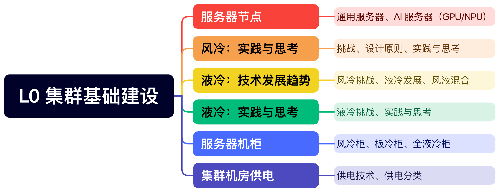

<!--Copyright © ZOMI 适用于[License](https://github.com/Infrasys-AI/AIInfra)版权许可-->

# 集群基础建设

集群基础建设的内容涵盖了服务器节点的基础知识、散热技术的发展与实践，以及机柜和机房的供电系统。首先，介绍服务器节点的基本概念，帮助初学者对服务器组成和功能有一个初步了解。接着，深入探讨服务器风冷技术的实践和思考，分析风冷在服务器散热中应用及其面临的挑战。随后，转向服务器液冷技术的发展，讨论液冷技术优势和在 AI 智算和传统 DC 数据中心的应用前景。还会探讨液冷技术在实际应用中面临的挑战以及相应的实践思考。最后，对服务器机柜进行深度认识，包括机柜的设计、布局和管理，以及集群机房的供电系统，确保机房的稳定运行和服务器的持续供电。为读者提供集群基础建设的全面视角，从硬件设备到散热技术，再到机房基础设施，为构建高效、可靠的集群系统奠定了坚实的基础。

## 内容大纲

## 详细内容

> 建议优先下载 PDF 版本，PPT 版本会因为字体缺失等原因导致版本很丑哦~

| 大纲 | 小节 | 链接 |
|:--- |:---- |:-------------------- |
| L0 集群基建 | 01 服务器节点初了解  | [PPT](./01Server.pdf), [文章](./01Server.md), [视频]() |
| L0 集群基建 | 02 服务器风冷实践与思考  | [PPT](./02AirCool.pdf), [文章](./02AirCool.md), [视频]() |
| L0 集群基建 | 03 服务器液冷技术发展 | [PPT](./03LiquidBase.pdf), [文章](./03LiquidBase.md), [视频]() |
| L0 集群基建 | 04 液冷挑战与实践思考  | [PPT](./04LiquidCool.pdf), [文章](./04LiquidCool.md), [视频]() |
| L0 集群基建 | 05 服务器机柜深度认识  | [PPT](./05ServerRack.pdf), [文章](./05ServerRack.md), [视频]() |
| L0 集群基建 | 06 集群机房供电  | [PPT](./06Others.pdf), [文章](./06Others.md), [视频]() |

## 备注

文字课程内容正在一节节补充更新，每晚会抽空继续更新正在 [AIInfra](https://infrasys-ai.github.io/aiinfra-docs) ，希望您多多鼓励和参与进来！！！

文字课程开源在 [AIInfra](https://infrasys-ai.github.io/aiinfra-docs)，系列视频托管[B 站](https://space.bilibili.com/517221395)和[油管](https://www.youtube.com/@ZOMI666/playlists)，PPT 开源在[github](https://github.com/Infrasys-AI/AIInfra)，欢迎取用！！！

> 非常希望您也参与到这个开源课程中，B 站给 ZOMI 留言哦！
>
> 欢迎大家使用的过程中发现 bug 或者勘误直接提交代码 PR 到开源社区哦！
>
> 希望这个系列能够给大家、朋友们带来一些些帮助，也希望自己能够继续坚持完成所有内容哈！

