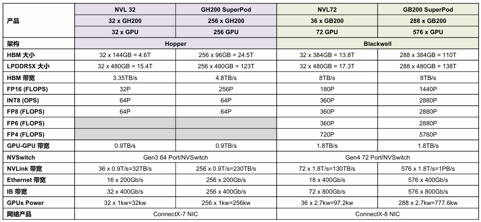

<!--Copyright © ZOMI 适用于[License](https://github.com/chenzomi12/AIInfra)版权许可-->

# NVIDIA Blackwell 演进

>>>>>>>>>>>>>>
author by: xxxxx

NVIDIA Blackwell 架构正引领 AI 计算进入新纪元。本节将深入解析其整体架构演进与多样化的产品形态，展示从单芯片到大规模系统部署的完整生态。

下图中概述了在 BlackWell 架构之前 NVIDIA GPU 的所有架构演进的过程，涵盖了从 2010 年的 Fermi 到 2022 年的 Hopper 各个时期。其中详细列举了各架构的发布时间、核心组成、主要特点与优势、制造工艺（纳米制程），以及代表型号。我们可以发现 NVIDIA GPU 技术在过去十余年间的显著发展，包括在核心设计、性能提升及制造工艺上的持续进步。

>>>>>>>>>>>>>>
这里直接放 AISystem 对应的内容，不再这里展示图，下面的图片和描述都要改改

作为 NVIDIA 最新的计算平台，Blackwell 架构产品家族拥有从基础芯片到大规模系统部署的完整生态。其产品形态涵盖从单一芯片、到模组、再到计算托盘（Compute Tray），直至整个机柜，由此衍生出众多新型号和专业名词。接下来，我们将通过详细介绍 Blackwell 架构的产品家族，来剖析其真正的含义，以及这些产品背后所代表的最新 AI 方向与产品演进趋势。

>>>>>>>>>>>>>>
截图我给你重新做了，可以改改对应的内容哈

本节内容主要分为三部分：GPU 产品介绍、HGX 产品介绍和 NVLink 与 SuperPOD 产品介绍。

## GPU 产品介绍

下图展示了 NVIDIA 主要 GPU 产品及其关键技术规格的对比，涵盖了从 Ampere 架构的 A100 到最新 Blackwell 架构的 B 系列产品。
>>>>>>>>>>>>>>
下图去哪里了？

首先，我们可以从架构演进的角度来看。表格清晰地展示了 NVIDIA 从 Ampere（代表产品 A100）发展到 Hopper（代表产品 H100、H200、GH200），再到最新的 Blackwell（代表产品 B100、B200、Full B200、GB200）的路线图。这种迭代更新体现了 NVIDIA 在高性能计算和 AI 领域的持续技术投入。

其次，存储性能是衡量 GPU 能力的重要指标。在 HBM 大小和 HBM 带宽两行中，我们可以看到显著的提升。从 A100 的 80GB HBM 和 2TB/s 带宽，逐步提升到 H200 的 141GB 和 4.8TB/s，而 Blackwell 架构的产品更是实现了飞跃，B100 和 B200 拥有 180GB/192GB HBM 和 8TB/s 带宽，GB200 更是达到了惊人的 384GB HBM 和 16TB/s 带宽。这表明 NVIDIA 正不断扩大显存容量和带宽，以满足日益增长的 AI 模型对数据吞吐量的需求。

再者，计算能力是 GPU 的核心竞争力。表格详细列出了多种浮点运算（FLOPs）和整数运算（OPS）的性能指标。从 FP16 到 FP4，我们可以看到：

* FP16 FLOPs 从 A100 的 312T 提升到 H100 的 1P，Blackwell 系列更是达到 1.75P 至 5P。
* INT8 OPS 也从 624T 飙升至 2P 甚至 Blackwell 的 10P。
* FP8、FP6 和 FP4 是 Blackwell 架构引入或大幅增强的计算特性，Hopper 架构虽支持 FP8 但 Blackwell 有更高性能，而 FP6 和 FP4 仅在 Blackwell 系列中支持，尤其 FP4 在 GB200 上达到了 20P。

NVLink 带宽的提升同样关键，它衡量了 GPU 之间以及 GPU 与 CPU 之间的数据传输速度。从 A100 的 600GB/s 到 Hopper 的 900GB/s，再到 Blackwell 的 1.8TB/s，GB200 甚至达到 3.6TB/s，这使得构建大规模多 GPU 系统和实现 CPU-GPU 协同工作变得更加高效。

最后，功耗（Powers）是性能提升伴随的考量，从 A100 的 400W 到 Blackwell 系列的 700W 至 2700W（GB200），反映了为实现更高性能所需的能源消耗。

值得注意的是，在芯片设计中，“1 Die”（单晶粒）表示单个封装内仅含一个独立的硅晶粒，而“2 Die”（双晶粒）则意味着一个封装内实际包含两个独立的硅晶粒。这两个晶粒通常通过高速互联技术（如 NVIDIA 的 NVLink-C2C）实现无缝连接，在逻辑上协同工作，形成一个更强大的整体。

在 Blackwell 架构问世之前，包括 Ampere 和 Hopper 在内的 NVIDIA GPU 架构均采用单晶粒（1 Die）设计。然而，Blackwell 架构则引入了革命性的双晶粒（2 Die）构造。这一设计上的根本性转变使得一张 Blackwell 架构的 B100 芯片，在计算能力和资源上，实际上等同于传统意义上的两张 GPU 卡。

正因如此，在 Blackwell 架构的系统配置中，例如在一个计算托盘（Trays 板）内，您会观察到它可能包含 8 张 Ampere 或 Hopper 架构的 GPU 芯片，但若配置 Blackwell 架构的 B 系列芯片，则仅需 4 张 B 系列芯片即可达到相同的总卡概念（即 4 张 B 芯片等同于 8 张单 Die 卡的算力），这充分体现了双晶粒设计在提升单芯片集成度和性能密度方面的显著优势。

下图则表示 B100 芯片的概念图。

接下来，我们将详细分析 FP16 浮点运算能力在这三代 GPU 架构中的显著变化。

首先，从 Ampere 架构的 A100 到 Hopper 架构的 H100，FP16 算力实现了超过三倍的惊人增长（从 312 TFLOPs 提升至 1 PFLOP）。值得注意的是，尽管性能大幅提升，但功耗仅从 400 瓦增加到 700 瓦。随后，从 Hopper 架构的 H200 到 Blackwell 架构的 B200，FP16 算力再次实现了超过两倍的提升（从 1 PFLOP 提升至 2.25 PFLOP），而同期功耗仅增加了 300 瓦（从 700 瓦增至 1000 瓦）。这些数据清晰地揭示了芯片制程工艺进步所带来的两大核心优势：一是能够实现几何级的性能飞跃，二是能够尽可能地抑制功耗的同步大幅增长。这种高效的性能提升模式，正是半导体制造工艺持续演进的强大驱动力。

>>>>>>>>>>>>>>
上面的内容太偏向于大模型生成，希望加入你自己的思考和理解。

### 关于 DGX B200 推理

>>>>>>>>>>>>>>
增加三级标题，新的小内容

下面则引出一个问题：DGX B200 是否适用于大模型推理任务呢？

如上图所示，在训练场景下，DGX B200 相较于 DGX H100 展现出约三倍的性能提升；而在推理场景下，其性能提升更是高达 15 倍以上。这一数据强烈暗示 DGX B200 在大模型推理任务中具备显著优势。

接下来，我们将对 DGX B200 实现如此性能提升的内在机制进行深入分析：

从硬件规格来看，DGX B200 相较于 DGX H100 在 FP16 浮点运算能力上提升了 2.25 倍。与此同时，其高带宽内存（HBM）容量显著增大，显存带宽也实现了 2.23 倍的提升，而 NVLink 的互联带宽更是直接翻倍。在这些核心硬件性能指标的全面跃升下，若假设模型算力利用率（MFU）能够达到 50%，那么整体训练性能实现三倍左右的提升是完全符合硬件增益逻辑的。

对于推理场景，我们认为 DGX B200 的适用性并非全然乐观，甚至在某些情况下，其所谓的巨大性能提升可能需要更审慎的评估。图中所示的“15 倍推理性能提升”，是通过比较 B200 的 FP4 算力与 H100 的 FP8 算力得出的。这种跨精度等级的比较并不完全对等，因为 FP4 相较于 FP8 会引入更高的量化误差，可能不适用于所有对精度要求严苛的推理任务。

>>>>>>>>>>>>>>
上文 ZOMI 哪个图？

在推理场景下，相较于训练，对性价比的考量往往更为关键。尽管 B200 在峰值性能上表现卓越，但其高昂的成本和在实际推理部署中是否能充分发挥 FP4 性能（例如，并非所有模型都支持或需要 FP4 推理，或者 FP4 推理需要额外的模型量化工作），这些因素都可能影响其在推理场景下的实际效益和普及程度。

## HGX 产品介绍

在深入探讨 HGX 产品线之前，让我们先厘清两个关键术语：HGX 和 DGX。理解它们各自独特的角色，将有助于您更清晰地了解 NVIDIA 在高性能计算领域的产品布局。

HGX（Hyperscale GPU eXchange） 是 NVIDIA 推出的一款强大且模块化的 GPU 平台，主要面向 OEM 厂商，例如浪潮（Inspur）、戴尔（Dell）和超微（Supermicro）。您可以将 HGX 想象成高性能服务器的“核心引擎”。它主要由一个 GPU 托盘或主板模块构成，集成了多颗 GPU 及其高速互联网络，例如 NVLink 和 NVSwitch。至关重要的一点是，HGX 模块本身不包含 CPU、存储或其他服务器必备组件。相反，它提供核心的 GPU 计算能力和高速网络互联，由 OEM 厂商将其整合到他们完整的服务器系统中（例如超微的 SYS 系列）。简而言之，HGX 提供的是**硬件模块 + 高速互联**，旨在帮助构建高密度、模块化、可扩展的 GPU 集群。

DGX（Deep GPU Xceleration）是 NVIDIA 直接提供的一整套开箱即用的高性能服务器系统。这类产品由 NVIDIA 亲自设计、制造和销售。DGX 系统是一个一体化的解决方案，集成了 GPU、CPU、内存、存储和网络组件，形成一个完整且优化的系统。DGX 产品专为大型 AI 模型的训练和推理而设计，提供无缝、即插即用的体验。

现在，我们已经区分了这两个关键平台，接下来将以 HGX 系列产品为例，介绍从 Ampere 架构到 Blackwell 架构的技术演进。

图中详尽地展示了 NVIDIA 不同代次 HGX 平台产品的关键技术规格对比，涵盖了从 Ampere 架构的 HGX A100 到最新 Blackwell 架构的 HGX B100 和 HGX B200。

>>>>>>>>>>>>>>
图要指定到底是哪个图？图加个序号

核心指标方面，图中详细对比了以下几个关键性能参数：

**HBM 大小和 HBM 带宽**：这些数据反映了系统总体的显存容量和数据吞吐能力。可以看到，从 HGX A100 的 640GB HBM 和 2TB/s 带宽，逐步提升到 HGX H100 的 1.1TB HBM 和 3.35TB/s 带宽，再到 HGX B200 惊人的 1.5TB HBM 和 8TB/s 带宽，显存容量和带宽都呈现出显著的增长趋势，以满足日益庞大的 AI 模型对显存和数据传输的需求。

**浮点和整数运算能力 (FLOPs/OPS)**：表格列出了不同精度（FP16、INT8、FP8、FP6、FP4）的理论峰值算力。

- FP16 算力从 HGX A100 的 312T FLOPs 提升到 HGX H100 的 1 PFLOPs，再到 HGX B200 的 2.25 PFLOPs，显示了 AI 训练能力的大幅提升。
- INT8 (8-bit integer) 算力同样从 624T OPS 跃升至 4.5P OPS，表明在推理任务中的效率显著提高。
- FP8、FP6 和 FP4 是更低精度的浮点运算，其中 FP8 在 Hopper 架构中开始支持，而 FP6 和 FP4 则主要在 Blackwell 架构中出现并显示出极高的性能（例如 HGX B200 的 FP4 达到 9P FLOPs），这对于大模型推理和进一步压缩计算量至关重要。

**互联带宽**：

- GPU-GPU 带宽：衡量了 HGX 模块内部 GPU 之间的数据传输速度，从 A100 的 600 GB/s 提升到 H100 的 900 GB/s，再到 Blackwell 的 1.8 TB/s，确保了多 GPU 协同计算的高效性。
- NVLink 带宽：这是 GPU 之间，乃至 HGX 模块之间的高速互联总带宽，从 HGX A100 的 4.8 TB/s 到 HGX H100 的 7.2 TB/s，再到 HGX B200 的 14.4 TB/s，其翻倍的增长对于构建更大规模的 AI 集群至关重要。
- 网络带宽：表格还包括了外部网络连接的能力，如 Ethernet 带宽和 IB（InfiniBand）带宽。这些指标从 HGX A100 的 200 Gb/s 以太网和 8 x 200 Gb/s IB，提升到 HGX B200 的 2 x 400 Gb/s 以太网和 8 x 400 Gb/s IB，体现了系统对外数据传输能力的显著增强，这对于分布式训练和集群扩展至关重要。

**功耗**：分 GPUs Power（GPU 核心功耗）和总 Power（整个 HGX 服务器的功耗）。可以看到，随着性能的提升，功耗也相应增加，从 HGX A100 的 6.5kw 总功耗，跃升到 HGX B200 的 14.3kw。

**网络产品**：展示了各代 HGX 平台所搭载的网络适配器或 DPU（数据处理器），如 ConnectX 系列网卡和 BlueField-3 DPU，它们提供了高性能的网络连接和卸载能力。

通过深入分析 NVIDIA HGX 平台的产品规格演变，我们可以清晰地描绘出其技术迭代的轨迹。首先，从 Ampere 架构的 HGX A100 迈向 Hopper 架构的 HGX H100/H200 时，FP16 浮点运算能力实现了约 3.2 倍的飞跃，与此同时，总功耗的增幅却控制在 2 倍以内，这充分彰显了新一代纳米制程工艺在提升计算效率和优化能耗方面的卓越贡献。

从 Hopper 架构的 HGX H100/H200 过渡到 Blackwell 架构的 HGX B100/B200，FP16 算力再次取得了约 2 倍的显著增长，而令人惊喜的是，系统总功耗却基本保持不变，这主要归功于 Blackwell 架构引入的创新性双晶粒（2 Die）设计，有效提升了封装内的计算密度。然而，在外部网络连接方面，尽管 GPU 核心性能实现了跨越式发展，但 Blackwell 架构的 InfiniBand（IB）带宽仍维持在 8x400Gb/s，其升级速度相较于 GPU 算力的爆发式增长显得相对滞缓，这可能预示着未来超大规模 AI 集群在节点间通信方面可能面临新的挑战。

## NVL & SuperPod 产品介绍

GB200 NVL72 是 NVIDIA Grace Blackwell 超级芯片的创新集成，采用先进的液冷机架式设计，集成了 36 个 GB200 Grace Blackwell 超级芯片。

作为 GB200 NVL72 的核心，每个 GB200 Grace Blackwell 超级芯片都通过 NVIDIA NVLink™-C2C 高速互连技术，将两颗高性能的 NVIDIA Blackwell Tensor Core GPU 与一个 NVIDIA Grace™ CPU 紧密连接起来，实现了 CPU 与 GPU 之间以及两颗 GPU 之间的极致带宽通信。

在此基础上，GB200 SuperPOD 则是一个由 8 个 GB200 NVL72 单元组成的超级计算集群，旨在提供前所未有的 AI 训练和推理性能。

上图全面介绍了 Hopper 架构（GH200 NVL 32, GH200 SuperPod）和 Blackwell 架构（GB200 NVL72, GB200 SuperPod）的主要产品及其关键性能指标。

>>>>>>>>>>>>>>
图片统一按照 markdown 的格式加序号，方便引用，图片默认放在文字下面。

1. **内存与带宽**：HBM 总大小从 GH200 SuperPod 的 24.5TB（LPDDR5X 为 123TB）大幅跃升至 GB200 SuperPod 的 110TB，显存带宽也从 Hopper 的 4.8TB/s 提升到 Blackwell 的 8TB/s。这表明新架构为超大规模 AI 模型提供了更广阔的内存空间和更快的数据存取速度。

2. **计算能力 (FLOPs/OPS)**：

    - **FP16** 算力从 GH200 SuperPod 的 256 PFLOPs，飙升至 GB200 SuperPod 的 1440 PFLOPs（即 1.44 EFLOPS），实现了超过 5 倍的巨大飞跃，展现了 Blackwell 架构在 AI 训练任务中的强大潜力。
    - **INT8 和 FP8** 算力也呈现相似的倍数增长，对于推理任务至关重要。

值得注意的是，Blackwell 架构引入并大幅提升了**FP6 和 FP4**的计算能力，其中 GB200 SuperPod 的 FP4 算力高达 5760 PFLOPs（5.76 EFLOPS），这预示着在低精度推理和更高效的 AI 应用方面将有突破性的进展。

3. **内部互联带宽**：

    - **GPU-GPU 带宽** 从 Hopper 架构的 0.9TB/s 提升到 Blackwell 架构的 1.8TB/s，翻了一番。
    - **NVLink 带宽** 的提升尤为显著，从 GH200 SuperPod 的 230TB/s，跃升至 GB200 SuperPod 的 1PB/s（1000TB/s），这对于实现 GPU 集群内的高效数据同步和模型并行训练至关重要，确保了超大规模集群的线性扩展能力。NVLink Switch 也从 Gen3 64 Port 升级到 Gen4 72 Port，提升了交换能力。

4. **外部网络带宽**：

    - **Ethernet 带宽** 从 256 x 200Gb/s 提升到 576 x 400Gb/s，总带宽大幅增加。
    - **IB 带宽** 从 256 x 400Gb/s 提升到 576 x 800Gb/s，这表明 NVIDIA 正在为构建更大、更复杂的分布式 AI 训练和推理集群提供更强大的外部通信能力，以减少网络瓶颈。

5. **总功耗**：随着性能的急剧提升，功耗也相应增加。GH200 SuperPod 的总功耗为 256kW，而 GB200 SuperPod 的总功耗高达 777.6kW，这反映了这些超级计算系统对电力和散热基础设施的极致要求。

6. **网络产品**：Hopper 架构的 HGX 使用 ConnectX-7 NIC，而 Blackwell 架构则升级到 ConnectX-8 NIC，提供了更高的网络性能和更先进的网络卸载功能。

## 总结与思考

NVIDIA Blackwell 架构的蓬勃发展，无疑为国内芯片与计算服务器产业的未来指明了极具价值的启发方向。

其中一个最为显著且不可逆转的趋势是，计算架构正从最初相对简单的**芯片堆叠模式，逐步演进为提供整套大规模集群解决方案**的复杂生态。NVIDIA Blackwell 架构（如 GB200 SuperPOD）的出现，不再仅仅是推出更强大的 GPU 芯片，而是着眼于如何将数以百计、乃至千计的高性能 GPU，通过超高带宽的 NVLink 互联、先进的网络架构（例如 ConnectX-8 InfiniBand），以及精密的软件协调层，无缝地整合为一个具备极致扩展能力和计算效率的统一体。这不仅仅是硬件性能的线性累加，更是通过系统级优化，将计算、存储、网络融为一体，以应对万亿参数级别大模型训练和推理的严峻挑战。

这种持续扩大规模并提供端到端解决方案的发展模式，对国内芯片设计企业和计算服务器制造商而言意义深远。未来的竞争不再局限于单一芯片性能，更在于构建高效协同、易于部署和管理的全栈式 AI 计算基础设施。这意味着，除了在芯片设计上追赶国际水平，国内厂商还需在高速互联技术（如类 NVLink）、大规模集群管理软件、高性能散热供电及定制化数据中心部署方案等多维度深度布局和创新，才能在未来的 AI 算力竞赛中占据一席之地。简而言之，竞争焦点已从“造好芯”拓展到“搭好台”，再到“唱好戏”，最终形成一个无缝连接、高度优化的完整计算生态。

## 本节视频

>>>>>>>>>>>>>>
加上视频的链接哈

<html>
<iframe src="https://player.bilibili.com/player.html?isOutside=true&aid=113582557698159&bvid=BV1iT6TYXE25&cid=25716792792&p=1&as_wide=1&high_quality=1&danmaku=0&t=30&autoplay=0" width="100%" height="500" scrolling="no" border="0" frameborder="no" framespacing="0" allowfullscreen="true"> </iframe>
</html>
