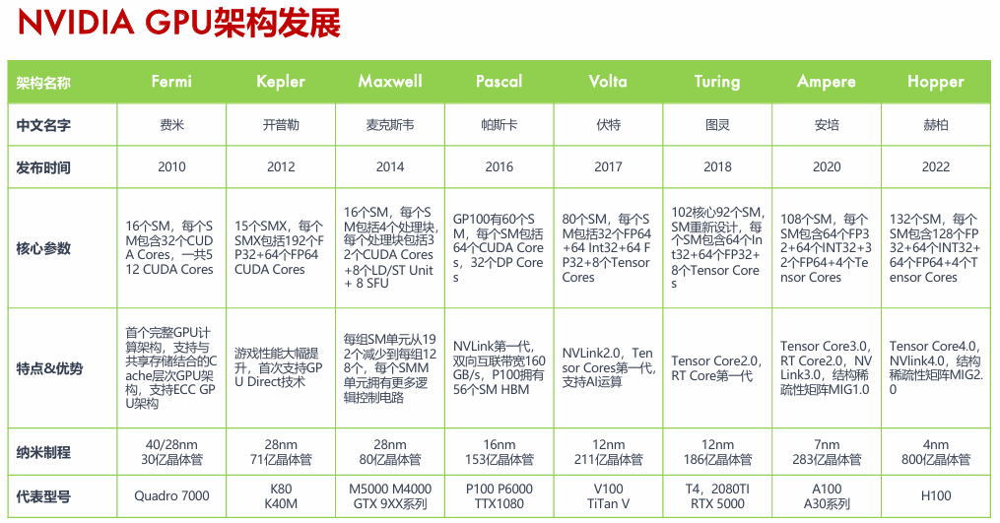
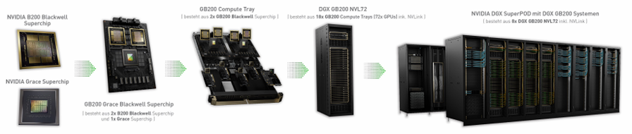
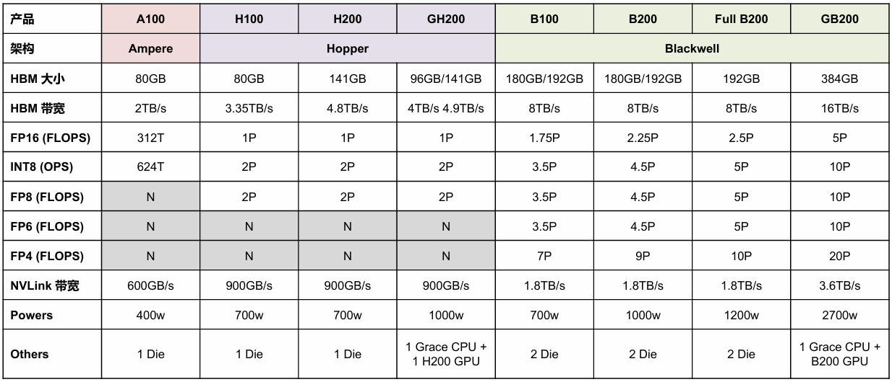
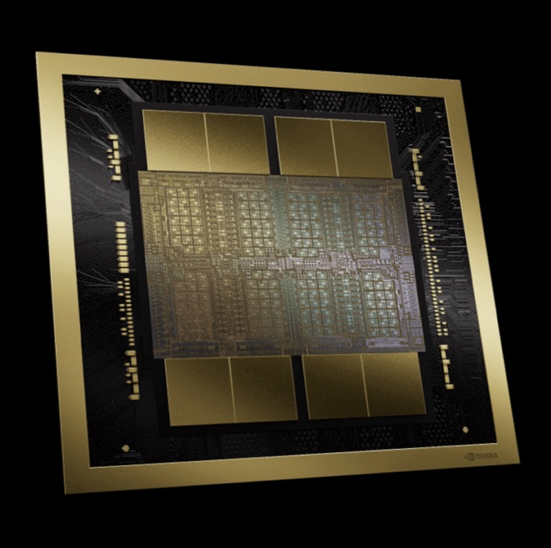
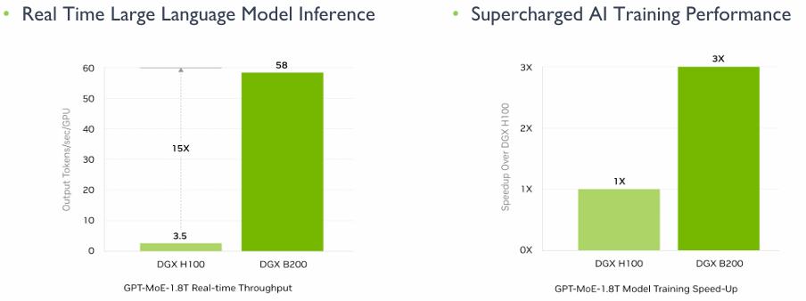

<!--Copyright © ZOMI 适用于[License](https://github.com/chenzomi12/AIInfra)版权许可-->

# NV Blackwell 产品演进分析

本节内容主要介绍 NVIDIA 最新一代架构 BlackWell 的整体架构演进与相关产品形态。

图1中概述了在BlackWell架构之前NVIDIA GPU的所有架构演进的过程，涵盖了从2010年的Fermi到2022年的Hopper各个时期。其中详细列举了各架构的发布时间、核心组成、主要特点与优势、制造工艺（纳米制程），以及代表型号。我们可以发现NVIDIA GPU技术在过去十余年间的显著发展，包括在核心设计、性能提升及制造工艺上的持续进步。

作为NVIDIA最新架构， Blackwell架构产品家族拥有从基础芯片到大规模系统部署的完整生态。从一块芯片到一个模组，再到一个Compute Tray，再到整个机柜，这种方式衍生了非常多不同型号的产品，从而产生了众多新的命名方式与产品名词，接下来我们将通过详细介绍Blackwell架构产品家族来搞清楚其真正含义以及产品背后代表的哪些新的AI方向与新产品的演进方向。

本节内容主要分为三部分：GPU产品介绍；HGX产品介绍；NVL产品介绍

## GPU产品介绍

下图展示了NVIDIA主要GPU产品及其关键技术规格的对比，涵盖了从Ampere架构的A100到最新Blackwell架构的B系列产品。

首先，我们可以从架构演进的角度来看。表格清晰地展示了NVIDIA从Ampere（代表产品A100）发展到Hopper（代表产品H100、H200、GH200），再到最新的Blackwell（代表产品B100、B200、Full B200、GB200）的路线图。这种迭代更新体现了NVIDIA在高性能计算和AI领域的持续技术投入。

其次，存储性能是衡量GPU能力的重要指标。在HBM大小和HBM带宽两行中，我们可以看到显著的提升。从A100的80GB HBM和2TB/s带宽，逐步提升到H200的141GB和4.8TB/s，而Blackwell架构的产品更是实现了飞跃，B100和B200拥有180GB/192GB HBM和8TB/s带宽，GB200更是达到了惊人的384GB HBM和16TB/s带宽。这表明NVIDIA正不断扩大显存容量和带宽，以满足日益增长的AI模型对数据吞吐量的需求。

再者，计算能力是GPU的核心竞争力。表格详细列出了多种浮点运算（FLOPs）和整数运算（OPS）的性能指标。从FP16到FP4，我们可以看到：

* FP16 FLOPs 从A100的312T提升到H100的1P，Blackwell系列更是达到1.75P至5P。
* INT8 OPS 也从624T飙升至2P甚至Blackwell的10P。
* FP8、FP6和FP4 是Blackwell架构引入或大幅增强的计算特性，Hopper架构虽支持FP8但Blackwell有更高性能，而FP6和FP4仅在Blackwell系列中支持，尤其FP4在GB200上达到了20P。

NVLink带宽的提升同样关键，它衡量了GPU之间以及GPU与CPU之间的数据传输速度。从A100的600GB/s到Hopper的900GB/s，再到Blackwell的1.8TB/s，GB200甚至达到3.6TB/s，这使得构建大规模多GPU系统和实现CPU-GPU协同工作变得更加高效。

最后，功耗（Powers）是性能提升伴随的考量，从A100的400W到Blackwell系列的700W至2700W（GB200），反映了为实现更高性能所需的能源消耗。

值得注意的是，在芯片设计中，“1 Die”（单晶粒）表示单个封装内仅含一个独立的硅晶粒，而“2 Die”（双晶粒）则意味着一个封装内实际包含两个独立的硅晶粒。这两个晶粒通常通过高速互联技术（如NVIDIA的NVLink-C2C）实现无缝连接，在逻辑上协同工作，形成一个更强大的整体。
在Blackwell架构问世之前，包括Ampere和Hopper在内的NVIDIA GPU架构均采用单晶粒（1 Die）设计。然而，Blackwell架构则引入了革命性的双晶粒（2 Die）构造。这一设计上的根本性转变使得一张Blackwell架构的B100芯片，在计算能力和资源上，实际上等同于传统意义上的两张GPU卡。
正因如此，在Blackwell架构的系统配置中，例如在一个计算托盘（Trays板）内，您会观察到它可能包含8张Ampere或Hopper架构的GPU芯片，但若配置Blackwell架构的B系列芯片，则仅需4张B系列芯片即可达到相同的总卡概念（即4张B芯片等同于8张单Die卡的算力），这充分体现了双晶粒设计在提升单芯片集成度和性能密度方面的显著优势。

下图则表示B100芯片的概念图。

接下来，我们将详细分析FP16浮点运算能力在这三代GPU架构中的显著变化。

首先，从Ampere架构的A100到Hopper架构的H100，FP16算力实现了超过三倍的惊人增长（从312 TFLOPs提升至1 PFLOP）。值得注意的是，尽管性能大幅提升，但功耗仅从400瓦增加到700瓦。随后，从Hopper架构的H200到Blackwell架构的B200，FP16算力再次实现了超过两倍的提升（从1 PFLOP提升至2.25 PFLOP），而同期功耗仅增加了300瓦（从700瓦增至1000瓦）。这些数据清晰地揭示了芯片制程工艺进步所带来的两大核心优势：一是能够实现几何级的性能飞跃，二是能够尽可能地抑制功耗的同步大幅增长。这种高效的性能提升模式，正是半导体制造工艺持续演进的强大驱动力。

下面则引出一个问题：DGX B200是否适用于大模型推理任务呢？

如上图所示，在训练场景下，DGX B200 相较于 DGX H100 展现出约三倍的性能提升；而在推理场景下，其性能提升更是高达15倍以上。这一数据强烈暗示 DGX B200 在大模型推理任务中具备显著优势。

接下来，我们将对DGX B200实现如此性能提升的内在机制进行深入分析：

首先，从硬件规格来看，DGX B200 相较于 DGX H100 在FP16浮点运算能力上提升了2.25倍。与此同时，其高带宽内存（HBM）容量显著增大，显存带宽也实现了2.23倍的提升，而NVLink的互联带宽更是直接翻倍。在这些核心硬件性能指标的全面跃升下，若假设模型算力利用率（MFU）能够达到50%，那么整体训练性能实现三倍左右的提升是完全符合硬件增益逻辑的。

然而，对于推理场景，我们认为DGX B200的适用性并非全然乐观，甚至在某些情况下，其所谓的巨大性能提升可能需要更审慎的评估。图中所示的“15倍推理性能提升”，是通过比较B200的FP4算力与H100的FP8算力得出的。这种跨精度等级的比较并不完全对等，因为FP4相较于FP8会引入更高的量化误差，可能不适用于所有对精度要求严苛的推理任务。此外，在推理场景下，相较于训练，对性价比的考量往往更为关键。尽管B200在峰值性能上表现卓越，但其高昂的成本和在实际推理部署中是否能充分发挥FP4性能（例如，并非所有模型都支持或需要FP4推理，或者FP4推理需要额外的模型量化工作），这些因素都可能影响其在推理场景下的实际效益和普及程度。

## HGX产品介绍

在介绍HGX产品之前，我们先搞清楚几个特殊的产品名词。

* HGX（Hyperscale GPU eXchange） 是一个 GPU 模块化平台，主要提供给 OEM 厂商（如 Inspur、Dell、Supermicro） 来组装自己的高性能服务器。其核心是一个 GPU 托盘（Tray）或主板模块，集成了多张 GPU 及其互连网络（如 NVLink/NVSwitch）。其中不包含 CPU、存储等部件，需 OEM 厂商整合成完整服务器（例如 Supermicro SYS 系列）。总结来说，HGX 是“硬件模块 + 高速互联”，用于构建高密度、模块化、可扩展的 GPU 集群。
* DGX（Deep GPU Xceleration）是 NVIDIA 提供的一整套高性能服务器系统，集成了GPU、CPU、内存、存储、网络等全套组件，即开即用，专为训练和推理大模型设计。这类产品由 NVIDIA 亲自设计、制造和销售。

