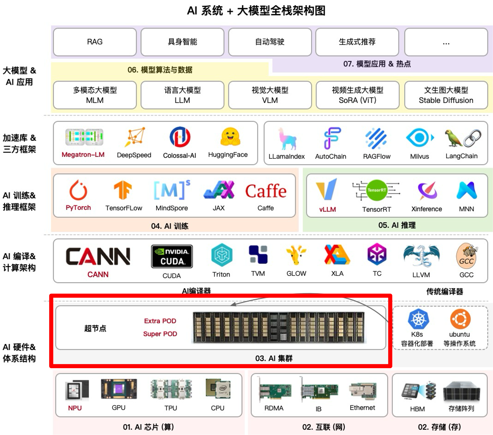

<!--Copyright © ZOMI 适用于[License](https://github.com/Infrasys-AI/AIInfra)版权许可-->

# AI 计算集群概述

本次大纲内容主要围绕计算集群展开，介绍了高性能计算的定义与发展趋势，梳理了从初代到下一代的集群发展历程，探讨了集群计算系统架构以及建设中的软硬件平台分层与挑战。同时，针对万卡 AI 集群建设方案、机房基础设施建设、超节点计算集群分析（包括国内外最新研究）、集群性能指标分析（如总算力、内存计算、能效等）以及实践应用（如精度与性能定位）等多方面进行了详细阐述，系统地展示了计算集群的理论基础、技术演进和实际应用。

## 课程位置

## 课程简介

xxx

## 课程知识

xxx

## 备注

系列视频托管[B 站](https://space.bilibili.com/517221395)和[油管](https://www.youtube.com/@ZOMI666/playlists)，PPT 开源在[github](https://github.com/Infrasys-AI/AIInfra)，欢迎取用！！！

> 非常希望您也参与到这个开源课程中，先给 github 点赞，然后 B 站给 ZOMI 留言哦！
>
> 欢迎大家使用的过程中发现 bug 或者勘误直接提交代码 PR 到开源社区哦！
>
> 希望这个系列能够给大家、朋友们带来一些些帮助，也希望自己能够继续坚持完成所有内容哈！
