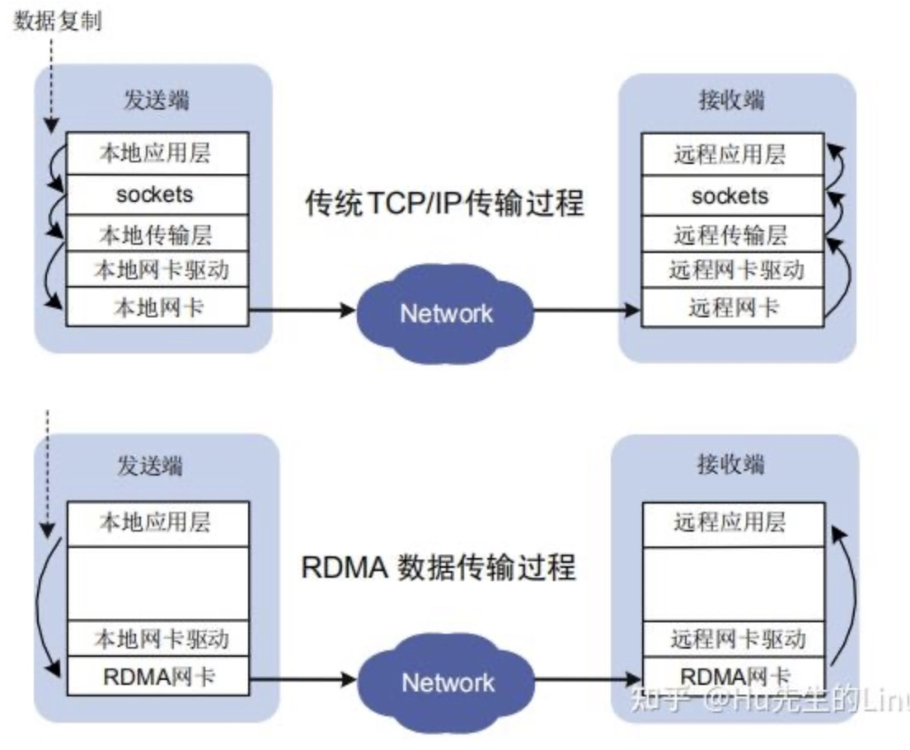
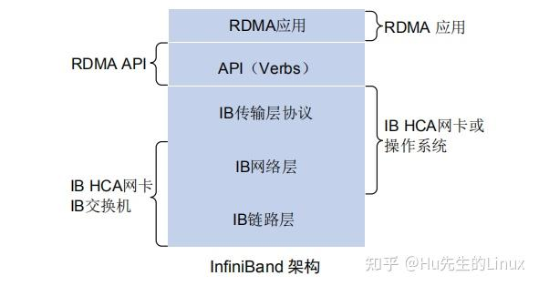
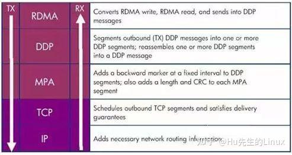
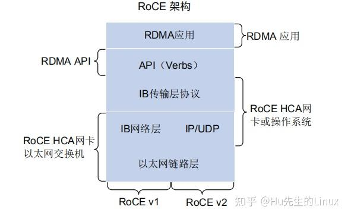

## 网络通信进阶

###  高速互联：RDMA 基本概述

（AI工作负载、RoCE、iWARP）

 随着人工智能模型特别是大型语言模型（LLM）的规模和数据量迅速增长，现代计算系统正面临严重的通信瓶颈问题。在由数百甚至上千个 GPU 组成的分布式训练集群中，限制性能的关键不再是计算能力，而是节点间的数据交换效率。频繁的梯度、参数和激活值传输导致 GPU 核心长时间等待数据，显著降低了资源利用率并延长了任务完成时间。

 传统的 TCP/IP 协议难以满足这种高强度通信需求。多次内存拷贝和用户态与内核态之间的频繁切换不仅消耗大量 CPU 资源，还导致延迟上升和带宽利用不足，尤其在 100GbE 或更高速网络中尤为明显。

 为突破这一瓶颈，远程直接内存访问（RDMA）技术应运而生。RDMA 允许一台机器直接访问另一台机器的内存，绕过操作系统和 CPU，从而大幅降低延迟并释放计算资源。这一源自高性能计算领域的技术，现已成为支撑大规模 AI 训练任务的关键网络基础。

#### RDMA 架构原理

 RDMA（Remote Direct Memory Access）的高性能源于其底层架构上的根本性变革，尤其体现在“内核旁路”（Kernel Bypass）与“零拷贝”（Zero-Copy）这两大关键机制上。借助这两个机制，RDMA 构建出了一条几乎绕开操作系统干预、从用户空间直达网络硬件的数据通路，极大地降低了通信延迟并释放了 CPU 资源。

 与传统的 TCP/IP 通信方式相比，RDMA 的数据发送路径有着本质的不同。在传统网络模型中，应用程序通过套接字 API 发起数据传输请求，操作系统会在用户空间与内核空间之间进行上下文切换，并将数据从应用缓冲区复制到内核缓冲区。随后，内核协议栈处理数据，添加 TCP/IP 头部信息，再通过网卡驱动将数据送往网络接口卡。这个过程中，数据至少会被拷贝两次，系统调用频繁触发 CPU 中断和上下文切换，整个链路严重依赖 CPU 的持续参与。

 相比之下，RDMA 则显得简洁高效得多。应用程序不再通过系统调用进行通信，而是直接调用位于用户态的 RDMA 库（通常是 Verbs API）与支持 RDMA 的网络适配器（rNIC）交互。在数据传输发起之前，应用需将一块内存区域注册给 rNIC，使其可被网络硬件访问，并锁定在物理内存中。传输过程中，应用仅需将包含内存地址、长度等元信息的请求发送至 rNIC，数据本身并不经过 CPU。rNIC 随后通过 DMA 从用户指定的内存地址中直接读取数据并封装为 RDMA 协议数据包发出，接收端的 rNIC 同样绕开操作系统，直接将数据写入接收方注册好的内存缓冲区。整个通信路径从未离开用户空间，亦未涉及任何中间的数据拷贝或内核干预。

 这种内核旁路机制意味着网络通信中的数据面操作完全跳过了操作系统，大大减少了上下文切换和系统调用开销，网络延迟从毫秒级大幅下降到微秒级。与此同时，零拷贝机制彻底消除了内核缓冲区与应用缓冲区之间的数据搬运需求，释放了大量 CPU 和内存带宽资源。在多个关键性能维度上，RDMA 的技术栈都对传统 TCP/IP 协议形成了压倒性的优势。它不仅大幅缩短了数据路径，降低了延迟，更在数据拷贝次数、CPU 使用率和操作系统依赖程度等方面实现了量级的性能提升。

 RDMA 的高效运行依赖于精密的软硬件协同机制。硬件层面，RDMA 网络适配器（rNIC）本身是一种集成了强大计算能力的协处理器，能够独立完成数据传输的封装与解析、地址转换、可靠性控制等复杂任务，从而减轻主机 CPU 的负担。软件层面，RDMA 提供了一套基于 Verbs 的编程接口，支持开发者直接控制通信过程。

 RDMA 架构的革新不仅体现在性能提升上，还带来了信任模型的改变。在传统网络模型中，操作系统内核是网络通信的中心控制者和安全裁判者。然而在 RDMA 架构中，数据传输路径完全绕开内核，信任关系从内核转移至用户程序与硬件之间，并通过内存注册和密钥机制来控制权限。尽管这一设计极大提高了通信效率，但也引入了新的安全风险。比如在不加密的场景中，若攻击者截获或猜测到传输过程中的 rkey，就有可能未经授权地直接访问目标主机的内存。因此，在多租户云平台等敏感场景下，RDMA 的部署必须配合专用物理网络或虚拟私有云等手段，确保网络层的强隔离，以防止潜在的恶意访问。

| **特性**     | **传统 TCP/IP 协议栈**                | **RDMA 协议栈**                        |
| ------------ | ------------------------------------- | -------------------------------------- |
| 数据路径     | 用户空间 → 内核空间 → NIC             | 用户空间 → NIC                         |
| CPU 参与度   | 高（协议栈管理、数据拷贝）            | 极低（仅发起请求，数据处理由硬件完成） |
| 数据拷贝次数 | 多次（应用缓冲区 → 内核缓冲区 → NIC） | 零拷贝（数据从应用内存直接传输）       |
| 内核参与程度 | 深度参与每一个数据包的处理流程        | 数据平面操作完全绕过内核               |
| 通信延迟     | 毫秒级                                | 微秒级                                 |
| 常用编程接口 | Sockets API                           | Verbs API                              |

 RDMA技术的原理及其与TCP/IP架构的对比如下图所示。

RDMA 技术主要包括：

- IB（InfiniBand）：基于 InfiniBand 架构的 RDMA 技术，由 IBTA（InfiniBand Trade Association）提出。搭建基于 IB 技术的 RDMA 网络需要专用的 IB 网卡和 IB 交换机。
- iWARP（Internet Wide Area RDMA Protocal）：基于 TCP/IP 协议的 RDMA 技术，由 IETF 标 准定义。iWARP 支持在标准以太网基础设施上使用 RDMA 技术，但服务器需要使用支持iWARP 的网卡。
- RoCE（RDMA over Converged Ethernet）：基于以太网的 RDMA 技术，也是由 IBTA 提出。RoCE支持在标准以太网基础设施上使用RDMA技术，但是需要交换机支持无损以太网传输，需要服务器使用 RoCE 网卡。

####  **InfiniBand技术简介**

 InfiniBand 是一种基于 InfiniBand 架构的 RDMA 技术，它提供了一种基于通道的点对点消息队列转发模型，每个应用都可通过创建的虚拟通道直接获取本应用的数据消息，无需其他操作系统及协议栈的介入。InfiniBand 架构的应用层采用了 RDMA 技术，可以提供远程节点间 RDMA 读写访问，完全卸载 CPU 工作负载；网络传输采用了高带宽的传输；链路层设置特定的重传机制保证服务质量，不需要数据缓冲。

####  iWARP 技术简介

 iWARP 是基于以太网和 TCP/IP 协议的 RDMA 技术，可以运行在标准的以太网基础设施上。

 iWARP并没有指定物理层信息，所以能够工作在任何使用TCP/IP协议的网络上层。iWARP允许很多传输类型来共享相同的物理连接，如网络、I/O、文件系统、块存储和处理器之间的消息通讯。

 iWARP协议栈，iWARP 由 MPA、DDP、RDMAP 三层子协议组成： 

- RDMAP层协议负责 RDMA 读、写操作和 RDMA 消息的转换，并将 RDMA 消息转发到 DDP层。
- DDP层协议负责将过长的 RDMA 消息分片分装成DDP数据包继续转发到 MPA 层。 
- MPA层在 DDP 数据段的固定标识位置增加转发后向标识、数据报文的长度以及 CRC 校验数据等字段构成 MPA 数据段交由 TCP 传输。

 iWARP 技术特点，iWARP 从以下几个方面降低了主机侧网络负载：

 • TCP/IP 处理流程从 CPU 卸载到 RDMA 网卡处理，降低了 CPU 负载。

 • 消除内存拷贝：应用程序可以直接将数据传输到对端应用程序内存中，显著降低 CPU 负载。

 • 减少应用程序上、下文切换：应用程序可以绕过操作系统，直接在用户空间对 RDMA 网卡下发命令，降低了开销，显著降低了应用程序上、下文切换造成的延迟。

 由于 TCP 协议能够提供流量控制和拥塞管理，因此 iWARP 不需要以太网支持无损传输，仅通过普通以太网交换机和 iWARP 网卡即可实现，因此能够在广域网上应用，具有较好的扩展性。

####  RoCE技术简介

 RoCE 技术支持在以太网上承载 IB 协议，实现 RDMA over Ethernet。RoCE 与 InfiniBand 技术有相同的软件应用层及传输控制层，仅网络层及以太网链路层存在差异。

 RoCE 协议分为两个版本：

 RoCE v1协议：基于以太网承载 RDMA，只能部署于二层网络，它的报文结构是在原有的 IB架构的报文上增加二层以太网的报文头，通过 Ethertype 0x8915 标识 RoCE 报文。 

 RoCE v2协议：基于 UDP/IP 协议承载 RDMA，可部署于三层网络，它的报文结构是在原有的 IB 架构的报文上增加 UDP 头、IP 头和二层以太网报文头，通过 UDP 目的端口号 4791 标 识 RoCE 报文。RoCE v2 支持基于源端口号 hash，采用 ECMP 实现负载分担，提高了网络的利用率。

 RoCE 使得基于以太网的数据传输能够：

 • 提高数据传输吞吐量。

 • 减少网络延时。

 • 降低 CPU 负载。

 RoCE 技术可通过普通以太网交换机实现，但服务器需要支持 RoCE 网卡，网络侧需要支持无损以太网络，这是由于 IB 的丢包处理机制中，任意一个报文的丢失都会造成大量的重传，严重影响数据传输性能。

### 参考

- https://zhuanlan.zhihu.com/p/549434847
- RDMA Networking and AI - 650 Group, accessed June 21, 2025, https://650group.com/wp-content/uploads/2024/06/650-Group-IBTA-RDMA-White-Paper-June-2024.pdf
- enhancing data transfer efficiency in gpu computing utilizing gpu direct technology with intel® ethernet network adapters, accessed June 21, 2025, [https://cdrdv2-public.intel.com/826151/SMCI_Whitepaper_GPUDirect_DataTransferEfficiency%20with%20Intel%20Ethernet%20Adapter%20V7_May%202024.pdf](https://cdrdv2-public.intel.com/826151/SMCI_Whitepaper_GPUDirect_DataTransferEfficiency with Intel Ethernet Adapter V7_May 2024.pdf)
- The Basics of Remote Direct Memory Access (RDMA) in vSphere - VMware, accessed June 21, 2025, https://www.vmware.com/docs/the-basics-of-remote-direct-memory-access-rdma-in-vsphere
- What are the key differences between TCP and RDMA in terms of data transfer protocols for distributed deep learning? - Massed Compute, accessed June 21, 2025, [https://massedcompute.com/faq-answers/?question=What+are+the+key+differences+between+TCP+and+RDMA+in+terms+of+data+transfer+protocols+for+distributed+deep+learning%3F](https://massedcompute.com/faq-answers/?question=What+are+the+key+differences+between+TCP+and+RDMA+in+terms+of+data+transfer+protocols+for+distributed+deep+learning?)
- An In-Depth Understanding of RDMA Interaction Mechanism between Software and Hardware - Alibaba Cloud, accessed June 21, 2025, https://www.alibabacloud.com/blog/601598
- What is Remote Direct Memory Access (RDMA)? - GreenCloud, accessed June 21, 2025, https://blog.greencloudvps.com/what-is-remote-direct-memory-access-rdma.php
- Can you explain the difference between RDMA and TCP/IP for GPU communication and which one is better for deep learning workloads? - Massed Compute, accessed June 21, 2025, [https://massedcompute.com/faq-answers/?question=Can%20you%20explain%20the%20difference%20between%20RDMA%20and%20TCP/IP%20for%20GPU%20communication%20and%20which%20one%20is%20better%20for%20deep%20learning%20workloads?](https://massedcompute.com/faq-answers/?question=Can+you+explain+the+difference+between+RDMA+and+TCP/IP+for+GPU+communication+and+which+one+is+better+for+deep+learning+workloads?)