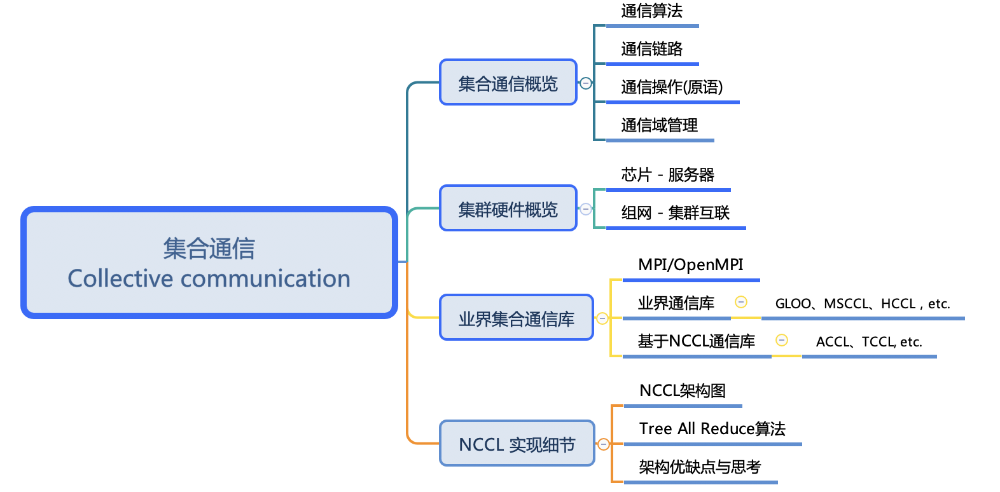
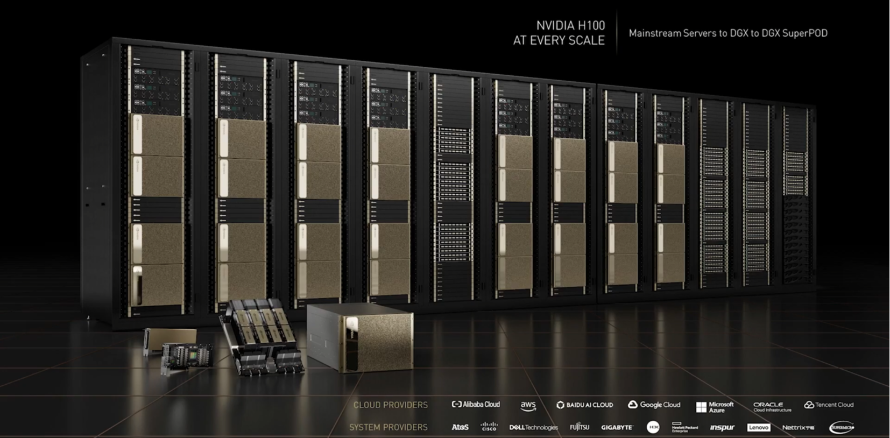

<!--Copyright © ZOMI 适用于[License](https://github.com/Infrasys-AI/AIInfra)版权许可-->

# 大模型集合通信介绍

Author by: SingularityKChen

在 AI 系统中，**计算算子**和**通信算子**是两类核心操作。计算算子映射到 AI 芯片上实现。而通信算子的实现是**硬件互连技术**、**软件通信库**和**系统优化策略**共同作用的结果。当单个 AI 芯片无法满足大模型的时候，通信算子的性能直接决定了分布式 AI 训练的扩展效率，是构建大规模 AI 系统的核心环节。

本系列课程将从**通信算法**、**通信链路**、**通信原语**和**通信域管理**四个维度展开讲解，从而帮助读者理解集合通信如何影响 AI 基础设施的软硬件系统、AI 训练算法甚至 AI 模型的架构。

<!-- 通信是指信息从一个地方传递到另一个地方的过程。它包括信息的发送、传输和接收等环节。

当单一节点的算力或存储无法满足应用需求时，往往采用分布式内存架构的节点协作解决给定问题。此时原本在单个节点上执行的计算现在自然地分布在各个节点之间。

当数据需要共享和（或）不同节点的计算结果需要合并时，就会进行通信。同时涉及一组节点的通信操作称为集合通信操作。 -->

## 集合通信概览

在集合通信概览中，我们将介绍通信的四个特征：通信算法、通信链路、通信操作（原语）、和通信域管理。

- **通信算法**：针对同一个通信算子，随着网络拓扑、通信数据量、硬件资源等的不同，往往会采用不同的通信算法，从而最大化集群通信性能。
- **通信链路**：承载集合通信的物理链接以及拓扑结构。
- **通信操作**：通信操作也被称为通信原语。通信原语包含点对点操作和集体操作。
- **通信域管理**：通信域是集合通信算子执行的上下文，管理对应的通信对象（例如一个 NPU 就是一个通信对象）和通信所需的资源。通信域中的每个通信对象称为一个 rank，每个 rank 都会分配一个介于 0~n-1（n 为 npu 的数量）的唯一标识。

下表总结了华为 HCCL 和英伟达 NCCL 集合通信库上述四个通信特征。

| 通信特性 | HCCL | NCCL |
|----------|------|------|
| 通信算法 | ring/mesh + ring/Hav-Doub/Pair-Wise，etc. | ring + Tree ring，etc. |
| 通信链路 | 灵渠总线 / PCIE | NVLink / NVSwitch / GPU-Direct / PCIE |
| 通信操作 | allreduce、broadcast、reduce、reduce scatter、allgather、all2all、send、recv | allreduce、broadcast、reduce、reduce scatter、allgather、all2all、send、recv |
| 通信域管理 | 全局通信域、子通信域、基于全局/子通信域配置算法 | 全局通信域、子通信域、自定义通信域配置算法 |

## 集群硬件概览

在了解大模型集合通信基础内容后，我们将从集合通信的硬件组成情况进行介绍。这部分将会从芯片内通信到集群间通信两个层次进行介绍其硬件组成。

### 芯片-服务器

这一部分内容将介绍芯片内 die 间互联的硬件组成及其发展趋势，以及一个服务器（1U）内通信相关硬件模块。

下图是英伟达 DGX-2系统，其标注内容如下：

1. 16 个全连接的 Tesla V100 GPU 核心，构成 1.92 PFLOPS 的总算力、512 GB HBM2 显存；
2. 双 GPU 基板互联（NVLINK Plane Card）；
3. 12 组NVSwith，提供 2.4 TB/s 对分带宽；
4. 8 路 EDR InfiniBand (IB) 或 100 GigE接口，提供 1600 Gb/s 的低延迟总双向带宽；
5. PCIe 交换机模块
6. 2 块英特尔 Xeon Platinum CPU 芯片
7. 1.5 TB 系统内存
8. 30 TB NVME SSD 缓存
9. 2 高速以太网网卡

### 组网-集群互联

>>>>>>>>>>>>>>
添加图，要把视频读厚，写实，视频都花了好几十秒讲了很多，文字不能比视频还简单了哦

## 业界集合通信库

>>>>>>>>>>>>>>
添加图，要把视频读厚，写实，视频都花了好几十秒讲了很多，文字不能比视频还简单了哦

了解通信的硬件组成后，我们再来学习业界的集合通信库。这部分内容将从以下三个部分进行介绍：

- MPI/OpenMPI：业界标准的通信库
- 诸多业界通信库的异同
- 基于 NCCL 的 CCL

## NCCL 实现细节

NCCL 是大模型时代应用最为广泛的集合通信库之一。我们将从以下三个角度介绍 NCCL：

- NCCL 架构图及其对应 GPU 的拓扑逻辑
- Tree All Reduce 算法
- NCCL 架构优缺点与思考

>>>>>>>>>>>>>>
添加图，要把视频读厚，写实，视频都花了好几十秒讲了很多，文字不能比视频还简单了哦

## 本节视频

<html>
<iframe src="https://player.bilibili.com/player.html?aid=1355442092&bvid=BV1jz421h7CA&cid=1568779156&page=1&as_wide=1&high_quality=1&danmaku=0&autoplay=0" width="100%" height="500" scrolling="no" border="0" frameborder="no" framespacing="0" allowfullscreen="true"> </iframe>
</html>

## 引用

- [NVIDIA DGX-2](https://www.nvidia.cn/data-center/dgx-2/)