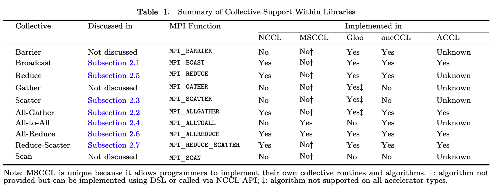
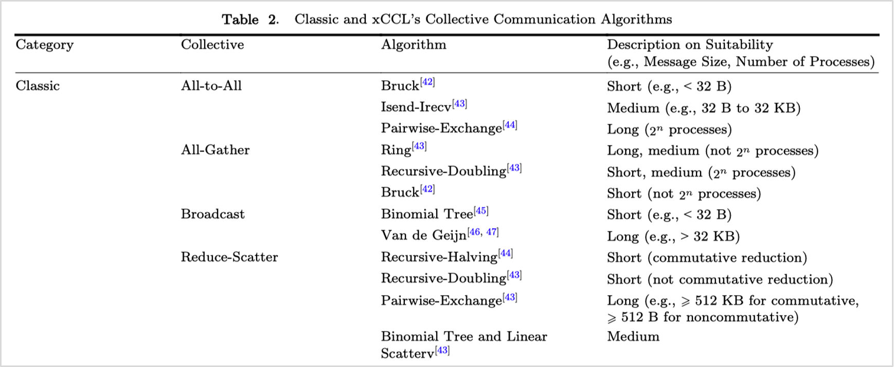
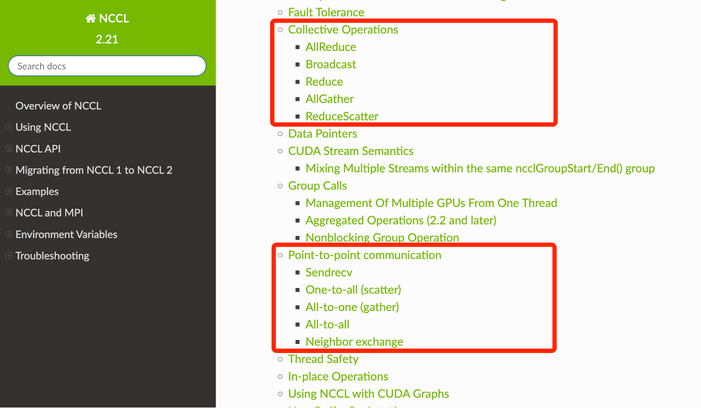
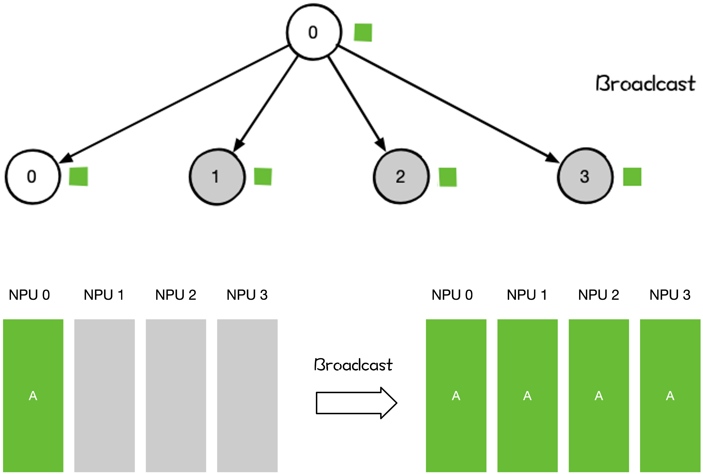
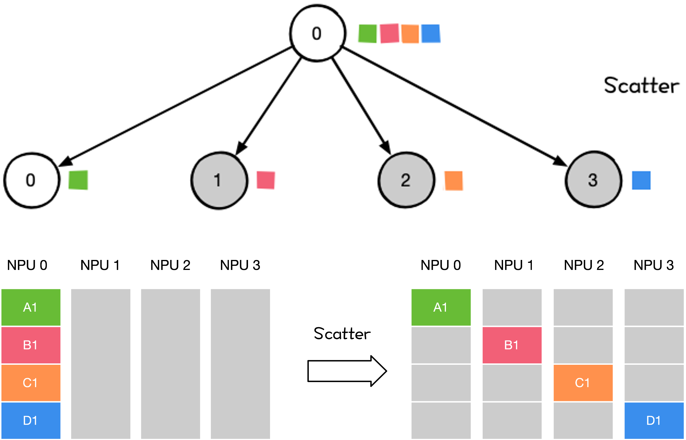
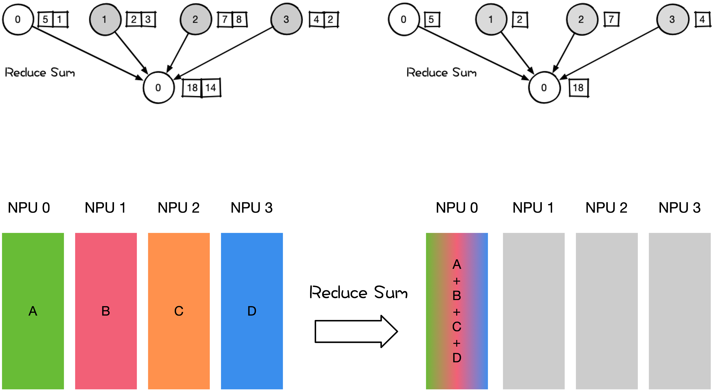
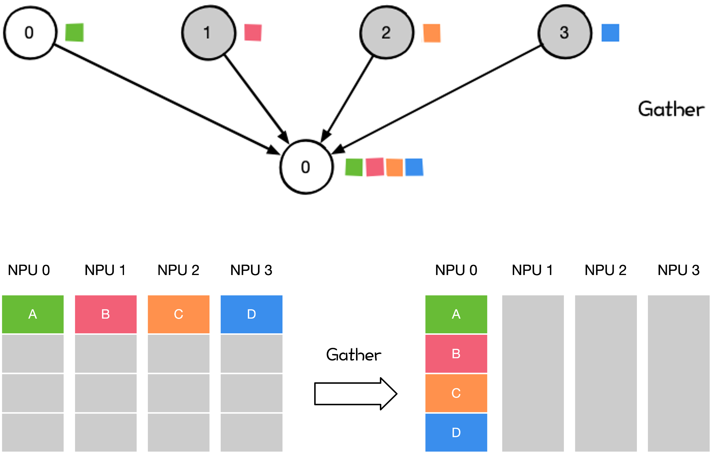
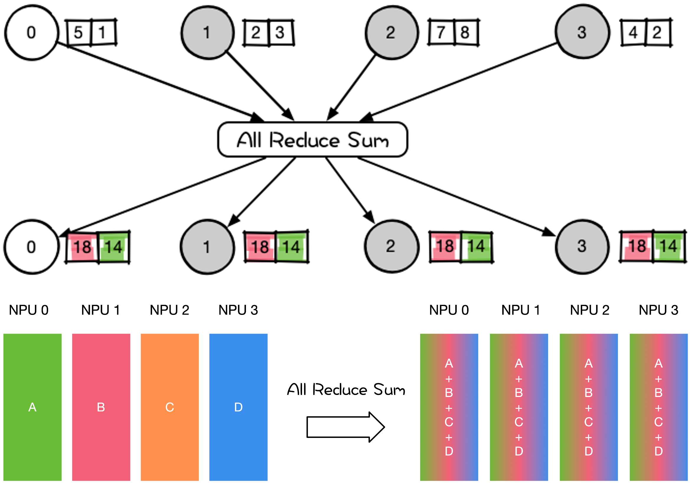

<!--Copyright © ZOMI 适用于[License](https://github.com/Infrasys-AI/AIInfra)版权许可-->

# 集合通信操作/原语/算子

Author by: SingularityKChen

本章内容聚焦**集合通信操作**，也称为**集合通信原语**或**集合通信算子**。

## 课程位置

本章节是集合同学系列课程的第三章。如下图所示，属于集合通信概览。

>>>>>>>>>>>>>>>>
[]里面的内容可以不用填写，加个序列让大家知道是哪个图就可以了，如 3-1 图所示这种

## XCCL 在 AI 系统中的位置

>>>>>>>>>>>>>>>>
每一个二级标题下面都要放字哦，介绍这个内容讲什么

### XCCL 在 AI 系统中的位置

>>>>>>>>>>>>>>>>
三级标题不应该跟二级标题一样

XCCL 在 AI 系统中属于承上启下的位置。

### XCCL 对通信操作支持情况

## 通信操作/原语——一对多

### Broadcast

Broadcast 操作将单个 Rank 把自身的数据发送到集群中的其他 Rank。

在 AI 系统中，涉及到 Broadcast 的操作有：

- 网络参数 Init Weight 的初始化；
- 数据并行 DP 对数据分发初始化；
- All-Reduce 操作的一部分；
  - All-Reduce 可分解为 Broadcast 和 Reduce 两个阶段

### Scatter

Scatter 操作将主节点的数据进行划分并散布至其他指定的 Rank。

在 AI 系统中，涉及到 Scatter 的操作有：

- 流水并行（PP）里初始化时将模型权重 Scatter 到不同 Rank 上；
- Reduce-Scatter 操作的一部分
  - Reduce-Scatter 可分解为 Reduce  和 Scatter 两个阶段；

## 通信操作/原语——多对一

### Reduce

Reduce 操作是把多个 Rank 的数据规约运算到一个 Rank 上。

Reduce 的规约操作包含：SUM、MIN、MAX、PROD、LOR 等类型的规约操作。Reduce Sum 操作示意如下。

在 AI 系统中，涉及到 Reduce 的操作有：

- 大模型训练权重 checkpoint 保存；
- All-Reduce 和 Reduce-Scatter 中的 Reduce 阶段

### Gather

Gather 操作是将多个 Rank 上的数据收集到Rank 上，Gather 可以理解为反向的 Scatter。

在 AI 系统中，涉及到 Gather 的操作相对较少。

## 通信操作/原语——多对多

### All-Reduce

All-Reduce 操作是在所有 Rank 执行相同Reduce 操作，然后将所有 Rank 数据规约运算得到的结果发送到所有 Rank。

在 AI 系统中，涉及到 All-Reduce 的操作有：

- 在专家并行、张量并行、序列并行中大量地使用 All-Reduce 对权重和梯度参数进行聚合。
- 数据并行DP 各种通信拓扑结构，比如 Ring All-Reduce、Tree All-Reduce 里的All-Reduce 操作；

### All-Gather

All-Gather 操作是从所有 Rank 收集数据并分发所有 Rank 上。

在 AI 系统中，涉及到 All-Gather 的操作有：

- 在专家并行、张量并行、序列并行中对权重和梯度参数进行聚合。
- 模型并行里前向计算里的参数全同步，把模型并行里将切分到不同的 NPU 上的参数全同步到一张 NPU 上才进行前向计算。

### Reduce-Scatter

Reduce-Scatter 操作是在所有 Rank 上都按维度执行相同的 Reduce 规约操作，再将结果发散到集群内所有的节点上。

在 AI 系统中，涉及到 Reduce-Scatter 的操作有：

- 数据并行 DP 中使用的 All-Reduce
  - All-Reduce 可分解为 Reduce-Scatter 和 All-Gather 两个阶段；
- 模型并行 MP 前向 All-Gather 后的反向计算 Reduce-Scatter；

### All2All

All to All 操作是对 All-Gather 的扩展，但不同的节点向某一节点收集到的数据是不同的。

在 AI 系统中，涉及到 All2All 的操作有：

- 应用于模型并行中的 TP/SP/EP；
- 模型并行里的矩阵转置；
- DP 到模型并行的矩阵转置；

## 小结与思考

>>>>>>>>>>>>>>>>
小结直接提供一段话总结即可哈

下表展示了典型并行类型、涉及的主要通信操作、节点规模及数据量。

| 类型                                                                                       | 通信操作                                | 节点规模           | 数据量   | 备注                        |
| ---------------------------------------------------------------------------------------- | ----------------------------------- | -------------- | ----- | ------------------------- |
| 数据并行 DP                                                                                  | All-Reduce、Broadcast                | ~理论无限          | ~GB   | 节点规模增长会受线性度影响             |
| 张量并行 TP                                                                                  | All-Reduce、All-Gather、Reduce-Scatter | 2 / 4 / 8 Rank | MB~GB | 计算通信可隐藏，节点内进行，不宜跨节点       |
| 流水并行 PP                                                                                  | Send、Recv                           | 2 Rank         | ~MB   | 通过多 Micro Batch 实现计算通信可隐藏 |
| 序列并行 SP                                                                                  | All-Reduce、All-Gather、Reduce-Scatter | ~理论无限          | MB~GB | 计算通信可隐藏                   |
| 专家并行 EP                                                                                  | All2All                             | ~理论无限          | ~MB   | 计算通信串行，不可隐藏               |

在学习了本章内容后，你应该对集合通信原语有了更加深入的理解：

1. 了解集合式通信的3种不同方式
2. 了解一对多 Scatter/Broadcast，多对一 Gather/Reduce，多对多具体方式
3. 了解多对多可以由一对多和多对一的方式组合

## 本节视频

<html>
<iframe src="https://player.bilibili.com/player.html?aid=1905375595&bvid=BV1gS411K7k5&cid=1571916171&page=1&as_wide=1&high_quality=1&danmaku=0&autoplay=0" width="100%" height="500" scrolling="no" border="0" frameborder="no" framespacing="0" allowfullscreen="true"></iframe>
</html>