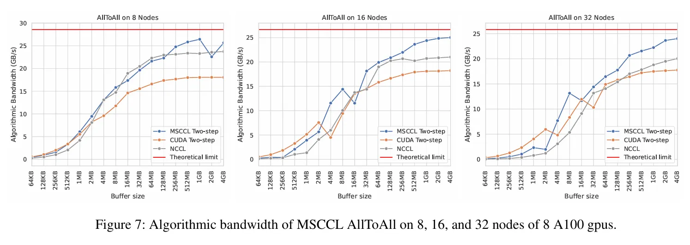
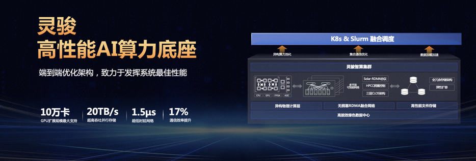

# XCCL 通信库

Author by: 刘军

本节主要介绍围绕 NCCL 衍生出的各种通信库（统称为XCCL）。重点分析各种通信库的具体内容，比如 GLOO，MSCCL，HCCL 等。同时介绍业界有哪些有名的集合通信库，公司在训练自己的大模型时都会使用哪些库，以及在大模型训练过程中用到的集合通信库 XCCL 都有哪些优缺点。

## XCCL 基本概念

XCCL（XXXX Collective Communication Library）集合通信库，大体上会遵照 MPI 提供 API 的接口规定，实现包括点对点通信（SEND，RECV 等），集合通信（REDUCE，BROADCAST，ALLREDUCE）等相关接口。同时针对统一通信原语，在不同的网络拓扑实现不同的优化算法。每个公司可以根据自己的硬件设计或者是系统需要，在底层实现上进行相应改动，保证接口的稳定和性能。因此有了业界常见的通信库，如英伟达的 NCCL，微软的 MSCCL、Meta的 GLOO、华为的HCCL等。

XCCL 在整个 AI 系统中是基于网络通信的拓扑之上进行构建的，向上层提供 AllReduce、AllGather、All2All 和 P2P 相关的通信原语，所有通信原语会集成在 AI 框架中，提供给 Megatron-LM，例如 MindSpeed 相关的分布式通讯库进行集成。这么多不同的 XCCL 通信库，核心功能都是实现点对点（P2P）和集合通信（CC）算法。

通信的具体算法在基本固定的情况下，各大厂家会基于 NCCL 在以下3个方面进行创新和改进：

（1）基础/集合通信算法创新：对开源网络拓扑编排算法进行优化，对基础通信算子&集合通信算法进行优化；

（2）网络传输优化：对拥塞控制、路由控制进行优化，对传输协议层、路由协议层等进行细化操作；

（3）端网协同专用优化：端网协同自研协议栈，匹配自研交换机，适配自研的网络架构进行优化。

以华为的 HCCL 为例，下面的架构图包括公共组件和用户API，也是相关创新的具体要素。

## NVIDIA NCCL

英伟达通信库 NCCL（Nvidia Collective Communication Library）作为业界标杆，具有以下优点：

（1）低延迟与高带宽：英伟达根据自己的 DGX 服务器优化通信路径和数据传输策略，实现了低延迟和高带宽；

（2）并行性：支持多并发集合操作，可以在不同数据流上同时进行通信，进一步提高了计算效率；

（3）容错性：GPU/网络连接出现故障，NCCL 自动重新配置通信路径，确保系统的健壮性和可靠性；

如下图所示，英伟达使用 Ring 网络结构在不同 GPU 和平台之间搬运数据。

同时 NCCL 也支持多网卡集合通信操作，GPU Direct RDMA 技术以及节点内多进程和单进程使用。在使用 Flat Ring、Hierarchical Rings 和 Tree 不同通信算法时，ResNet-50 在不同数量 GPU 时的图像生成速度有所差异。

NCCL 的优点在于其生态开源，支持用户按需自定义新的集合通信算法（ACCL、TCCL 等），同时内置基础通信算子开箱即用。同时灵活解耦，CUDA 等其它组件解耦并单独开发，版本独立演进和发布，在不同层级提供 API，灵活兼顾自定义性能增强算法，具有开发易用性，提供 NCCL Net Plugin 等 API。

同时NCCL 也存在以下不足：

（1）节点间拓扑识别能力、流量监控、信息获取能力有限；

（2）GPU 和 Infiniband 搭配使用效果更好，但是对 RDMA 等网络支持的程度一般，因为英伟达主要在推动 Infiniband 相关的自家网络产品；

（3）缺乏对异构网络（clos/tours/RDMA）通信传输的系统级优化，需要用户基于原有接口进一步开发；

（4）集合通信算法编排不感知物理拓扑，当前内置 ring、tree 算法只适合 ring、tree 特定类型的物理拓扑；

（5）容错管理粒度粗，任意执行过程出错会导致 NCCL 重启。

因为以上不足，业界出现了多种多样的通信库。

## AMD RCCL

AMD 开源的通信库RCCL（ROCm Communication Collectives Library）是 AMD ROCm 生态的一部分。在AMD自己的 GPU 软硬件生态中，RCCL 通常用于替代 NCCL，在 GPU 互联方面 Infinity Fabric 替代节点内的 NVSwitch，可以看出 AMD 拥有和 NVIDIA 相对等的软件和硬件产品以及相关生态。

AMD 的 RCCL 主要特性包括 GPU 到 GPU（P2P）直接通信操作，支持通过 PCIe 和 xGMI 互连在本地传输数据，支持通过 InfiniBand Verbs 和 TCP/IP 套接字在网络上传输数据。对标 CUDA 使用 NCCL 相同 API，所以 RCCL 还支持通信器和拓扑等特性，RCCL 中流特性与 NCCL 中流特性不同，它使用 HIP 流而不是 CUDA 流。下图是 AMD MI300X GPU 通过使用  Infinity Fabric 实现了 8 个 GPU 硬件的全互联。

## Intel oneCCL

oneCCL（oneAPI Collective Communications Library） 是 Intel 开发的一个高效通信库，作为 oneAPI 生态系统的一部分，支持不同设备之间的通信。

oneCCL 支持多种通信模式，包括点对点、广播、规约等，同时支持 SYCL，可与最底层的驱动层配合，充分利用 Intel 的 NPU 和 GPU 硬件资源。提供自动线程亲和性设置功能，可以优化多核处理器上的并行性能。对于低精度数据类型，例如BF16 提供专门的优化支持。

分别以 MPI 和 oneCCL 作为集合通信的后端，可以看出 oneCCL 通信效率明显高于 MPI。

## Meta Gloo

Meta 研发的通信库 Gloo 也是开源的，相关集合通信库主要集成在 Pytorch 的后端，是一个类似 MPI 的集合通信库。Gloo 提供一系列基于 CUDA-aware 的 All reduce 实现。Mate 开源机器学习集合通信库，对 all reduce 提供多种实现方案，比如 allreduce_ring、allreduce_ring_chunked、allreduce_halving_doubling 和 allreducube_bcube。集成 GPU-Direct，实现多 GPU 内存缓冲区间数据传输，减少 Host-Device 内存复制。Gloo 支持通过 PCIe 和 NVLink 等互连进行多 GPU 通信，同时 Gloo 支持不同的数据传输方式进行节点间和节点内的数据通信。

在 Pytorch 的官方文档（[https://pytorch.org/docs/stable/distributed.html](https://pytorch.org/docs/stable/distributed.html)）中，特别说明了什么场景适合用 GLoo 以及在什么场景适合用 NCCL。在 CPU 分布式训练、使用 InfiniBand 或以太网交换机的场景中推荐使用 Gloo 作为后端，在 GPU 分布式训练场景中推荐使用 NCCL。

## Microsoft MSCCL

微软集合通信库 MSCCL（Microsoft collective communication library）是一个专为 Microsoft Azure 提供的异构加速平台，用于执行自定义集合通信算法。MSCCL 建立在 NCCL 之上，并利用其构建块来执行用户自定义的集合通信算法，从而提供一个统一、高效且可扩展的框架，以跨多个加速器执行集合通信算法，其关键特性之一是可编程性。由于加速器之间的互连具有不同的时延和带宽，通用的集合通信算法可能并不适用于所有拓扑和缓冲区大小。

在不同节点数量 A100 GPU情况下，通过测试MSCCL 支持的 AllToAll 算法带宽，其通信带宽明显优于 NCCL，尤其在通信时的buffer size比较大的情况下，优势更为明显。

通过在 H100 上进行测试，使用 msccl-tests-nccl 对 FP16 All-Reduce 和 All-Gather 算法进行了测试和比较，在时延方面，MSCCL 都做到了一定的加速效果，目前MSCCL 也是一个开源的支持自定义集合通信算法的开源集合通信库。

## 阿里 ACCL

ACCL（Alibaba Collective Communication Library）是基于 NCCL 面向阿里云灵骏架构设计的集合通信库。结合阿里云自身网络特点以及丰富的大模型任务通信调优经验，提供更高的通信性能，并且具备一定的故障诊断和自愈能力。对万卡规模的AI集群提供无拥塞、高性能的集群通讯能力。

ACCL 的关键特性包括异构拓扑感知，如节点内 PCIe 与 NVLink/NVSwitch、节点间多轨 RDMA 网络，分层混合充分利用不同互连带宽。端网协同选路，算法与拓扑协同设计实现无拥塞通信，支撑训练性能上规模可扩展。在网多流负载均衡，多任务并发、资源争抢时保障整体吞吐。

更多技术细节来自于阿里2021年发表的一篇论文：EFLOPS: Algorithm and System Co-design for a High Performance Distributed Training Platform (2021)。阿里集合通信库主要实现了 BigGraph 网络拓扑，两层交换机分组互联，每层一个交换机和另一层交换机全互联，两层交换机间至少存在 N/2 个物理链路可用。两层交换机间最短路径确认，接入不同层次任意两个设备之间最短路径具有唯一性并等长。

在不同数量 GPU 组成的集群场景下，在整体和单个 GPU 吞吐量方面，阿里的 ACCL 优于 NCCL。在大规模的场景，ACCL 为集群节点间AllReduce 实现 Halving-Doubling 算法，比 Ring 有更优的通信开销控制效果，在典型的集合通信方法测试中可将性能提升20%以上。

同时提供了 HD（Halving-Doubling）算法逻辑连接和 BigGraph 拓扑物理链路进行映射，避免链路争用，彻底解决网络拥塞。Halving-Doubling with rank-mapping（HDRM），从集合通信管理层面分配链路。在万卡规模下，可达80%以上的线性集群能力。在百卡规模下，有效（计算）性能可达95%以上，可满足80%以上的业务场景需求。

## 腾讯 TCCL

腾讯提供了计算加速套件 TACO Kit（TencentCloud Accelerated Computing Optimization Kit），其中 TACO Train 基于腾讯内部的 AI 业务场景，提供自底向上的网络通信、分布式策略及训练框架等多层级的优化，是一套全生态的训练加速方案，其中 TCCL 为 AI 大模型训练提供更高效的网络通信性能。

TCCL（Tencent Collective Communication Library）是针对腾讯云星脉网络架构定制的高性能加速通信库。主要功能是依托星脉网络硬件架构，为 AI 大模型训练提供更高效的网络通信性能，同时具备网络故障快速感知与自愈的智能运维能力。TCCL 基于开源的 NCCL 代码做了扩展优化，完全兼容 NCCL 的功能与使用方法。TCCL 目前支持主要特性包括：

+ 双网口动态聚合优化，发挥 bonding 设备的性能极限。

+ 全局 Hash 路由（Global Hash Routing），负载均衡，避免拥塞。

+ 拓扑亲和性流量调度，最小化流量绕行。

+ 为 AI 大模型训练提供更高效的网络通信性能，同时具备网络故障快速感知与自愈的智能运维能力。

TCCL 主要特性包括双网口动态聚合优化，端网协同自研协议栈，发挥 GPU 性能极限。全局哈希路由（Global Hash Routing），实现负载均衡从而避免拥塞。同时支持拓扑亲和组网，流量调度监控，最小化流量绕行，自研交换机和可编程 RDMA 拥塞控制算法。

腾讯自研星脉高性能计算网络支持单集群10万卡组网，规模翻倍网络通信效率提升60%，让大模型训练效率提升20%。集合通信库 TCCL2.0 采用 NVLINK+NET 异构并行通信，相当于为GPU新建了一条网络通道，以实现数据的并行传输。通信性能提升30%，让大模型的训练效率再提升10%。由于腾讯云的星脉网络架构不开源且参考资料较少，因此无法进一步探究更多技术细节。

## 百度 BCCL

百度百舸AI异构计算平台是面向大规模深度学习的高性能云原生AI计算平台，为模型算法专家和运维专家提供全面的集群运维支持和任务全生命周期管理，在网络方面，百舸支持了万卡级别的RDMA网络，配合拓扑感知调度和高性能通信库BCCL可以有效降低网络延迟，提升带宽利用率。其中 BCCL（Baidu Collective Communication Library） 是百度智能云推出的一款面向大模型训练场景优化的集合通信库，基于开源的 NCCL 进行了功能扩展和能力增强。

BCCL 支持集合通信带宽实时统计功能，为故障诊断排除、训练性能调优等提供数据支撑。支持集合通信 hang 时故障诊断能力，快速进行任务的异常检测。网络故障容错能力增强，针对于偶发性异常故障场景（如单端口的偶发updown），增加相应重试重传超次机制，提升训练任务的健壮性。

BCCL 针对百度智能云提供的主流的 GPU 芯片进行了深度优化。以双机 H800 测试环境为例，BCCL 相比 NCCL 带宽利用率可提升 10%。借助 BCCL 在运维能力和稳定性进行的优化，使得百度百舸平台的有效训练时长达到 98%，带宽的有效利用率可以达到 95%。

## 小结

不同XCCL通信库的对比如下表所示，比较了不同通信库的优缺点以及核心设计目标，其中英伟达的NCCL处于行业标杆的位置，Intel、AMD和华为分别基于自己的硬件设计了自己的通信库，但是 AMD 的 ACCL 和华为的 HCCL 无法支持异构通信。腾讯、阿里等互联网大厂则是基于NCCL开发了属于自己的通信库。

| 通信库 | 厂商	| 是否基于NCCL| 是否开源 | 是否支持异构通信 | 拓扑感知强化 | 流量监控强化 | 集群容错 | 核心设计目标 |
| --- | --- | --- | --- | --- | --- | --- | --- | --- |
| NCCL	 | NVIDIA	 | 是	 | 是	 | 否	 | 是	 | 是	 | 是	 | 针对NVIDIA GPU调优，集合通信标杆 |
| RCCL	 | AMD	 | 否	 | 是	 | 否	 | 是	 | 是	 | 是	 | 为 AMD 的 NPU 硬件进行通信加速 |
| oneCCL	 | Intel	 | 否	 | 是	 | 是	 | 是	 | 是	 | 是	 | 为 Intel 的异构芯片进行加速 |
| Gloo	 | Mate	 | 否	 | 是	 | 是	 | 是	 | 是	 | 是	 | 为 CPU-GPU 之间通信进行加速 |
| MSCCL | Microsoft | 是 | 是 | 是 | 是 | 是 | 是 | 专为自己的云平台提供异构加速，自定义通信算法 |
| ACCL | 阿里 | 是 | 否 | 是 | 是 | 是 | 是 | 面向阿里云灵骏架构设计优化性能 |
| TCCL | 腾讯 | 是 | 否 | 是 | 是 | 是 | 是 | 为腾讯星脉网络定制通信库极致优化性能 |
| BCCL | 百度 | 是 | 否 | 是 | 是 | 是 | 是 | 异构通信故障诊断容错性能优化 |
| HCCL | 华为 | 否 | 是 | 否 | 是 | 是 | 是 | 基于昇腾硬件 NPU 之间通信进行加速 |

## 内容参考

Weingram A, Li Y, Qi H et al. xCCL: A survey of industry-led collective communication libraries for deep learning. JOURNAL OF COMPUTER SCIENCE AND TECHNOLOGY 38(1): 166−195 Jan. 2023. DOI:  10.1007/s11390-023-2894-6. [https://jcst.ict.ac.cn/cn/article/doi/10.1007/s11390-023-2894-6](https://jcst.ict.ac.cn/cn/article/doi/10.1007/s11390-023-2894-6)

NCCL [https://github.com/NVIDIA/nccl,](https://github.com/NVIDIA/nccl,) [https://developer.nvidia.com/nccl](https://developer.nvidia.com/nccl)

RCCL [https://github.com/rocm/rccl,](https://github.com/rocm/rccl,) [https://rocm.docs.amd.com/projects/rccl/en/latest/](https://rocm.docs.amd.com/projects/rccl/en/latest/)

oneCCL [https://github.com/intel/torch-ccl,](https://github.com/intel/torch-ccl,)  [https://oneapi-src.github.io/oneCCL/introduction/sample.html](https://oneapi-src.github.io/oneCCL/introduction/sample.html)

Gloo [https://github.com/pytorch/gloo,](https://github.com/pytorch/gloo,) 

MSCCL [https://github.com/microsoft/msccl,](https://github.com/microsoft/msccl,) [https://arxiv.org/pdf/2201.11840v1](https://arxiv.org/pdf/2201.11840v1)

ACCL [https://help.aliyun.com/zh/pai/user-guide/accl-alibaba-high-performance-collective-communication-library](https://help.aliyun.com/zh/pai/user-guide/accl-alibaba-high-performance-collective-communication-library), EFLOPS: Algorithm and System Co-design for a High Performance Distributed Training Platform (2021)

TCCL [https://cloud.tencent.com/document/product/1646/93319](https://cloud.tencent.com/document/product/1646/93319), [https://mp.weixin.qq.com/s/w5lG3maG1_2RFQKIF8yhYQ](https://mp.weixin.qq.com/s/w5lG3maG1_2RFQKIF8yhYQ)

BCCL [https://mp.weixin.qq.com/s/SJ7SCA2T0ILqZ4Ln5Zvg-Q](https://mp.weixin.qq.com/s/SJ7SCA2T0ILqZ4Ln5Zvg-Q)

HCCL [https://gitee.com/ascend/cann-hccl](https://gitee.com/ascend/cann-hccl), [https://www.hiascend.com/document/detail/zh/CANNCommunityEdition/82RC1alpha002/hccl/hcclug/hcclug_000001.html](https://www.hiascend.com/document/detail/zh/CANNCommunityEdition/82RC1alpha002/hccl/hcclug/hcclug_000001.html)

智算场景下集合通信库的挑战与发展趋势:

[https://www.telecomsci.com/zh/article/doi/10.11959/j.issn.1000-0801.2025048/](https://www.telecomsci.com/zh/article/doi/10.11959/j.issn.1000-0801.2025048/)

## 本节视频

<html>
<iframe src="https://player.bilibili.com/player.html?isOutside=true&aid=1756291116&bvid=BV1o4421U7mo&cid=1652341860&p=1" width="100%" height="500" scrolling="no" border="0" frameborder="no" framespacing="0" allowfullscreen="true"> </iframe>
</html>

<html>
<iframe src="https://player.bilibili.com/player.html?isOutside=true&aid=1506297164&bvid=BV1bS421X7uN&cid=1654063780&p=1" width="100%" height="500" scrolling="no" border="0" frameborder="no" framespacing="0" allowfullscreen="true"> </iframe>
</html>
