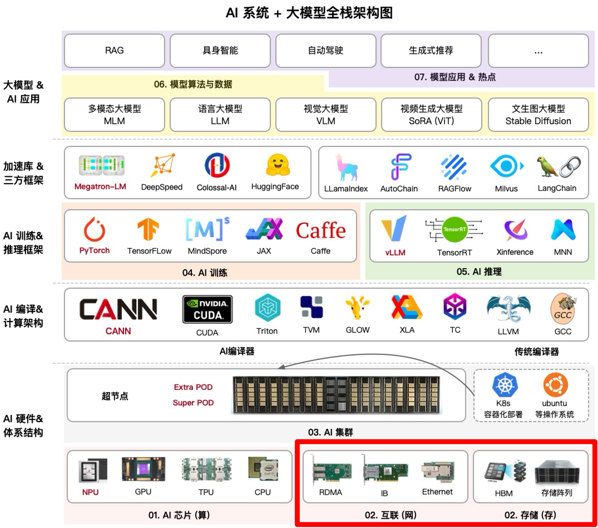
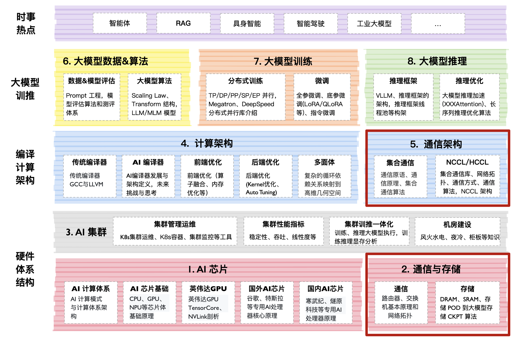

<!--Copyright © ZOMI 适用于[License](https://github.com/Infrasys-AI/AIInfra)版权许可-->

# 通信与存储概述

通信架构主要是指各种类型的 XCCL 集合通信库，大模型在推理的 PD 分离和分布式训练，都对集合通信库有很强烈的诉求，网络模型的参数需要相互传递，因此 XCCL 极大帮助大模型更好地训练和推理。

## 课程位置

## 课程简介

- [**01. AI 集群存储**](./01Storage/)：想要占领大模型应用的高地，数据和算力可以说是不可或缺的基石。和算力相关的讨论已经有很多，以至于英伟达的市值在 2023 年翻了两番。同样不应小觑的还有数据，除了数据量的爆炸性增长，数据的读取、写入、传输等基础性能，开始遇到越来越多的新挑战。

- [**02. 集合通信原理**](./02Communicate/)：集合通信原理主要介绍在 AI 集群或者大模型训练、推理的过程中，使用到的通信原理涉及相关知识，如什么是通信域、通信算法、集合通信原语的类型，除了集合通信的基本原理，还会介绍 AI 集群通信过程中相关的硬件介质，如片内互联、片外互联或者叫带内带外互联的方式方法。

- [**03. 集合通信库**](./03CommLibrary/)：MPI 是集合通信库的鼻祖，英伟达 NVIDIA 大量的参考和借鉴 MPI 通信库相关的内容从而提出了业界集合通信库的标杆 NCCL。本将会从 MPI 开始，介绍业界的各种主流集合通信库的变种 XCCL。然后深入地剖析 NCCL 相关的实现算法、对外 API 等，最后还会介绍华为开源的 HCCL 集合通信库。

## 课程脑图

## 课程知识

## 备注

系列视频托管[B 站](https://space.bilibili.com/517221395)和[油管](https://www.youtube.com/@ZOMI666/playlists)，PPT 开源在[github](https://github.com/Infrasys-AI/AIInfra)，欢迎取用！！！

> 非常希望您也参与到这个开源课程中，先给 github 点赞，然后 B 站给 ZOMI 留言哦！
>
> 欢迎大家使用的过程中发现 bug 或者勘误直接提交代码 PR 到开源社区哦！
>
> 希望这个系列能够给大家、朋友们带来一些些帮助，也希望自己能够继续坚持完成所有内容哈！
