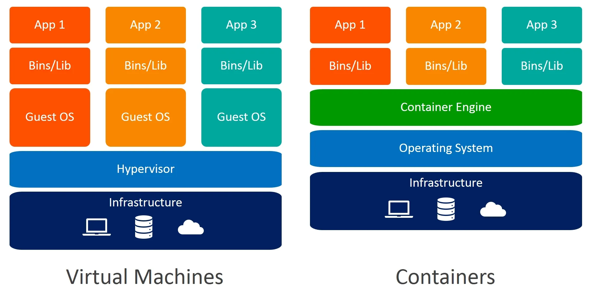
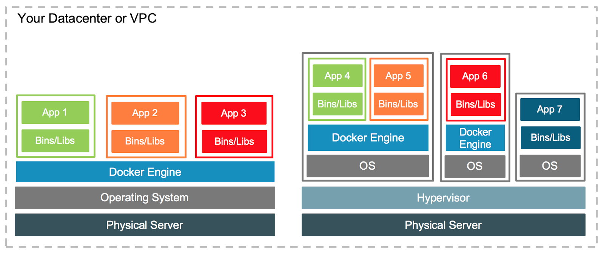

<!--Copyright © ZOMI 适用于[License](https://github.com/Infrasys-AI/AIInfra)版权许可-->

# 揭秘容器隔离性：从进程到 Namespace

Author by: 张柯帆

> 注：以下讨论基于 Linux

在上一篇文章中，我介绍了容器化作为技术的先进性，其主要体现在两方面：

1. 环境的一致性
2. 隔离性

本节会先从讲解概念入手，谈谈容器与虚拟机的对比，再逐步深入到操作系统里的技术细节。

## 容器化 VS 虚拟化

如果你之前学习过容器化技术，你可能经常会听到“沙箱”、“集装箱”之类的类比。这确实是两个非常好的比喻：“集装箱”试图说明不同容器之间存在明确的**边界**而互不影响，也隐含了易于搬运的特性；而 Docker 这个词的本意——码头（Dock），则恰如其分地扮演了装卸、管理这些集装箱的角色。我们所说的容器化环境，就像一个自动化的高效码头。”

不过，若是只考虑隔离性，虚拟机也能做到，为什么非得用容器呢？



看这张架构图可以发现：容器是建设在**操作系统之上的**，会利用原本操作系统的能力来部署应用；而虚拟机的方案则是虚拟出任意多个操作系统，再在虚拟操作系统上部署应用。那既然容器是在操作系统之上的应用，那虚拟的操作系统能否继续安装 Docker 呢？答案是肯定的，例如下图的右半部分：



所以虚拟机跟容器并不是非此即彼的关系，而是可以协同工作，解决不同的问题。

但我们需要容器，主要是因为容器在**效率、速度和可移植性**上提供了巨大的优势，这在云原生的微服务架构中十分重要。

- **虚拟机（VM）就像独栋房子**
  - 每栋房子都有自己的地基、水管、电路、煤气系统（即完整的操作系统和虚拟硬件），然后你才能在里面住人、放家具（运行你的应用）。房子之间隔离性非常好，但建造起来又慢又耗费资源。主要通过 Hypervisor（如 VMware, KVM, Hyper-V），在物理硬件之上虚拟出一整套硬件（虚拟CPU、内存、硬盘、网卡）。
  - 缺点：完整的操作系统通常需要独占大量的磁盘空间（几十GB）和内存（几百MB到几GB），而且启动时需要像启动一台真实电脑一样，耗费较多时间。
- **容器（Container）就像公寓楼里的一个个套间**
  - 整栋楼共享同一个地基、总水管和总电路（即宿主机的操作系统内核）。每个套间（容器）只包含自己的家具和生活用品（即应用及其依赖库），并且有独立的门锁和墙壁（通过 Namespace 和 Cgroups 实现隔离）。入住（启动）非常快，而且在一栋楼里可以容纳很多住户（高密度）。
  - 优点：容器本身非常轻量级（几MB-几GB），启动速度更快（秒级甚至毫秒级），由于没有 Hypervisor，资源损耗很少。另外由于是共享宿主机资源，也使得部分场景下的超卖成为可能。

| 特性     | 虚拟机 (Virtual Machine)               | 容器 (Container)                                      | 为什么容器胜出？                                                                             |
|----------|----------------------------------------|-------------------------------------------------------|----------------------------------------------------------------------------------------------|
| 启动速度 | 慢 (分钟级/秒级)                       | 快 (秒级/毫秒级)                                      | 部署更快，方便弹性伸缩，敏捷性更高                                                           |
| 资源开销 | 高 (GB级内存/磁盘)                     | 低 (MB级内存/磁盘)                                    | 在相同配置的服务器上，可以运行更多的容器，成本更低                                           |
| 性能     | 有 Hypervisor 层的性能损耗             | 接近原生性能，几乎没有开销                            | 应用程序运行效率更高。                                                                       |
| 可移植性 | 镜像巨大，与 Hypervisor 耦合          | 镜像小巧，分层构建，标准化（OCI 标准），移植性极强                             | 一次构建，随处运行，可移植性更强大                                       |
| 隔离性   | 强隔离 (硬件级别)                      | 弱隔离 (进程级别)                                     | 该项是虚拟机的优势。一个VM的内核崩溃不会影响其他VM。容器共享内核，内核漏洞可能影响所有容器。不过近年也有像 Kata Containers、gVisor 这样的安全容器项目 |
| 应用场景 | 运行不同操作系统、强安全隔离、传统应用 | 微服务、CI/CD (持续集成/持续部署)、快速迭代、弹性伸缩 | 符合现代云原生部署需求                                                                       |

> 注：在云上，通常会在虚拟机中运行容器编排系统（如 Kubernetes），然后在这些虚拟机节点上部署和管理成千上万的容器。这种模式既利用了虚拟机的安全隔离能力，又享受了容器带来的所有好处。

## 隔离技术

在容器中，隔离具体是怎么实现的呢？怎么能做到不同的应用互不影响呢？

认知：**应用隔离的本质是资源隔离**。无论是虚拟机、容器还是简单的进程，实现“隔离”的手段，都是限制一个应用程序能够访问和使用的资源。这些资源可以分为不同层次：

- **硬件资源**：CPU 时间、内存空间、硬盘 I/O、网络带宽。虚拟机（VM）主要是在这个层面做隔离。
- **内核资源**：进程ID（PID）、用户ID（UID）、网络协议栈、文件系统挂载点。容器（如 Docker）主要是在这个层面做隔离。
- **运行时资源**：特定编程语言独有的资源，比如 Java 虚拟机（JVM）中的类、堆内存，也有资源隔离的诉求。

假设你要写一个输出 `Hello World` 的程序。不论你用什么编程语言实现（先忽略 Java、Python 这种使用解释器的情况），最终都需要将代码编译成操作系统可以理解的可执行文件，在 Linux 下则是 ELF(Executable and Linkable Format)。这时的程序还只是硬盘上的 01 字节，但只要执行起来，操作系统就会将这个文件加载到内存里，为其分配运行所需要的各种资源和一个 id，然后交给内核调度。此时运行中的程序已经变成内存空间里的数据、打开的文件、堆栈状态的总和，被称为**进程**（Linux 其实不区分进程、线程，统一叫 LWP，下文统一称为进程）。这个进程也有一个数据结构，在 Linux 中被定义为 `task_struct`，是操作系统调度的一个实体，其持有运行一个程序所必要的内存空间、文件描述符、信号处理等**资源**。`task_struct` 结构体过于庞大，我们可以简单一窥几个重要成员。

```c
struct task_struct {
    unsigned int		    __state; // 表示当前进程状态，例如可运行、睡眠、僵死等。
    void				        *stack;  // 指向进程的内核栈。
	  struct sched_entity	se;      // CFS（完全公平调度器）的调度实体。
    struct mm_struct	  *mm;     // 指向进程的内存描述符结构（mm_struct），管理进程的虚拟内存。
	  pid_t				        pid;     // 进程ID
	  struct fs_struct	  *fs;     // 指向文件系统信息结构，记录进程的当前工作目录、根目录等文件系统相关信息。
    struct files_struct	*files;  // 指向进程打开的文件表
    ...
}
```

可以看到，`task_struct` 中包含了进程ID(pid)、内存空间(mm)、文件系统(fs)等与资源相关的字段。那么，要实现隔离，思路就变得清晰了：只要我们能让一个进程在访问这些资源时，看到的是一套“专属”的版本，不就实现了隔离吗？比如，让进程A看到的进程列表里只有它自己，让它看到的文件系统根目录是一个特定目录，分配给它的CPU和内存是受限的。Linux 内核恰恰提供了实现这两大目标的两大核心技术：Namespace（命名空间） 和 Cgroups（控制组）。

- Namespace：**解决“看不看得到”的问题**。 它负责“欺骗”进程，为进程创建一个独立的视图，让它感觉自己独占了整个系统资源（如独立的PID、网络、文件系统）。这是一种视图隔离。
- Cgroups：**解决“用多少”的问题**。 它负责限制进程实际能使用的物理资源量，比如CPU、内存、磁盘I/O。这是一种资源限制。

我们可以通过 docker 命令直观感受一下这两项技术的威力。

假设你已经安装了 docker 环境，可以运行以下命令来启动一个容器：

```sh
docker run -it alpine /bin/sh
```

以上 docker 命令的含义就是：启动一个容器，并在容器里运行 `/bin/sh` 程序，同时为当前的终端分配一个可交互的 TTY。当启动完成后，你在终端上的输入就会传输到容器内部，而容器的输出也会传输到你当前的终端。这时候，一个运行着 `/bin/sh` 的程序就运行在了你的宿主机上。此时如果你使用 `ps` 命令检查容器内的进程，你会发现这样的输出：

```bash
/ # ps
PID  USER   TIME COMMAND
  1 root   0:00 /bin/sh
  7 root   0:00 ps
```

这个容器里居然只有 2 个进程，且 1 号进程居然是 `/bin/sh` 而不是 Linux 的引导进程 `init`。如果你在宿主机也运行 `ps`，也许能看到这样的输出：

```sh
/ # ps
PID     USER   TIME COMMAND
...
  29965 root   0:00 /bin/sh
```

这意味着这个容器的进程空间跟宿主机已经完全不同了。这种机制，其实就是对被隔离应用的进程空间做了手脚，使得这些进程看不到其他进程，并且以为自己就是 1 号进程。可实际上，他们在宿主机的操作系统里，还是原来的进程 PID。这就是 Namespace 技术。

PID Namespace 的使用也非常简单，在创建 Linux 子进程的时候传入一个参数即可：

```sh
int pid = clone(fn, stack, SIGCHLD | CLONE_NEWPID, NULL); 
```

只要设置 `CLONE_NEWPID` 这个 flag，子进程就会被创建到一个新的 PID Namespace 里。在这个新的 Namespace 中，这个子进程就是第一个进程，因此它的 PID 为 1。但是父进程拿到的 `pid` 还是其在物理机上的真实 PID。

子进程创建子子进程和子子子进程时可以继续设置 `CLONE_NEWPID` ，每个子进程在自己的视角里都会认为自己是 1 号进程，在父进程里则会看到递增的 PID：2、3...。而从“上帝视角”（即父进程所在的 Namespace）看，拿到的 `pid` 变量依然是它在宿主机上的真实 PID。

那么资源限制呢？ 这就要靠 Cgroups 了。虽然我们无法用一个简单的命令直观展示，但其原理就是将进程放入一个特定的“控制组”里。我们可以对这个组设置资源的上限。例如，我们可以规定某个容器内的所有进程，CPU 使用量不能超过50%，内存最多只能使用512MB。一旦超出，内核就会进行干预（如限制CPU时间、或杀死进程）。

Docker 正是巧妙地将 Namespace 的视图隔离和 Cgroups 的资源限制结合在一起，才为我们提供了轻量而强大的容器环境。

不过 [PID Namespace](https://man7.org/linux/man-pages/man7/pid_namespaces.7.html) 只能隔离 PID 的视图。为了隔离其他内核资源，Linux 还提供了 [Cgroup](https://man7.org/linux/man-pages/man7/cgroup_namespaces.7.html)、[IPC](https://man7.org/linux/man-pages/man7/ipc_namespaces.7.html)、[Network](https://man7.org/linux/man-pages/man7/network_namespaces.7.html)、[Mount](https://man7.org/linux/man-pages/man7/mount_namespaces.7.html)、[Time](https://www.man7.org/linux/man-pages/man7/time_namespaces.7.html)、[User](https://man7.org/linux/man-pages/man7/user_namespaces.7.html)、[UTS](https://man7.org/linux/man-pages/man7/uts_namespaces.7.html) 等 Namespace。

总结一下：**容器的隔离，本质就是资源的隔离**，技术上利用了 Linux 内核提供的两大特性：Namespace 负责构建“与世隔绝”的独立视图；而 Cgroups 则像一个“资源管家”，严格限制每个容器能消耗的资源配额。

在接下来的文章中，我们还会详细介绍 Cgroups 的技术细节。