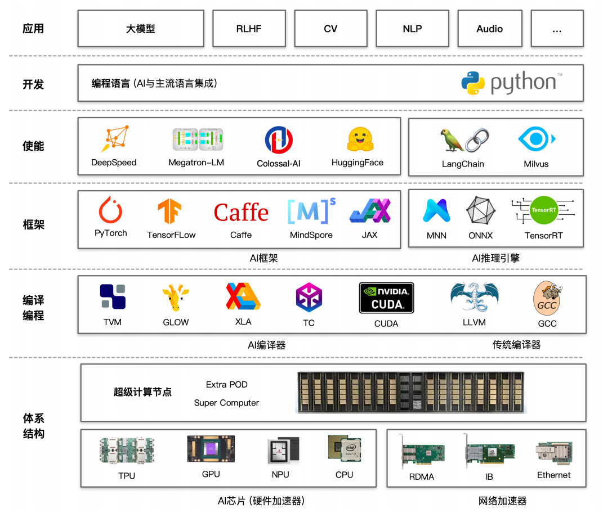

# 分布式并行基础

在人工智能的浩瀚星空中，大模型犹如一颗璀璨的新星，散发着无与伦比的光芒。它以惊人的智慧和能力，不断拓展着我们对机器认知的边界，为各个领域书写着前所未有的壮丽篇章。然而，大模型的成功并非偶然，其背后蕴含着复杂而精妙的技术体系。分布式并行技术作为其基石，支撑着大模型的训练与优化，使其能够在海量数据和复杂计算中高效运转，展现出非凡的智能。本节将带您走进分布式并行的世界，探索其在大模型训练中的重要作用和深远意义。

## 分布式并行框架介绍

随着人工智能技术的飞速发展，数据规模呈爆炸式增长，模型复杂度也在不断提高，这给传统的单机训练模式带来了严峻的挑战。单机训练面临着计算资源有限、训练速度缓慢、难以处理大规模数据等诸多棘手问题，严重制约了大模型性能的提升和应用的拓展。面对这些瓶颈，分布式并行技术成为了大模型训练的破局之路。
分布式并行技术的核心思想是将大规模的计算任务分解为多个子任务，分配到多个计算节点上进行并行处理，通过高效的通信和协调机制，将各个节点的计算结果整合起来，从而实现整体任务的快速完成。在大模型训练中，数据规模庞大、模型参数众多，单机难以承载如此庞大的计算量，分布式并行技术为解决这一难题提供了有效的途径。
为了更好地理解分布式并行在大模型训练中的意义，首先我们要明晰深度学习中的训练耗时公式组成：
<!-- $训练耗时 = 训练数据规模 × 单步计算量 / 计算速率$ -->
$$\text{训练耗时} = \frac{\text{训练数据规模} \times \text{单步计算量}}{\text{计算速率}}$$
<!--  -->
$$\text{计算速率} = \text{单设备计算速率} \times \text{设备数} \times \text{多设备并行效率（加速比）}$$
从公式中我们可以直观地看出，训练耗时是和训练数据规模、单步计算量和计算速率是强相关的，而在实际应用中，我们拥有的数据规模通常是固定的，模型也是已经选型好的，单步计算量相对固定，那么我们能改变的就只有计算速率，计算速率越高，训练耗时就越短。计算速率由单设备计算速率、设备数和多设备并行效率（简称加速比）共同决定。
其中，单设备计算速率主要由Moore定律（处理器的性能大约每两年翻一倍，同时价格下降为之前的一半）、制成工艺、封装工艺等因素决定，这一部分相对固定，但可以通过优化算法进行优化。也就是说，在提高计算速率上，我们能控制的可变因素有优化算法、设备数和多设备并行效率。
1. 对于单设备的计算速率，我们可以通过混合精度、算子融合和梯度累加等方法来提高
2. 因为单个设备无法容纳我们的大模型，所以我们要增加设备数，使之成为一个集群，进而提升计算速率。
3. 在引入集群之后，我们面临着新的问题——并行的效率问题。其中，比较典型的并行有数据并行、模型并行、流水并行等，这些内容会在后续详细展开。

### 硬件体系的支持

提及大模型的分布式并行训练，首先要介绍的就是硬件体系对分布式的支持。

AI系统+大模型全栈架构图（可能需要更换图源）

+ **硬件接口抽象：** GPU/TPU/NPU和各种DSA。统一硬件接口抽象可以服用编译优化策略，让优化与具体底层设备和体系结构适当解耦。
+ **可扩展网络：** RDMA，InifiBand，NVLink等。提供高效NPU到NPU互联，更高带宽，更灵活通信原语与搞笑的通信聚合算法。
+ **集群硬件体系结构：** 负责集群的建设，包括存储、网络和程序的执行，互联与加速。
+ **作业调度和资源管理：** 在更广的层面，作业与作业间需要平台提供调度，运行期资源分配与环境隔离，异构资源集群管理等。将服务器资源池化，通过高效的调度器结合深度学习作业特点和异构硬件拓扑进行高效调度。

### 大模型使能层介绍
在AI框架之上，我们构建了一层使能层，在本书中我们更多指分布式训练框架。对于推理，出于对速度的追求，我们通常不愿意采用分布式的方式。当然，随着大模型规模的不断增大，分布式推理也逐渐成为一种必然选择。
**解决大模型分布式训练：**
1. 部署和训练Transformer类型结构的大模型；
2. 提供数据并行、模型并行和流水并行等分布式并行模式，也就是我们俗称的PTT多维并行的并行模式；
3. 以集合通信和参数服务器方式进行资源整合。
### 加速库简介
随着模型的不断增大，并行已经成为一种在有限硬件资源上训练大型模型、提升训练速度的关键策略。HuggingFace创建的加速库，能够帮助用户实现在单台机器的多个GPU或者多台机器的多个GPU上轻松训练Transformers模型。下面我们将对部分加速库进行总览介绍。
#### DeepSpeed
DeepSpeed是**微软**开发的一款致力于提升**大模型训练效率**和可扩展性的优秀工具。其优势在于提供了多种强大的加速训练手段：
1. 加速训练手段：DeepSpeed涵盖数据并行（ZeRO系列）、模型并行（PP）、梯度累积、动态缩放、混合精度等技术，高效加速模型训练，提升速度与效率，助理模型快速收敛；
2. 辅助工具：提供分布式训练管理、内存优化和模型压缩等功能，全方位满足开发者需求，帮助开发者更好管理和优化大模型训练任务；
3. 快速迁移：通过Python Warp方式基于PyTorch来构建，开发者可直接调用接口，轻松实现从单机到分布式环境的快速迁移，方便快捷。

DeepSpeed广泛应用于大模型训练，其优势在预训练环节及与HuggingFace Transformers 框架结合使用时尤为显著，但在其他场景下的应用相对有限。

#### Megatron-LM
Megatron-LM是**NVIDIA**开发的利器，专注于提高**大模型分布式并行训练效率和线性度：**
1. 加速训练手段：通过综合数据并行（Data Parallelism），张量并行（Tensor Parallelism）和流水线并行（Pipeline Parallelism）来复现GPT-3，有效提升大规模模型的训练效率，加快模型收敛速度；
2. 辅助工具：配备了强大的数据处理和Tokenizer功能，能够高效地处理和转换数据，为基于Transformer结构的LLM（大型语言模型）和VLM（视觉语言模型）等大模型提供有力支持，确保模型可以准确理解和生成高质量的内容。

然而，Megatron-LM的工程实现不够优雅，存在版本管理问题，实际使用中可能给用户带来不便。

#### Colossal-AI & BMTrain
**Colossal-AI**凭借多种优化策略高效提升训练效率并**降低显存需求**：
1. 加速训练手段：其拥有更加丰富的张量并行策略，包括 1D/2D/2.5D/3D-TP等，为大模型训练提供了多样化的并行计算方案，能够充分挖掘硬件的并行计算能力，加快训练速度；
2. 丰富案例：Colossal-AI还提供了20+大模型DEMO和配置文件，这些资源融入了最新的MOE（Mix of Experts）技术和SORA（一种优化方法），为开发者提供了宝贵的实践参考和应用范例，助力快速上手和深入探索大模型训练。

**BMTrain**则专注于训练数**百亿规模参数**大模型：
1. 模型支持：BMTrain 主要支持智源研究院Aquila系列的模型分布式并行框架，为该系列模型的高效训练和优化提供了强大的支持；
2. 加速训练手段：支持对DeepSpeed中的并行策略进行深度优化，进一步提升了模型训练的效率和性能，使得大规模模型的训练更加高效、稳定。

### 总结：分布式加速库/分布式加速框架
分布式加速库和框架在大模型的训练与推理中扮演着至关重要的角色。它们不仅赋予了大模型多维分布式并行的能力，使其能够在AI集群上实现高效的训练和推理，更极大地提升了模型和算力的利用率，增强了AI集群的线性度。随着大模型的不断发展，分布式加速技术将继续发挥其关键作用，为人工智能领域带来更多突破和创新。