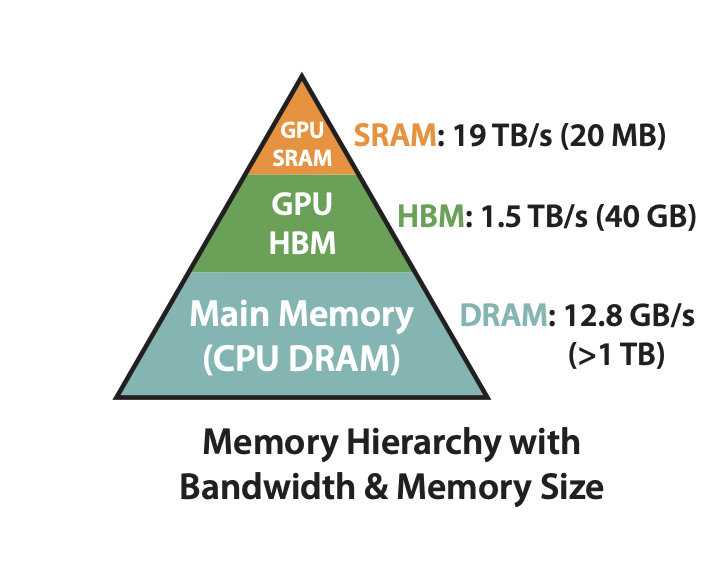
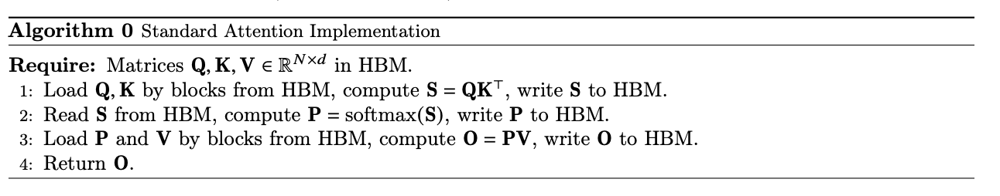

# 计算优化：Flash Attention优化

由于核心的Attention模块计算的时空复杂度会随着序列长度的增加呈二次（平方）增长，所以Transformer结构在长序列场景计算速度慢且显存消耗较大，FlashAttention提出通过tilling / recompute的方式，减少了显存占用，加速模型训练并提升了模型效果。

## 标准的Attention及问题
首先我们来简单回顾一下标准Attention的算法公式：

$$
\text{Attention}(Q, K, V) = \text{softmax}\left(\frac{QK^T}{\sqrt{d_k}}\right)V
$$
输入为 $Q,K,V \in \mathbb{R}^{N \times d}$ , 其中 $N$ 表示序列长度，$d$ 表示注意力头的维度。在模型实际训练时，我们通常考虑通过GPU进行加速，GPU的内存由多个不同大小和不同读写速度的内存组成。以A100-40GB为例，内存分级图如下所示：

* SRAM：shared memory，共20MB，带宽19TB/s
* HBM：global memory，即显存，共40GB，带宽1.5TB/s

可以看到，HBM的带宽远低于SRAM的带宽。结合GPU内存分级存储架构，我们可以将标准Attention算法的实际执行过程抽象出如下流程：

* 计算注意力分数：首先从HBM中读取 $Q,K$，计算 $S=QK^\top \in \mathbb{R}^{N \times N} $ 并将结果 $S$ 写回HBM，此时访存次数为 $O(Nd+N^2)$
* 计算注意力权重：从HBM中读取 $S$,计算 $P=softmax(S) \in \mathbb{R}^{N \times N} $ ，并将 $P$ 写回HBM, 访存次数为 $O(N^2)$
* 加权求和：从HBM中读取 $P, V$, 计算 $O=PV$ , 并将结果 $O$ 写回HBM, 访存次数为 $O(Nd+N^2)$
* 返回结果：返回 $O$

由此可见，在标准Attention的计算过程中，存在非常多对HBM的访问，同时，部分中间变量在计算完成写入HBM后又立刻被访问，如：$S, P$，这会带来两个问题：
1. 访存瓶颈：HBM带宽较低，频繁的HBM读写操作导致内存访问成为瓶颈，进而导致计算效率降低
2. 显存OOM：中间变量的存储消耗大量显存空间，$S$ 的大小为 $N \times N$，显存占用随序列长度平方增长

为了避免中间变量S和P可能引发的低速读写以及显存压力，一个比较朴素的想法是将三个计算融合为一个算子。但是为了利用SRAM的高带宽，GEMM（通用矩阵乘法）通常需要将数据进行Tiling处理，放进SRAM中进行计算。但SRAM仅20M，当序列较长时就会被截断，从而导致标准的SoftMax无法正常工作，Flash Attention解决了这个问题。

## Flash Attention V1
### SoftMax Tiling
### 重计算（Recomputation）
### 性能分析
### 缺陷

## Flash Attention V2
### 

## Flash Attention V3
## 