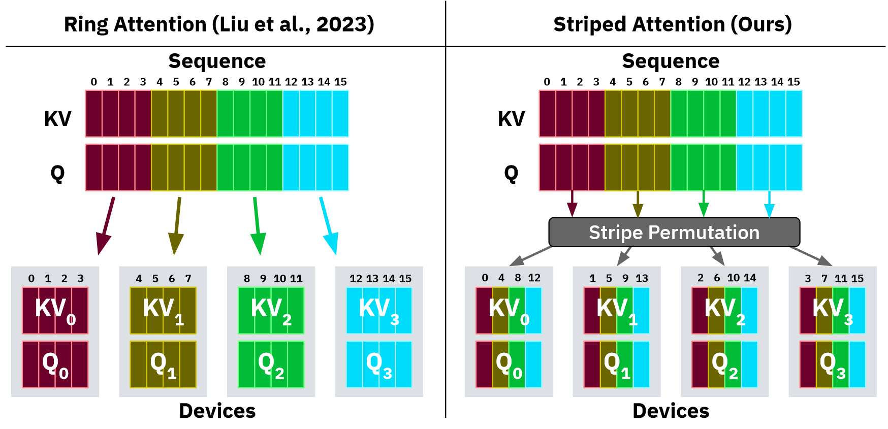

# 序列优化： Ring Attention 优化算法

- Author by: 管弘毅

## Context Parallel 计算

大模型的发展趋势之一是支持更长的上下文长度（Context Length），使模型能够在对话过程中保留更多的历史信息，从而在多轮对话中维持一致性，避免遗忘初始的问题背景而导致回答偏离主题。

现在几家大公司都推出了自己可以记忆超长上下文的模型，例如：

> - **Meta’s Llama 4 Scout** extends ultra-long context capabilities with a **10 million** token context window, perfect for on-device multimodal workflows, deep video/audio transcript analysis, and full-book summarization.
> - **OpenAI’s GPT-4.1, Google’s Gemini 2.5 Flash & 2.5 Pro, and Meta’s Llama 4 Maverick** all offer massive **1 million** token context windows, ideal for complex multimodal tasks, enterprise-grade document analysis, “Deep Think” hypothesis generation, and large-scale codebase comprehension.
> - **Anthropic’s Claude 4 (Opus 4 & Sonnet 4), Anthropic’s Claude 3.7 Sonnet & 3.5 Sonnet, and OpenAI’s o3 & o4** models provide robust **200k** token context windows, optimized for high-precision multi-step workflows, deep research, and cost-efficient reasoning with full toolchain support.
> - **OpenAI’s GPT-4o, Mistral Large 2, and DeepSeek R1 & V3** deliver flexible solutions with **128k** token context windows, balancing efficiency and performance across tasks including vision-language understanding, advanced summarization, code generation, and resource-efficient on-device deployments.

随着模型上下文长度的增加，Tensor Parallel (TP) 域内的单个节点内存不再足以容纳完整的序列；并且，即使采用完全重计算的方案，LLM 层间传递的 token 仍需要被存储，这些数据的总量随着序列长度线性增长，因此我们需要使用 Context Parallel (CP) 来对上下文进行分布式存储和并行计算。

Context Parallel (CP) 的核心思想是在序列维度上进行数据切分，将不同的部分分配给不同的节点进行存储和计算。在序列维度上进行切分不会影响 LLM 中的大部分组件，例如 LayerNorm 和 FFN 层都是针对单个 Token 进行操作。从计算角度来看，CP 与 Flash Attention 有很强的相似性，两者都是让同一个 Query 分别与多个 Key/Value Block 进行分块计算，最后合并得到完整结果。二者的主要差异在于：Flash Attention 的目标是优化单个 GPU 在计算 Attention 时的内存访问模式，而 CP 的目标是将完整的序列分布到多个计算节点上，减少每个计算节点所需的内存量。

在 Attention 模块中，每个 Node 上的每个 Token 都需要访问所有 Node 上计算出的 Key/Value 对（或者在考虑了 Causal Mask 的情况下，需要访问所有前序 Key/Value 对）。这样的数据需求看似会带来非常大的通信开销，但在实际应用中，CP 却是一种简单且高效的方案，这正是我们本节要介绍的 Ring Attention 算法的精髓所在。

## Ring Attention

### Naive Implementation

在 Ring Attention 的实现过程中，每个计算节点首先启动异步通信操作，将其 Key/Value 对发送给下一个计算节点。在等待接收其他计算节点数据的同时，当前节点会先计算本地已有数据部分的 Attention Score。理想情况下，下一个 Key/Value 对会在本轮计算结束前从前一个计算节点接收完成，这样本节点就能在完成当前计算后立即开始下一轮计算，实现计算与通信的重叠。

下面以一个包含 4 个 GPU 的系统为例，展示 Ring Attention 中多个计算节点之间的连接关系。需要注意的是，为了便于理解，此处暂时忽略 Causal Mask 的影响。


完整的计算流程表述如下：

1. 数据分发：将 Q/K/V 按照序列方向分别放置在 N 个计算节点中，形成环形拓扑
2. Key/Value 对传递：Key 和 Value 按照环形传递，将本地数据传输给下一个节点，并从上一个节点接收数据
3. 计算：每个节点使用其本地的 Query 和接收到的 Key/Value 对进行 Attention 计算
4. 循环：重复执行 N-1 次，直到获得整个序列的 Attention 层计算结果

看完图片，相信读者已经可以理解本机制为什么叫 Ring Attention 了。

### Causal Masking

在 Attention 计算中，我们需要注意前序的 Token 不能从后序 Token 获取信息，否则会引入因果性错误。因此需要将这部分的 QK^T 计算结果置零，即这部分计算是不必要的。如下图左侧矩阵所示，其中黑色部分代表不需要计算的区域，即被 Causal Mask 遮盖的部分。


我们很容易发现，由于 Query Block 是按行直接均匀切分后放置在不同计算节点中的，第一个计算节点上需要实际完成的计算只有 Block A，其他计算都是无效的。这样的切分方式无法将所有计算任务均匀分配到各个节点，因此后续有更多研究探索如何尽可能均衡地进行任务分配。

### Striped Attention

Striped Attention 的作者将 Naive 方案中按序列直接分块切割的方式改变为用 Stride 抽取 Token 后组合成一个 Block，下面给出一个例子：

- Naive
  ```
  0,1,2,3 | 4,5,6,7 | 8,9,10,11 | 12,13,14,15
  ```
- Striped Attention
  ```
  0,4,8,12 | 1,5,9,13 | 2,6,10,14 | 3,7,11,15
  ```

可以参考对应论文中的图片：



此时，对应的数据流如下所示：


此时，每个 Round 中每个计算节点的负载相对均衡，但在实际计算过程中仍然存在一定的差异。

### Zig Zag Attention

Zig Zag Attention 的方案在 Striped Attention 的基础上进行了进一步的优化，它选择将 Context 对称位置的数据合并组成一个 Block，如下图所示：


与上述对应的例子为：

- Zig Zag Attention
  ```
  0,1,14,15| 2,3,12,13 | 4,5,10,11 | 6,7,8,9
  ```

相应地，在每个计算节点上需要计算的数据分布如下所示：


可以看到，每一步在每个计算节点上的计算量完全一致，实现了很好的负载均衡。


## 参考资料

- [LLMs with largest context windows](https://codingscape.com/blog/llms-with-largest-context-windows)

- [Ring Attention with Blockwise Transformers for Near-Infinite Context](https://arxiv.org/pdf/2310.01889)

- [STRIPED ATTENTION: FASTER RING ATTENTION FOR CAUSAL TRANSFORMERS](https://arxiv.org/pdf/2311.09431)

- [GPU MODE Lecture 13: Ring Attention](https://christianjmills.com/posts/cuda-mode-notes/lecture-013/#introduction-and-overview)

- [The Ultra-Scale Playbook -- Context Parallelism Section](https://huggingface.co/spaces/nanotron/ultrascale-playbook?section=context_parallelism)


- [Balancing computation with zigzag blocking](https://github.com/zhuzilin/ring-flash-attention/issues/2#issuecomment-2236746166)


