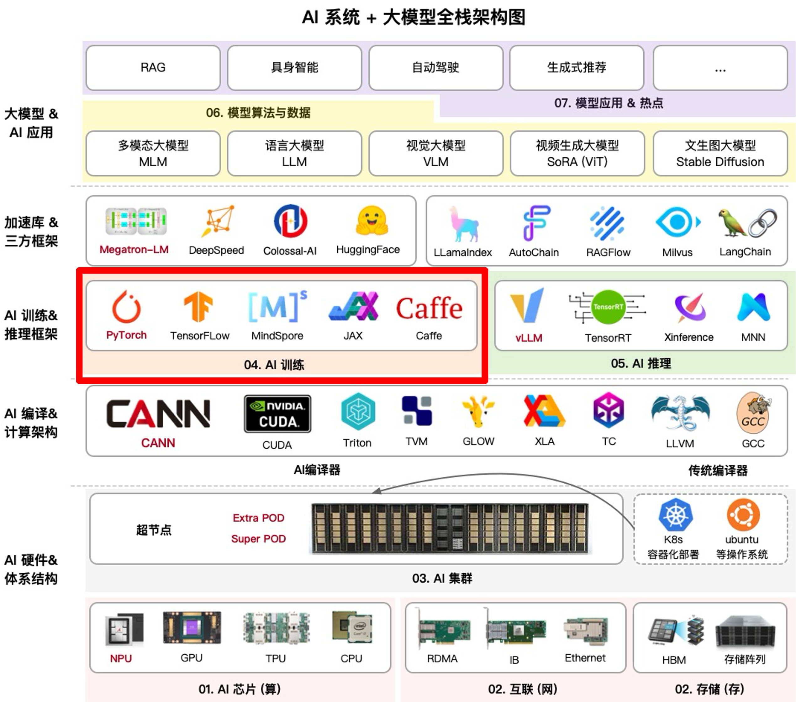
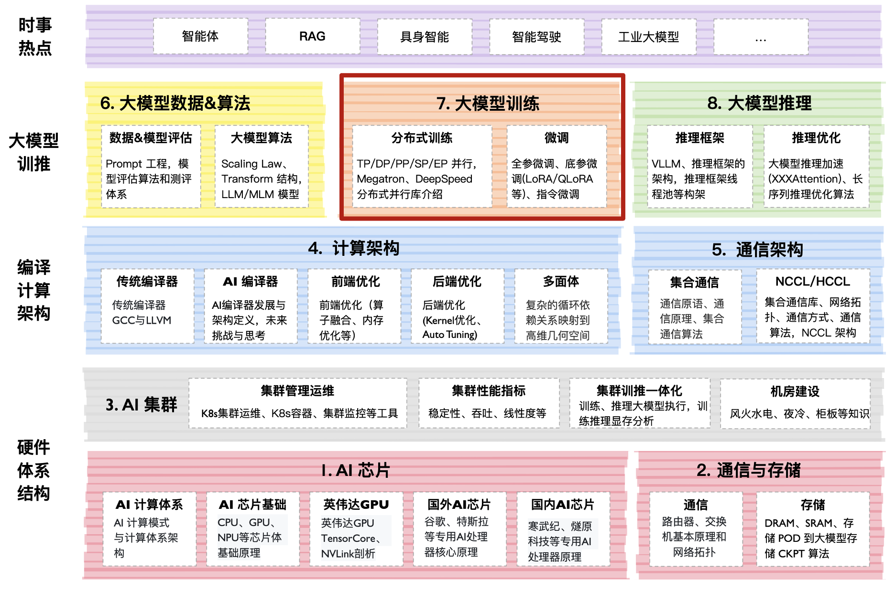

<!--Copyright © ZOMI 适用于[License](https://github.com/Infrasys-AI/AIInfra/)版权许可-->

# 大模型训练概述

大模型训练的核心特点在于大规模分布式训练和高效 AI 框架的协同。分布式训练通过数据并行、模型并行等技术，将计算任务分散到多个 GPU 或节点，显著提升训练速度与规模。AI 框架（如 PyTorch）提供分布式支持、混合精度计算和梯度优化，确保高效资源利用与稳定收敛。两者结合，使训练千亿级参数的模型成为可能，同时降低硬件成本与能耗。

## 课程位置

## 课程简介

- [**《分布式并行》**](./01Parallel/)：大模型分布式并行通过数据并行、模型并行和流水线并行等策略，将计算任务分布到多个设备上，以解决单设备内存和算力不足的问题。数据并行复制模型，分发数据；模型并行分割参数；流水线并行分阶段处理。混合并行结合多种方法优化效率，同时需解决通信开销和负载均衡等挑战，提升训练速度与扩展性。

- [**《PyTorch 框架》**](./02PyTorch/)：PyTorch 在大模型时代以动态计算图为核心，提供灵活性和易用性，支持自动微分与 GPU 加速。其模块化设计便于扩展，兼容分布式训练（如 torch.distributed），助力数据、模型和流水线并行。通过 TorchScript 支持静态图部署，结合生态系统（如 Hugging Face、DeepSpeed），优化大规模模型的训练与推理效率，满足高性能需求。

- [**《模型微调与后训练》**](./03Finetune/)：大模型微调与后训练旨在适应特定任务或领域，通过调整预训练模型参数或部分参数实现高效迁移。微调通常使用小规模标注数据，更新全量或部分参数；后训练则在大规模未标注数据上继续训练，增强泛化能力。两者均需权衡计算成本与性能，常结合技术如 LoRA、量化等优化效率，同时避免过拟合和灾难性遗忘问题。

希望这个系列能够给朋友们带来一些帮助，也希望 ZOMI 能够继续坚持完成所有内容哈！欢迎您也参与到这个开源课程的贡献！

## 课程知识

## 备注

文字课程开源在 [AIInfra](https://infrasys-ai.github.io/aiinfra-docs)，系列视频托管[B 站](https://space.bilibili.com/517221395)和[油管](https://www.youtube.com/@ZOMI666/playlists)，PPT 开源在[github](https://github.com/Infrasys-AI/AIInfra/)，欢迎取用！！！

> 非常希望您也参与到这个开源课程中，B 站给 ZOMI 留言哦！
> 
> 欢迎大家使用的过程中发现 bug 或者勘误直接提交代码 PR 到开源社区哦！
>
> 欢迎大家使用的过程中发现 bug 或者勘误直接提交 PR 到开源社区哦！
>
> 请大家尊重开源和 ZOMI 的努力，引用 PPT 的内容请规范转载标明出处哦！
