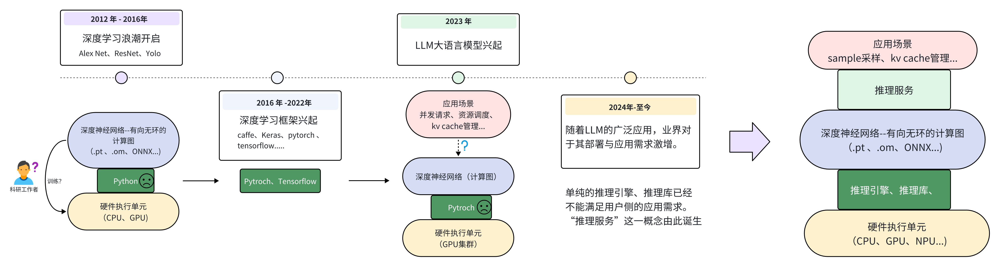
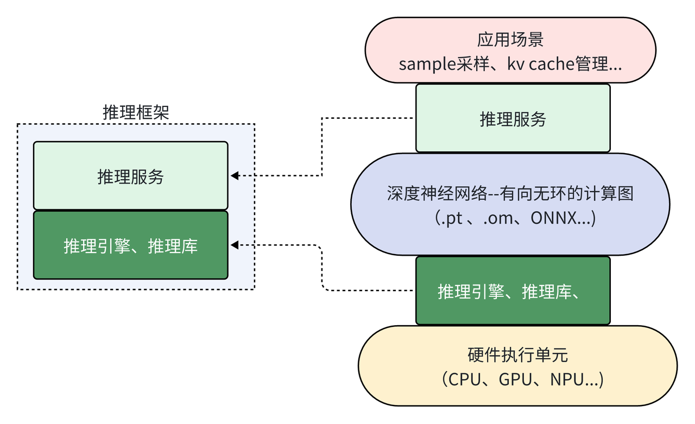

# 大模型推理框架概述

大模型的推理框架是大语言模型应用需求暴增后出现的产物，也是当今大语言模型推理部署过程中最重要的组件。所以在本章中，我们将对大模型的推理框架进行简单的介绍，并初步对认识当下主流大模型推理框架的特点。

## 推理框架概念理解

对于接触过深度学习的同学来说，提到“框架”可能首先想到的是pytorch、tensorflow等深度学习框架。而对于了解过AI模型部署的同学，还了解过一些如TensorRT的深度神经网络推理引擎。那么现在我们所谓的大模型“推理框架”与这些传统的概念之间有什么联系和区别呢？

接下来让我们简单梳理深度学习的发展历程，来从需求的角度理解到底什么是大模型推理框架以及为什么现在需要大模型推理框架。

### 深度学习框架起源

从上图我们可以看到，自2012年AlexNet问世之后，大量科研领域的工作者开始研究深度学习。此时如果使用像Numpy这样的python数学库来进行深度神经网络的训练，会面临很多麻烦。例如如何利用GPU进行加速？如何对整个网络进行反向传播求梯度？...等等。在这样的需求背景下，各式各样的为深度学习而搭建的框架开始涌现。其目的就是为了方便开发人员快速搭建、训练出自己想要的神经网络。

时至今日Pytroch框架基本上成为了学术界首选的深度学习框架。而Pytroch能赢得大家喜欢的原因也很简单，那就是在此阶段，深度神经网络大大部分用户都是“科研人员”。对于他们来说，简单、易用、兼容性好就是评判一个框架最主要的标准。至于到底哪个框架运行的更快、更轻量化，绝大部分人们都不是很在乎。

### LLM应用需求爆发

随着2023年GPT4问世之后，大语言模型的巨大潜力使得深度学习真正“出圈”。各行各业开始关注LLM模型的发展与应用。至此人们对于深度学习的需求不再仅仅是“训练”，更多的用户需要一些更高效的“推理需求”。在大量的个人用户以及云服务厂商等应用侧的需求推动之下，如何将一个动辄几十上百亿参数的模型高效的部署、如何进行多卡集群的联动、合理利用硬件资源等便成为了关键的问题。显然这些需求都不是Pytroch这样以“简单、易用”的训练为目的框架能够解决的问题。所以自2024年之后，以推理服务和推理引擎构成的大模型推理框架开始不断涌现。

### 推理引擎、推理服务、推理框架概念区分

在进行后续对推理框架的对比介绍之前，我们需要明确“推理引擎”、“推理服务”和“推理框架”之间的区别和联系。正如下图所示，大部分推理框架包含了“推理服务”和“推理引擎”两大部分

其中，推理引擎部分主要是用来优化大模型在推理时，关于硬件资源的利用率、效率等偏底层的优化。也就是所谓的“runtime”运行时的优化。有的是以加速库的形式进行优化、也有例如TVM这样的深度学习编译器，都可以称之为推理引擎。而推理服务则是偏向应用层的例如KV cache的管理、模型的sample采样策略甚至是用户对话的Web界面等等。例如ollama则是一个典型的推理服务，它主要为用户提供一键式运行环境、Web界面等偏上层应用的服务，而底层后端则是有llama.cpp作为backend提供推理支持。

但是也有部分如推理框架如Lmdeploy只包含推理引擎。或者llama.cpp虽然是ollama的推理引擎，但其自身也有关于llm的服务支持，也被看作是一个推理框架。所以在后文中，除了特别情况下，我们统一将这些用于部署大语言模型的库都笼统的称为“推理框架”。

## 大模型推理加速的目的

TBD