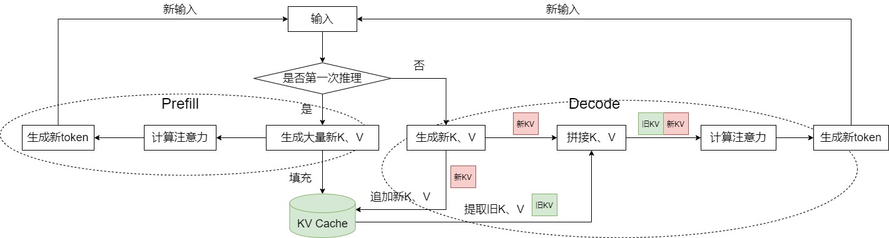

# KV Cache 原理

随着大型语言模型（LLM）的发展，模型生成的 token 长度不断增加，注意力阶段计算成为推理性能瓶颈。KV Cache 是解决这一问题的关键措施，它通过缓存已计算的 Key 和 Value 矩阵，避免在自回归生成过程中重复计算，从而显著提升推理效率。

本章节旨在对 KV Cache 技术进行全面的梳理。我们将从大模型推理的基本流程出发，解释其计算瓶颈与 KV Cache 的设计动机。在此基础上，介绍 KV Cache 的原理，及其具体实现。最后，我们将对 KV Cache 的显存开销进行定量分析。

## 大模型推理过程

### 大模型推理回顾
我们先简要回顾一下大模型推理的过程。模型依据所有已知的历史 Token 序列 $[t_1, t_2,...,t_n]$，来预测下一个最可能的 Token $t_{n+1}$，输出的 token 会与输入 tokens 拼接在一起，然后作为下一次推理的输入 $[t_1, t_2,...,t_n,t_n+1]$，这样不断重复直到遇到终止符。

为实现高效推理，这个过程在实践中被划分为两个阶段：

1. Prefill 阶段：Prefill 阶段的目标是一次性地、并行地处理用户输入的全部 Prompt，计算出用于预测第一个新 Token 的初始状态。
2. Decode 阶段：在 Prefill 阶段完成后，模型进入逐个 Token 的生成阶段。在每一步中，模型都将上一步生成的 Token 加入到历史序列中，并以此为基础预测下一个 Token，直到生成结束符或达到最大长度。

### 大模型推理的计算分析（无优化）

在了解了大模型的推理过程之后，现在来看在没有 KV Cache 的优化下，推理过程需要进行哪些计算。
我们先来看单个 token 自回归推理的计算流程，它会依次经过以下核心模块：

1. Embedding 层: 将输入的 Token 转换为其对应的词向量（Embedding Vector）。
2. QKV 计算: 词向量通过与三个不同的权重矩阵（$W_q$，$W_k$，$W_v$）相乘，生成该 Token 的 Query、Key 和 Value 向量。
3. 因果注意力计算 (Causal Attention): 在计算每个时间步的注意力时，只关注当前时间步及之前的内容
4. 前馈神经网络 (FFN): 注意力计算的输出会进一步通过一个前馈神经网络，得到该层最终的输出。这个输出将作为下一层的输入，或在最后一层用于预测下一个 Token。

整个过程的核心计算是注意力计算，其基础公式如下：
$$
\text{Attention}(Q, K, V) = \text{softmax}\left(\frac{QK^T}{\sqrt{d}}\right)V
$$

其中，$Q$ (Query), $K$ (Key), $V$ (Value) 矩阵由输入序列 $X$ 与对应的权重矩阵 $W_Q$, $W_K$, $W_V$ 相乘得到：
$$
Q = X W_Q, \quad K = X W_K, \quad V = X W_V
$$

为了方便描述，我们在之后的公式中忽略 scale 项 $\sqrt{d}$。假设我们输入的 prompt 是 h，最终的输出是 hello。

因为这里计算的是 casual attention，根据定义，第 t 个 token 的公式表示如下：
$$
Att_t = \text{softmax}\left( \frac{q_t K_t^T}{\sqrt{d_k}} \right) V_t \quad \text{其中 } K_t = \begin{pmatrix} k_1 \\ \vdots \\ k_t \end{pmatrix}, V_t = \begin{pmatrix} v_1 \\ \vdots \\ v_t \end{pmatrix}
$$


为了方便理解，我们将上述公式展开，用 $softmaxed$ 表示 softmax 对矩阵计算后的结果，来直观表示每一步的 attention 计算。
第一步输入"h"的时候，attention 计算如下：
 $$ \text{Att}_1 = \text{softmaxed}(q_1 k_1^T) \cdot v_1 $$
最终计算出了 token "e"，然后下一步我们输入"e",这个时候 attention 计算公式变成了：
$$ \text{Att}_2 = \text{softmaxed}(q_2 k_1^T) \cdot v_1 + \text{softmaxed}(q_2 k_2^T) \cdot v_2 $$
然后我们计算出了 token"l",然后我们下一步输入"l",这个时候 attention 计算公式为:
$$ \text{Att}_3 = \text{softmaxed}(q_3 k_1^T) \cdot v_1 + \text{softmaxed}(q_3 k_2^T) \cdot v_2 + \text{softmaxed}(q_3 k_3^T) \cdot v_3$$

通过上述步骤可以看到，每一次计算当前 token 的 attention 都需要之前所有 token 的 K/V,为了能够计算这些 k/v 值,当我们不采取任何优化措施时，我们需要将之前的 token 也作为输入，这样才能够计算得到我们需要的 attention，实际计算如下所示:

【todo】without cache 的计算示意图

我们可以看到这种计算模式导致总计算复杂度与生成序列长度 $T$ 的平方成正比 $O(T^2)$，这样的复杂度是不能忍受的。


## KV Cache 原理
因为有了上一节的分析，我们知道了每个 token decode 阶段具体需要用到哪些东西，由于大模型的推理是 Masked Self-Attention 每个 token 只能够看到其之前的 token 信息，因此相关当我们输入第一个 token 的时候，k1 v1 计算之后就是确定的，之后计算新的 attention 的时候，前面计算的 key 和 value 值并不会改变，我们自然想到直接将之前计算出的 key 和 value 向量缓存。

我们以第 3 个 token 为例，当我们缓存了之前的 K 与 V 之后，$\text{Att}_k$ 计算只与当前的 qk 有关，因此，只需要将当前的 token 输入，那么 attention 矩阵计算变成了如下的流程：

【todo】 with Cache 的计算示意图

我们可以清楚的看到与没有 KV Cache 相比,我们只需要输入当前的 token,然后利用缓存的 KV 就可以完成 KV 的计算

而从上述图解和公式中，也可以清晰的看到为什么没有 Q Cache。因为之前 token 的 Q 在之后 token 的 attention 计算中根本不会用到。

最后做一下总结，KV Cache 的目的就是缓存之前 token 的 K 和 V 向量，避免重复计算，以降低推理开销，其在大模型推理过程中的总流程如下：

在 prefill 阶段开始保存初始的 KV Cache，
之后在 decode 阶段每一次计算都将最新的使用保存的 KV Cache 与当前 token 最新的计算出的 KV 进行拼接，进行 self-attention 的计算。


## KV Cache 的实现

了解了 KV Cache 的原理之后，其实现变的非常简单，本质上就是在上一次缓存的 Key 和 Value 上做 concat，我们以 huggingface 的 Transformer 库的 gpt2 的实现为例[transformers/src/transformers/models/gpt2/modeling_gpt2.py ](https://github.com/huggingface/transformers/blob/main/src/transformers/models/gpt2/modeling_gpt2.py)来看具体实现过程。

早期 KV Cache 的实现如下：
```python
if layer_past is not None:
        past_key, past_value = layer_past
        key = torch.cat((past_key, key), dim=-2)
        value = torch.cat((past_value, value), dim=-2)
    
    if use_cache is True:
        present = (key, value)
    else:
        present = None
```


在每层中，每个头的 Key 向量和 Value 向量存储在内存中。使用`layer_past`变量进行存储，其维度为`[n, 2, b, h, s, d]`，每个维度的含义如下：

- 第一维 num_layers：以每一个堆叠的 Block 为单位，例如堆叠 12 层，则一共有 12 组 Key、Value 信息。
- 第二维 2：代表 Key 和 Value 这两个信息对象，索引 0 是 Key 向量，索引 1 是 Value 向量。
- 第三维 batch_size：代表 batch_size，和输入需要推理的文本条数相等，如果输入是一条文本，则 b=1。
- 第四维 num_heads：代表注意力头的数量，例如每层有 12 个头，则 h=12。
- 第五维 seq_len：代表截止到当前 token 为止的文本长度，在每一个历史 token 位置上该 token 在每一层每个头下的 Key，Value 信息。
- 第六维 d：代表 Key、Value 向量的映射维度，若 token 总的映射维度为 768，注意力头数为 12，则 d=768/12=64。

这种直接在模型代码中通过元组（Tuple）传递之前 KV 缓存并手动`torch.cat`的方式，虽然直观，但存在几个严重的问题：

1. 代码冗余：每一个支持 KV Cache 的模型都需要在自己的 Attention 模块中重复编写几乎完全相同的逻辑，一旦需要修改缓存逻辑，需要在不同的文件中进行修改
2. 扩展性不足：随着大模型技术的发展，出现了多种不同的 KV Cache 策略，比如`SinkCache`，通过抛弃过去的 tokens，允许模型生成超出其上下文呢的长度。

为了解决上述问题，huggingface transformers 库引入了`Cache` API（[transformers/src/transformers/cache_utils.py ]）(https://github.com/huggingface/transformers/blob/main/src/transformers/cache_utils.py)，将 KV 缓存封装在一个专用的`Cache`对象中，这个对象不仅负责存储数据，还负责管理自身的更新逻辑。`Cache`类主要成员与函数如下：
```python
class Cache:
    """
    Base, abstract class for all caches. The actual data structure is specific to each subclass.
    """
    is_compileable = False

    def __init__(self):
        super().__init__()

    def update(
        self,
        key_states: torch.Tensor,
        value_states: torch.Tensor,
        layer_idx: int,
        cache_kwargs: Optional[dict[str, Any]] = None,
    ) -> tuple[torch.Tensor, torch.Tensor]:
        """
        Updates the cache with the new `key_states` and `value_states` for the layer `layer_idx`.
        Return:
            A tuple containing the updated key and value states.
        """
        raise NotImplementedError("Make sure to implement `update` in a subclass.")

    def get_seq_length(self, layer_idx: Optional[int] = 0) -> int:
        """Returns the sequence length of the cached states. A layer index can be optionally passed."""

    def get_max_cache_shape(self) -> Optional[int]:
        """Returns the maximum sequence length (i.e. max capacity) of the cache object"""
        

    def get_usable_length(self, new_seq_length: int, layer_idx: Optional[int] = 0) -> int:
        """Given the sequence length of the new inputs, returns the usable length of the cache."""

    def reorder_cache(self, beam_idx: torch.LongTensor):
        """Reorders the cache for beam search, given the selected beam indices."""
```

现在模型代码处理 KV Cache 的操作更加简单，只需要调用`update()`函数即可，具体的拼接逻辑由`Cache`类完成，如下所示：
```python
if past_key_value is not None:
    if isinstance(past_key_value, EncoderDecoderCache):
        if is_cross_attention:
            past_key_value = past_key_value.cross_attention_cache
        else:
            past_key_value = past_key_value.self_attention_cache
    cache_kwargs = {"cache_position": cache_position}
    key_states, value_states = past_key_value.update(
        key_states, value_states, self.layer_idx, cache_kwargs=cache_kwargs
    )
```


关于如何开启/关闭 KV Cache，transformers 库的`generate`方法通过`use_cache`参数来指定是否开启 KV Cache。


## KV Cache 显存占用分析

值得注意的是，KV Cache 的显存占用不可忽视。KV Cache 的显存占用公式如下：

`Cache_Memory = 2 * num_layers * batch_size * seq_len * hidden_size * precision_in_bytes `

其中第一个`2` 代表我们需要保存 K/V Cache， `num_layers` 代表模型层数，`batch_size`是批次大小，`seq_len` 指当前需要缓存的序列长度，等于 Prompt 的长度加上已经生成的 Token 数量，`hidden_size` 指的是隐藏层维度，`precision_in_bytes` 指的是用于存储每个数值的字节数,取决于模型的精度，比如 FP32 需要 4 字节。
我们以 GPT3-175B 为例估算 KV Cache 占用显存，该模型主要参数如下：
| 模型    | 参数量 | 层数 | 隐藏层维度 | 
| --------  | ----------- | -----| -----| 
| GPT3     | 175B      |  96 |  12288 |

我们假设序列总长度为 1024，批次大小为 16，精度为 FP16，则 KV Cache 占用显存为 $2 \times 96 \times 16 \times 1024 \times 12288 \times 2 / 1024 / 1024 / 1024 = 72 GB$。 这个显存占用量已经约为大模型参数量的一半，消耗了大量的显存资源，这也正是针对 KV Cache 的内存优化在大模型推理领域至关重要的原因。


## 小结与思考

本章节回顾了大模型推理的过程，从大模型推理的瓶颈出发，引入了 KV Cache 的介绍，并对比是否开启 KV Cache 的推理计算过程，然后展示了 KV Cache 在大模型中的具体实现。最后给出了 KV Cache 显存占用的计算方法。


## 本节视频