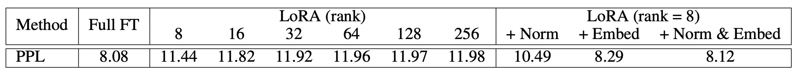
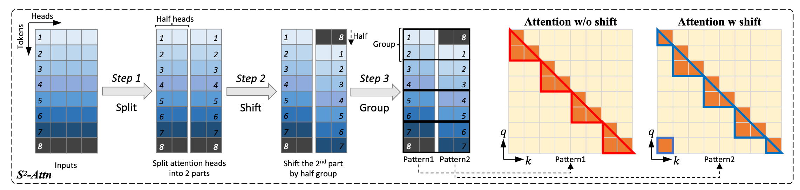

# LongLoRA 介绍
LongLoRA 是一种长序列微调方法，其核心部分是提出了 Shifted Sparsed Attention（$S^2$-Attn），在微调时启用稀疏 Attention 从而减少训练参数量以及计算量。在推理时启用的仍然是稠密 Attention。
Self-Attention 的计算复杂度可简化为$O(n^2)$，因此训练过程中 LLM 的计算量和内存压力随着序列变长而大幅增加，导致训练变慢。此外，LoRA 微调得到的长序列输出的困惑度与全量微调存在较大差距，研究表明这种差距无法通过增大 LoRA 的 rank 值进行弥补。LongLoRA 提出了$S^2$-Attn ，通过与 LoRA 进行结合，实现了在参数节约的情况下有效学习长文本序列。
相比 LoRA，LongLoRA 能够显著改善长序列输出质量：

<figure style="text-align: center;">
    
</figure>

## Shifted Sparsed Attention ($S^2$-Attn)
<figure style="text-align: center;">
    
    <figcaption>图 1：Shifted Sparsed Attention</figcaption>
</figure>

$S^2$-Attn 主要分为以下 3 步：
1. 序列分组：在训练时对输入序列平均分为 $G$ 组，例如训练时序列输入长度为8192，将其分为 4 组，每组长度为 2048，每组序列分别做 self attention。但是这样的做法存在一个问题，每组序列之间的信息不互相流动，计算时彼此隔离，因此$S^2$-Attn 参考 Swin Transformer 的思想，在每组 token 的 attention head 维度进行 shift 平移操作。

2. Shift 操作：模型的 self attention 经过上述的分组后， qkv 矩阵的维度是$(B, N, 3, H, D)$，B 表示 batch size，$N$ 表示序列长度，3 表示 qkv 三个矩阵，$H$ 和 $D$ 分别是 head 数量以及 head dim，$S^2$-Attn 将 qkv 矩阵的 $H$ 维度切分为两半，再将这两半沿着 $N$ 所在的维度错位移动$-\frac{1}{2}G$，这样每个 token 就会带有其他组的 token 的信息，实现信息流动。 

3. Attention 输出复原：经过 shift 操作之后，qkv 矩阵就可以进行标准的 self attention 计算了。不过在最终得到的 attention 输出之后，需要将矩阵反向 shift 回去，也就是沿着 N 所在的维度移动$\frac{1}{2}G$。

上述过程的 pytorch 伪代码如下：
```python
# B: batch size; S: sequence length or number of tokens; G: group size;
# H: number of attention heads; D: dimension of each attention head
# qkv in shape (B, N, 3, H, D), projected queries, keys, and values
# Key line 1: split qkv on H into 2 chunks, and shift G/2 on N
qkv = cat((qkv.chunk(2, 3)[0], qkv.chunk(2, 3)[1].roll(-G/2, 1)), 3).view(B * N / G, G, 3, H, D)
# standard self-attention function
out = self_attn(qkv)
# out in shape (B, N, H, D)
# Key line 2: split out on H into 2 chunks, and then roll back G/2 on N
out = cat((out.chunk(2, 2)[0], out.chunk(2, 2)[1].roll(G/2, 1)), 2)
```