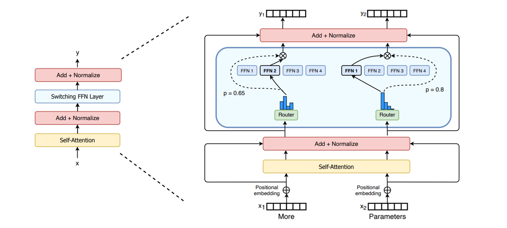
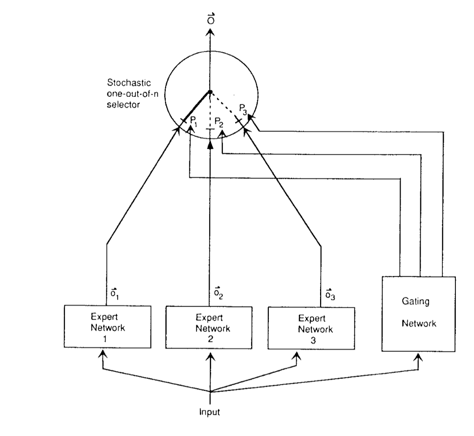
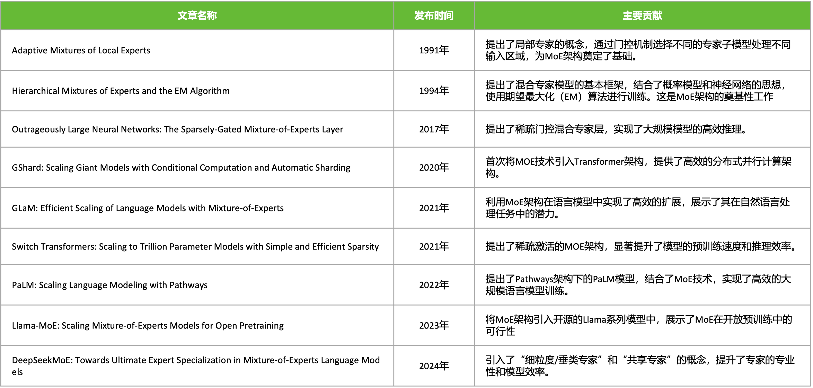
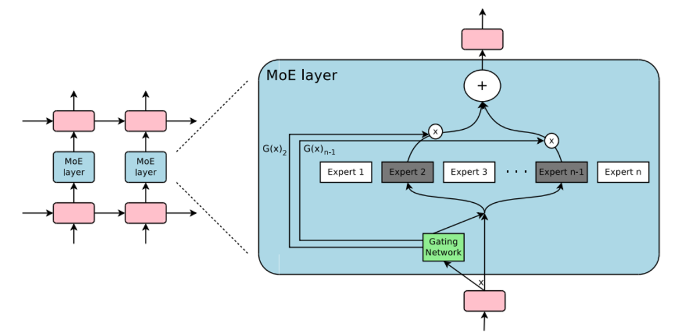
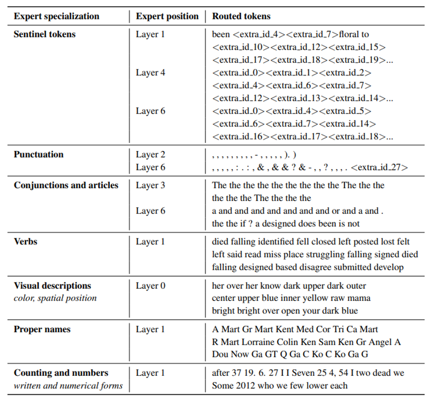
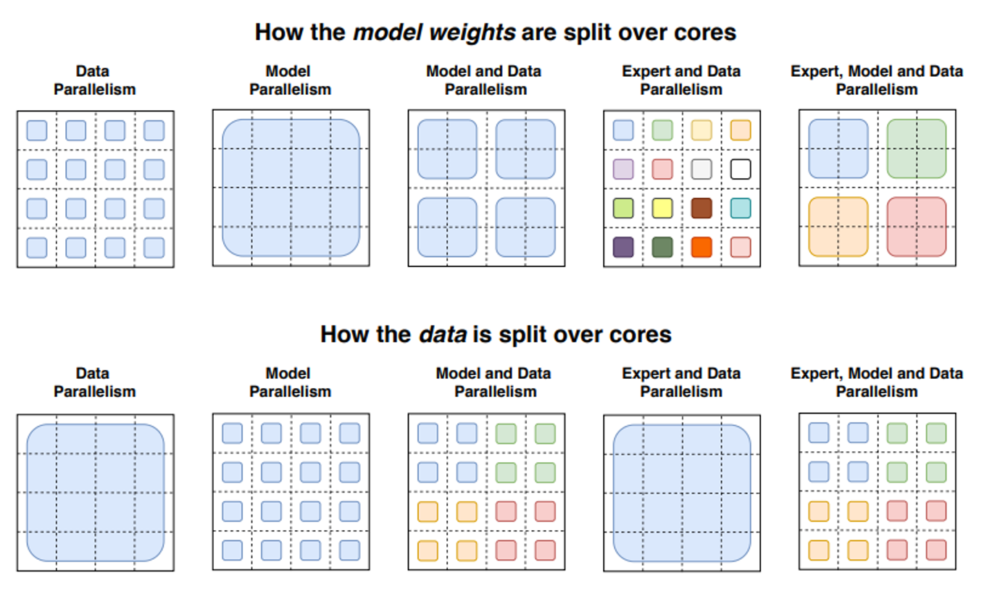
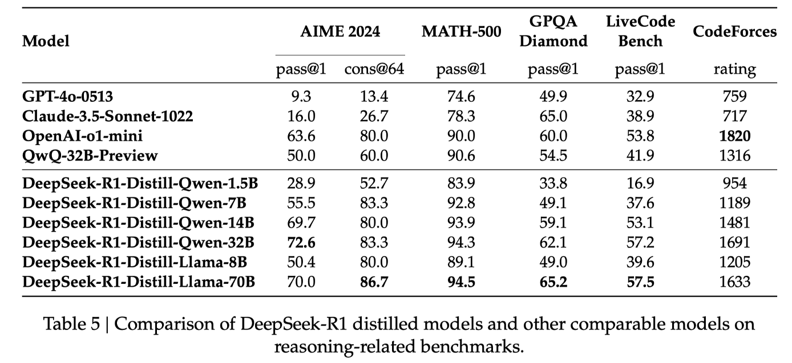

<!--Copyright © ZOMI 适用于[License](https://github.com/chenzomi12/AIInfra)版权许可-->

# MoE 算法架构

Author by: 张晓天

**MoE（Mixture of Experts，混合专家）**，这绝非一个全新的概念，它的思想甚至可以追溯到几十年前。近年来，它随着 Mixtral 8x7B 的推出，在开源人工智能社区又引起了关注。但真正让它在大模型时代大放异彩、成为突破“成本-性能”瓶颈关键钥匙的，是国内幻方团队推出的DeepSeek V3 和 R1 模型。

可以想象一下，当你向AI助手提问，它流畅地写出千字长文，精准分析复杂数据时，这一切的成本**低至每百万次交互（Tokens）只需几分钱，甚至不到一分美金（< \$0.001 / 1M Tokens）**。而这就是DeepSeek V3 和 R1 模型所创造的现实。

**这不禁让人追问：**

1. 为什么幻方 DeepSeek V3 和 R1 模型能够做到这么便宜的 Tokens/pre $?
2. 幻方的 DeepSeek MoE 架构到底有什么主要特性使得算力利用率上去？
3. 幻方的 DeepSeek MoE 架构会不会降低对训练算力和推理算力的需求？

这些问题的核心都将围绕 MoE 进行展开，本章将提供一系列的文章一步步的揭开 MoE 的面纱。

## 什么是 MoE 混合专家模型？

都知道模型规模是提升模型性能的关键因素之一。在有限的计算资源预算下，用更少的训练步数训练一个更大的模型，往往比用更多的步数训练一个较小的模型效果更佳。

传统稠密模型 (Dense Model)，必须**激活其绝大部分甚至全部参数**来处理每一个输入（Token），这一方面导致了处理简单问题也动用庞大算力，其次模型总参数量的直接增加、线性地推高每次推理的计算成本和延迟。

混合专家模型 (MoE) 的一个显著优势是它们能够在远少于稠密模型所需的计算资源下进行有效的预训练。这意味着在相同的计算预算条件下，可以显著扩大模型或数据集的规模。

MoE 主要由两个关键部分组成:

1.稀疏 MoE 层：MoE 层代替传统 Transformer 中 FFN 层。MoE 层包含若干“专家 Expert”，每个专家本身是一个独立的神经网络。

2.门控网络或路由：用于决定哪些 token 发送到哪个专家。例如，More 可能被发送到第二个专家 FFN2，Parameters 被发送到第一个专家 FFN1。有时，一个 token 可以被发送到多个专家 Expert。 token 的路由方式是 MoE 中一个关键点，因为路由器由学习的参数组成，并且与网络的其他部分一同进行预训练。



门控网络或路由根据该 Token 与**每个专家**的“匹配度”或“相关性得分”，只为当前 Token 选择得分最高的前 K个专家（通常 K非常小，如 1, 2, 或 4）。只有这K个被选中的专家会被激活并处理该 Token，其他专家则处于“待机”状态，**不参与此次计算**。这就是条件计算（Conditional Computation）的精髓。

MoE 架构的核心价值在于它巧妙地解耦了 **模型总容量 (Total Capacity)** 和 激活计算量(Activated Computation)。MoE 模型的**总参数量**可以非常庞大（例如 DeepSeek-V3 MoE 拥有 **2360 亿总参数**），这赋予了它强大的知识储备和表示能力，理论上能处理更复杂、更多样化的任务。然而其每次处理一个 Token 时，**实际参与计算的参数只是所有专家参数的一小部分**（取决于 K 和专家数量）。例如，如果模型有 64 个专家，每次只激活 Top-2 (`K=2`)，那么每次 Token 计算只激活了 `2/64 ≈ 3.1%` 的总参数。

这种**稀疏性**直接转化为计算效率的显著提升和推理成本与延迟的显著降低。同时在训练时，虽然整体训练量依然庞大，但对于训练数据中的**每个 Token**，其梯度计算和参数更新也**只影响被选中的 `K` 个专家**。这意味着，在相同计算资源下，**处理单个 Token 的训练成本也可能低于等总参数量稠密模型**。

虽然MoE 提供更高效的预训练和与稠密模型相比更快的推理速度，但也伴随着一些挑战：

1. 训练挑战：MoE 能够实现更高效的计算预训练，在微调阶段往往面临泛化能力不足，易于引发过拟合现象，或者预训练难以收敛。
2. 推理挑战：MoE 模型拥有大参数量，但在推理过程中只激活其中一部分专家参数，这使得推理速度快于具有相同数量参数的稠密模型。然而，MoE 需要将所有参数加载到内存 HBM，因此对内存 HBM 需求高。

例如，Mixtral 8x7B MoE，需要足够 HBM 来容纳 47B 参数。

> 1.为什么总参数是47B而非56B？
>
> 在典型的MoE架构（如Mixtral 8x7B）中，**只有前馈神经网络（FFN）层被设计为独立专家**，而模型的其余关键组件（如注意力机制、嵌入层、归一化层等）**采用共享参数设计**。这种"部分专家化"的结构带来了显著的参数效率，共享参数部分约占模型总参数的15-20%。那么模型的总参数量就是共享参数加上专家数量乘以单个专家的 FFN参数。
>
> 2.如何进行共享呢？
>
> 设每个 Token 只使用两个专家，那么推理速度类似使用 12B 模型 （而不是 14B 模型），因为虽然进行 2x7B 矩阵乘法计算，但 MoE 层通过通信来实现参数共享，而非重复计算。

## MoE 混合专家模型简史

混合专家模型 (MoE) 的理念起源于 1991 年的论文 **[Adaptive Mixture of Local Experts](https://link.zhihu.com/?target=https%3A//www.cs.toronto.edu/~hinton/absps/jjnh91.pdf)**，出自 Geoffrey Hinton 和 Michael I. Jordan 两位大神之手。这个概念与集成学习方法相似，旨在为由多个单独网络组成的系统建立一个监管机制。在这种系统中，每个网络 (被称为“专家”) 处理训练样本的不同子集，专注于输入空间的特定区域。那么，如何选择哪个专家来处理特定的输入呢？这就是门控网络发挥作用的地方，它决定了分配给每个专家的权重。在训练过程中，这些专家和门控网络都同时接受训练，以优化它们的性能和决策能力。



在 2010 至 2015 年间，两个独立的研究领域为混合专家模型 (MoE) 的后续发展做出了显著贡献:

1. **组件专家**: 在传统的 MoE 设置中，整个系统由一个门控网络和多个专家组成。在支持向量机 (SVMs) 、高斯过程和其他方法的研究中，MoE 通常被视为整个模型的一部分。然而，**[Eigen、Ranzato 和 Ilya 的研究](https://link.zhihu.com/?target=https%3A//arxiv.org/abs/1312.4314)** 探索了将 MoE 作为更深层网络的一个组件。这种方法允许将 MoE 嵌入到多层网络中的某一层，使得模型既大又高效。
2. **条件计算**: 传统的神经网络通过每一层处理所有输入数据。在这一时期，Yoshua Bengio 等研究人员开始探索基于输入令牌动态激活或停用网络组件的方法。



这些研究的融合促进了在自然语言处理 (NLP) 领域对混合专家模型的探索。特别是在 2017 年，**[Shazeer 等人](https://link.zhihu.com/?target=https%3A//arxiv.org/abs/1701.06538)** (团队包括 Geoffrey Hinton 和 Jeff Dean，后者有时被戏称为 **[“谷歌的 Chuck Norris”](https://link.zhihu.com/?target=https%3A//www.informatika.bg/jeffdean)**) 将这一概念应用于 137B 的 LSTM (当时被广泛应用于 NLP 的架构，由 Schmidhuber 提出)。通过引入稀疏性，这项工作在保持极高规模的同时实现了快速的推理速度。这项工作主要集中在翻译领域，但面临着如高通信成本和训练不稳定性等多种挑战。


从 2023 年 ChatGPT 发布以来，大模型领域也迎来了很多关于 MoE 相关工作的进展。例如，虽未官方确认，但多方证据（如 George Hotz 爆料）表明 2023 年 3 月 OpenAI 发布的 GPT-4 可能是 **8×220B MoE** 架构。2024 年 1 月 DeepSeek 发布了DeepSeek-MoE 为国内首个开源 MoE。2024 年 3 月 Databricks 发布了 最强开源 MoE DBRX，它的参数量打的了132B 总参数。2025 年 1 月 DeepSeek 发布了 性价比之王 DeepSeek-V3 总参数量2360B，但通过 **动态稀疏化** 实现超低推理成本。2025 年 1 月  MiniMax 发布了 参数量达到4560B 的 MiniMax-01 MoE 模型。

## MoE 混合专家对训练的影响？

### 什么是稀疏性？

稀疏性的概念采用了条件计算的思想。

在传统的 稠密模型（Dense Model）属于全参数强制激活。对于**任意输入数据x，模型的**全部参数 W 都必须参与计算，即所有神经元和权重矩阵都会被激活。

* 数学表达：$y = f_{\text{all}}(x, W_{\text{full}})$
* 计算量固定：FLOPs（浮点运算次数）与模型参数量成正比，**无动态调整空间**。

MoE 稀疏模型（Sparse Model）属于条件化参数激活。通过**动态路由（Router）**，仅选择与当前输入 x **最相关的少数专家（Experts）** 参与计算，其余专家处于“休眠”状态。

* 数学表达： $y = \sum_{i=1}^K g_i(x) \cdot f_{\text{expert}_i}(x)$
  * $g_i(x)$：路由器对专家 $i$的激活权重（通常 Top-K 稀疏）
  * $f_{\text{expert}_i}(x)$：第 $i$个专家的子网络计算
* **计算量动态变化**：FLOPs 取决于激活的专家数量

条件计算的概念 (即仅在每个样本的基础上激活网络的不同部分) 使得在不增加额外计算负担的情况下扩展模型规模成为可能。这一策略在每个 MoE 层中实现了数以千计甚至更多的专家的有效利用。然而这种稀疏性设置确实带来了一些挑战。例如，在混合专家模型 (MoE) 中，尽管较大的批量大小通常有利于提高性能，但当数据通过激活的专家时，实际的批量大小可能会减少。比如，假设我们的输入批量包含 10 个token， 可能会有五个token被路由到同一个专家，而剩下的五个token分别被路由到不同的专家。这导致了批量大小的不均匀分配和资源利用效率不高的问题。

### 解决稀疏性计算

那我们应该如何解决这个问题呢？一个可学习的门控网络 $g_i(x)$ 决定将输入的哪一部分发送给哪些专家 $f_{\text{expert}_i}(x)$。

Google Shazeer 对 MoE 在翻译应用中，引入条件计算，在每个样本的基础上激活网络的不同部分。不增加额外计算情况下扩展 MoE 规模，每个 MoE 层中实现更多 Expert，提升专家利用率。



### Token 负载均衡

在标准 MoE 训练中，门控网络（Router）倾向于**过度选择少数专家**，导致少数专家被高频激活（如 20% 的专家处理 80% 的样本），其参数快速优化，形成“强者愈强”的正反馈。冷门专家（Cold Experts）则因训练不足逐渐退化，甚至输出全零（参数未被有效更新）。这种现象使得模型容量浪费，实际性能接近稠密小模型，硬件利用率也不会很高。

通过损失函数（Auxiliary Loss）强制门控网络**均匀分配样本给所有专家，使每个专家在 batch 内的**总被选概率接近均匀，打破马太效应。

```
def auxiliary_loss(gating_probs, lambda=0.01):
    """
    gating_probs: [batch_size, num_experts]
    """
    batch_size, num_experts = gating_probs.shape
    importance = gating_probs.mean(dim=0)  # 计算每个专家的平均选择概率 [num_experts]
    target = torch.ones_like(importance) / num_experts  # 均匀分布目标
    loss = lambda * torch.sum((importance - target)**2)  # L2 惩罚
    return loss

# 在总损失中加入辅助损失
total_loss = task_loss + auxiliary_loss(gating_probs)
```

通过引入辅助损失，MoE 模型能够更高效地利用全部专家容量，这也是 **DeepSeek-V3** 等先进模型实现低成本高性能的关键技术之一。

### 专家如何学习？

那么 MOE 专家是如何学习的呢？ST-MoE 的研究者们发现，编码器中不同的专家倾向于专注于特定类型的token或浅层概念。例如，某些专家可能专门处理标点符号，而其他专家则专注于专有名词等。与此相反，解码器中的专家通常具有较低的专业化程度。

实际上，专家的学习过程是一个动态演化的自组织系统，其核心在于路由机制与专家能力之间持续的相互塑造。在模型训练初期，所有专家处于近乎均质的状态，随着训练进程的推进，微小的随机差异开始被放大。某个专家可能偶然对特定类型的token（比如标点符号）处理效果略好，这个微小优势通过梯度回传使得路由网络逐渐倾向于将同类token更多地分配给该专家。这种正反馈循环导致专家开始形成专业化倾向。为了防止单一专家垄断某类token的处理，确保系统资源得到合理分配，所以引入负载均衡机制作为关键约束条件。



如图展示了ST-MoE-32B模型中部分专家的token处理分布。从图中可以发现，在多语言训练场景下，预期中的语言专业化之所以没有出现，深层原因在于语言特征的表征方式。路由网络实际上是基于token的语言学特征（如词性、字符类型、句法角色）而非语言类别进行决策。不同语言中相似的语法结构（如英语和法语的名词变格、中文和日文的量词使用）会在嵌入空间形成相近的表征，导致专家自然地按照语言学功能而非语言种类形成专业化。例如，一个专门处理数字表达的专家会同时处理英语"123"、中文"一百二十三"和日语"一二三"，因为这些数字表征在嵌入空间中具有相似的拓扑结构。

编码器和解码器专家的行为差异源于它们所处的上下文环境不同。编码器专家主要处理局部上下文特征，可以专注于特定表层模式；而解码器专家需要参与序列生成任务，必须保持更强的灵活性来协调各种语言特征。这种差异本质上反映了编码的"分析"特性与解码的"合成"特性对专家提出的不同要求。

整个专家系统的学习过程呈现出典型的涌现特性——宏观的专业化模式并非预先设计，而是通过大量微观的token级路由决策自下而上形成的。这种自组织过程既受到模型架构的约束（如专家容量、路由维度），也受到优化目标的引导（如负载均衡损失、任务损失）。最终形成的专家分工体系实际上是模型在效率压力下（有限的计算资源）和效能需求间找到的平衡解。

### 专家的数量对预训练有何影响？

研究表明，增加专家数量能够提高混合专家模型（MoE）的样本处理效率和计算速度，但其性能增益随专家数量的增加呈现递减趋势，并在专家数量达到 256 或 512 时趋于饱和。此外，由于推理过程中需要加载所有专家模型，增加专家数量会线性增加显存需求，从而对硬件资源提出更高要求。

### 稀疏 VS 稠密，如何选择?

在固定计算预算的预训练场景中，稀疏模型通常能够取得更好的性能表现。而对于显存资源有限且对吞吐量要求不高的应用场景，稠密模型往往是更合适的选择。需要注意的是，由于稀疏模型和稠密模型在架构设计和参数计算方式上存在本质差异，直接比较两者的参数量并不具备实际意义。

## 让 MoE 训练和推理起飞

早期的混合专家模型(MoE)就像一架设计精良却笨重不堪的初代飞机——理论上拥有强大的性能，在实际飞行中却屡屡受挫。问题根源在于其分支式的架构设计，这种设计在纸面上完美无缺，却忽视了现代计算硬件的实际特性。就像早期的飞机设计师尚未完全理解空气动力学原理一样，MoE的开拓者们最初也未能充分考虑GPU的并行计算特性和分布式系统的通信瓶颈。

### 初代MoE的"缺陷"

第一代MoE模型面临的核心挑战可以比作飞机设计中的"重量与升力"矛盾。模型中的分支结构导致两个主要问题：

首先，GPU作为现代深度学习的主力计算单元，其优势在于处理规整的、高度并行的计算任务。而MoE模型中动态路由带来的条件计算路径，就像在一条高速公路上设置无数个可变车道一样，使得GPU难以充分发挥其并行计算能力。每次前向传播时，不同的token可能被路由到不同的专家，这种不规则性导致计算资源的利用率大幅下降。

其次，在分布式训练场景下，专家往往分布在不同的计算设备上。这就好比飞机的各个部件分散在不同的工厂生产，需要频繁运输组装。当数据需要在设备间传递时，网络带宽很快成为系统瓶颈。我们的实验数据显示，在某些配置下，通信开销可占总训练时间的60%以上，这意味着计算设备大部分时间都在等待数据传输，而非实际进行计算。

### 并行计算：MoE的动力系统

现代MoE模型的效率优化建立在四大并行计算范式的基础之上，它们如同飞机的四个发动机，共同推动模型性能的提升：

**数据并行**如同机群的编队飞行，每个计算节点都携带完整的模型副本（包括所有专家），但处理不同的数据批次。这种方式的优势在于实现简单，但当模型规模增大时，内存压力也随之剧增。

**模型并行**则像将飞机的不同部件分散到多个工厂生产，模型被分割到不同节点，每个节点处理完整的数据流。这种方法适合超大规模模型，但需要精细的流水线设计以避免计算资源的闲置。

**混合并行**结合了前两者的优势，如同现代航空制造业的全球供应链，既在不同地区生产部件（模型并行），又在各地工厂内部实现完整装配线（数据并行）。这种模式下，不同节点可以同时处理不同批次的数据和模型的不同部分。



**专家并行**是MoE特有的"矢量推力引擎"，专家被 strategically分配到不同计算节点。在非MoE层，它的行为与数据并行无异；但当处理MoE层时，系统会根据路由决策将token精准投送到拥有对应专家的节点，就像空中交通管制系统引导飞机到指定跑道。这种设计的关键突破在于：

* 动态路由与静态分配的结合，确保计算负载均衡
* 专家本地化原则，将频繁交互的专家部署在相邻节点
* 通信优化，通过智能缓冲减少节点间数据传输

### 通信优化：突破音障的关键

在MoE模型的优化设计中，容量因子(Capacity Factor, CF)的调节可以提升模型性能，但同时也增加了机身重量（通信成本和显存需求）。这也意味着更高的通信成本和对保存激活值的显存的需求。

容量因子作为MoE模型的核心调节旋钮，呈现出明显的收益递减特性：

* **性能提升阶段**（CF=1.0-1.5）：适当增加容量因子显著降低token丢弃率
* **边际效益阶段**（CF=1.5-2.0）：性能提升趋缓而资源消耗线性增长
* **过载阶段**（CF>2.0）：资源浪费显著，通信延迟成为主要瓶颈

针对不同网络环境，推荐分级配置方案如下所示：


| 网络带宽    | 推荐CF   | Top-k | 专家分布策略   |
| ----------- | -------- | ----- | -------------- |
| >400Gbps    | 1.5-2.0  | Top-2 | 跨节点专家共享 |
| 200-400Gbps | 1.25-1.5 | Top-2 | 节点内专家分组 |
| <200Gbps    | 1.0-1.25 | Top-1 | 单节点专家     |

**专家-数据混合并行**可以更快的加速通信性能，将专家并行与数据并行有机结合。每个节点既包含部分专家，也处理部分数据批次。这种架构下：

* 对于非MoE层，所有节点像标准数据并行一样工作
* 对于MoE层，系统首先在本地专家中寻找匹配，仅当必要时才进行跨节点通信
* 通过预取和缓存机制，将通信延迟隐藏于计算过程中

实验数据显示，这种混合策略可以将通信开销从传统方案的60%降低到15%以下，同时保持95%以上的计算利用率。

其次，为缓解高CF带来的显存压力，可以通过**梯度检查点专家选择**，**动态显存分配池**，**专家级混合精度**来进行优化解决。

### MoE模型的精简化革命

#### 1. 模型蒸馏

模型蒸馏在MoE架构中扮演着"精炼厂"的角色，能够将庞大稀疏模型的知识精华浓缩到紧凑的稠密模型中。通过将 MoE 模型蒸馏回其对应稠密模型，保留 30-40% 由稀疏性带来性能提升。预先蒸馏不仅加快预训练速度，还使得在推理中使用更小型模型。



利用MoE教师模型生成富含专家决策特征的增强训练数据，通过早期专家特征融合技术将稀疏路由模式编码为稠密表示，同时引入动态调整机制逐步提升蒸馏强度，形成渐进式的知识迁移课程。进入部署阶段后，系统自动根据业务需求智能选择推理路径——当任务需要最高精度时调用原始MoE模型，在常规场景下则启用蒸馏模型。

#### 2. 任务级别路由

任务级路由机制代表了混合专家模型架构的重要演进方向，它通过将整个输入序列或特定任务直接路由到确定的专家子集，实现了模型结构的本质性简化。这种路由方式犹如为MoE系统装上了智能导航仪，不再对每个token进行细粒度决策，而是在更高语义层面做出路由选择。

在具体实现上，任务级路由系统首先会对输入进行语义特征分析，通过轻量级分类器判断任务类型（如文本分类、序列生成、问答等），然后将整个任务实例分配给预配置的专家组合

#### 3.专家网络聚合

通过数学方法将多个专家模块的知识融合到紧凑的参数。合并各个专家权重，推理时减少所需参数数量。在不显著牺牲性能的情况下降低模型稀疏复杂度。相比传统MoE架构，这种集约化设计消除了稀疏计算带来的硬件适配挑战，使模型部署效率提升了一个数量级。专家聚合特别适用于需要严格满足延迟SLA的在线服务等场景。

## 思考与小结

幻方DeepSeek V3和R1模型能够实现极低的成本，主要得益于其创新的DeepSeekMoE架构和一系列工程优化。相同参数下，MOE 架构的天然优势，推理时候只执行部分参数。例如，V3总参数量671B但激活仅37B，大幅减少计算量。同时，FP8混合精度训练、无辅助损失的负载均衡策略以及MLA（多头隐式注意力）机制进一步降低了显存占用和计算开销**8**10。在训练阶段，DeepSeekMoE通过优化通信重叠和专家并行，避免了传统MoE的跨节点瓶颈，这些都使得DeepSeek V3和R1模型能够实现极低的成本。因此，MOE架构不仅提升了算力利用率，还通过稀疏激活特性降低了对训练和推理算力的需求，同时保持高性能。

## 本节视频

<html>
<iframe src="https://player.bilibili.com/player.html?isOutside=true&aid=113959675893393&bvid=BV17PNtekE3Y&cid=28253028746&p=1&as_wide=1&high_quality=1&danmaku=0&t=30&autoplay=0" width="100%" height="500" scrolling="no" border="0" frameborder="no" framespacing="0" allowfullscreen="true"> </iframe>
</html>
