<!--Copyright © ZOMI 适用于[License](https://github.com/Infrasys-AI/AIInfra)版权许可-->

# MOE 前世今生

Author by: 张晓天

1991年，Robert Jacobs和Geoffrey Hinton在论文 "Adaptive Mixtures of Local Experts" 中首次提出MoE时，他们或许未曾预料到，这个旨在解决‘分而治之’的神经网络框架，会在沉寂了三十年后再次引起大家关注。本节将初步梳理MoE相关的经典奠基工作，介绍模型架构形成到智能涌现，以及几个近期发布的中文MoE模型，从背景、思路和效果来了解MoE模型的前世今生。

## MoE 简史

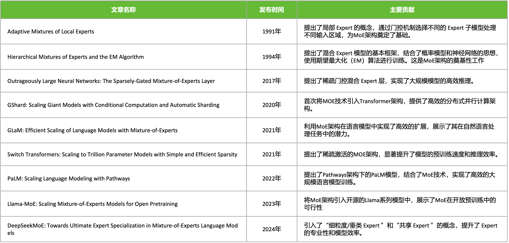

1991年 MoE 局部专家概念性想法被 "Adaptive Mixtures of Local Experts" 论文所提出，但 MoE 架构真正的理论基石是 1994 年的 "Hierarchical Mixtures of Experts and the EM Algorithm" 论文，它超越了1991年提出的概念性想法，将 MoE 建模为一个概率模型。2017 年的"Outrageously Large Neural Networks: The Sparsely-Gated Mixture-of-Experts Layer" 论文，首次将MoE应用于大规模神经网络，它提出了一种**可导的稀疏门控机制**，使得对于每个输入样本，**只激活 Top-K 个专家**（通常是 K=1 或 2）。这意味着计算成本不再随着专家数量线性增长（`O(n)`），而是几乎恒定（`O(1)`），只与激活的专家数有关。2020年的“GShard: Scaling Giant Models with Conditional Computation and Automatic Sharding”论文则首次将MoE 技术系统地、成功地集成到 Transformer 架构中，并设计了高效的**分布式训练**方案，开启了 MoE 在 LLM 时代的主流应用。2021 年的“Switch Transformers: Scaling to Trillion Parameter Models with Simple and Efficient Sparsity” 论文，在 GShard 的基础上，进一步简化 MoE 架构、提出 K=1 路由等简化稳定技术，成功训练万亿模型，将效率和规模推向新高峰。2024 年的 “DeepSeekMoE: Towards Ultimate Expert Specialization in Mixture-of-Experts Language Models” 论文采用 细粒度专家划分 和 共享专家机制，60 亿参数的 DeepSeekMoE 仅激活约 28 亿参数，计算量（74.4 TFLOPs）比同等规模的密集模型（如 Llama 2-7B）减少 60%，但性能相当甚至更优，成为开源 MoE 大模型的标杆之一。

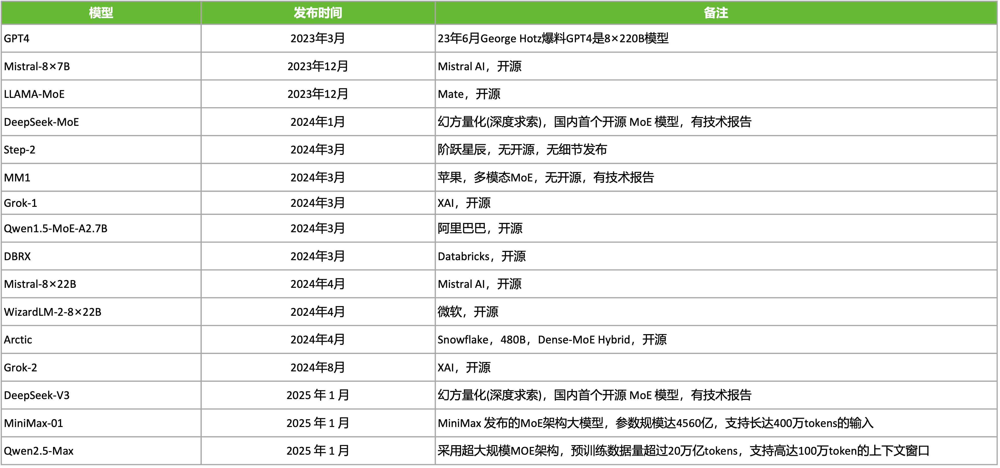

进入 LLM 大模型时间，MoE 的发展更加迅猛，大大小小的基于 MoE 的模型被发布出来。例如，23年6月George Hotz爆料GPT4是8×220B MoE模型，2023年，Mistral AI发布的Mistral 8x7B模型由70亿参数的小模型组合起来的MoE模型，直接在多个跑分上超过了多达700亿参数的Llama 2。2025 年幻方量化(深度求索)，在国内首个开源 MoE 模型 DeepSeek-v3。

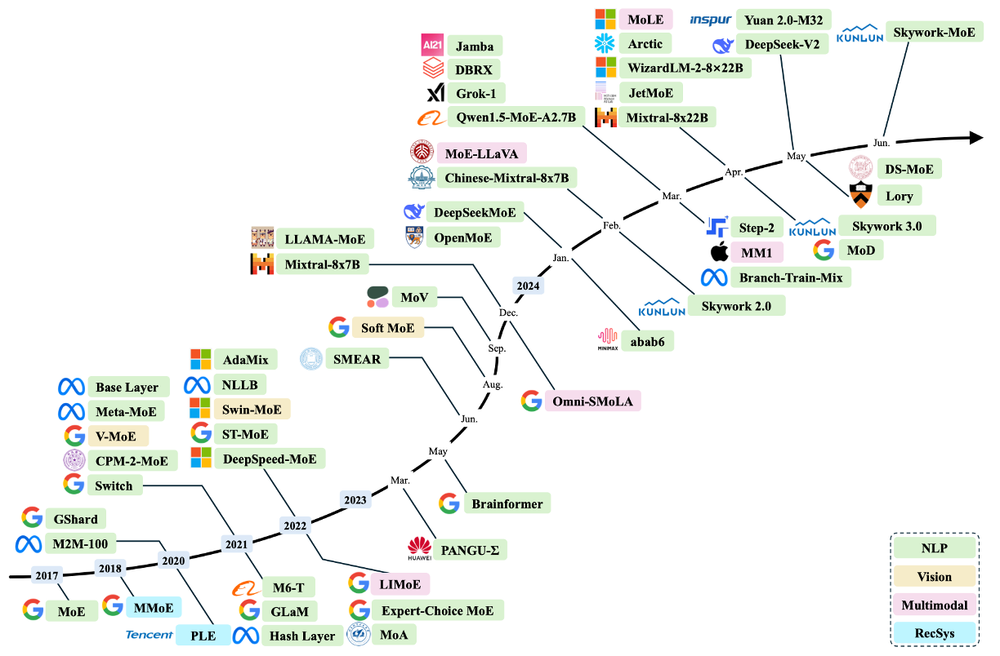

除了在 NLP 领域，计算机视觉（黄色），多模态（粉色），推荐系统（青色）等领域，MoE 也在被快速应用和发展。

### 传统MoE结构

1. 专家网络（Experts）

每个专家 $f_i$ 是一个前馈神经网络（FFN）：

- 输入：Token $x$
- 输出：$f_i(x)$, 其中 $i \in \{1, \dots, N\}$

2. 门控网络（Gating Network）

门控网络 $G$ 生成专家权重分布：

$$
G(x) = \text{Softmax}(W_g x + b_g)
$$

- $W_g$: 门控权重矩阵
- $b_g$: 偏置项
- $\text{Softmax}$ 保证 $\sum_{i=1}^N G(x)_i = 1$

3. 输出计算

MoE 层的输出是所有专家的加权和：

$$
y = \sum_{i=1}^N G(x)_i \cdot f_i(x)
$$

**稀疏 MoE** 仅激活 Top-K 专家（通常 $K=1$ 或 $2$）：

$$
y = \sum_{i \in \text{TopK}} G(x)_i \cdot f_i(x), \quad \text{其他专家权重置零}
$$

4.代码示例

以下是 PyTorch 风格的伪代码，展示传统 MoE 层的实现逻辑：

```python
class MoELayer(nn.Module):
    def __init__(self, num_experts, hidden_size, expert_size):
        super().__init__()
        self.experts = nn.ModuleList([FeedForward(hidden_size, expert_size) for _ in range(num_experts)])
        self.gate = nn.Linear(hidden_size, num_experts)  # 门控网络

    def forward(self, x):
        # 门控计算（Softmax 权重）
        gate_scores = torch.softmax(self.gate(x), dim=-1)  # [batch_size, seq_len, num_experts]
  
        # 稀疏化：仅保留 Top-K 专家
        topk_values, topk_indices = torch.topk(gate_scores, k=2)  # Top-2
  
        # 计算专家输出并加权求和
        output = 0
        for i in range(2):
            expert_mask = (topk_indices == i)  # 当前专家的 Token 掩码
            expert_output = self.experts[i](x)  # 专家计算
            output += expert_output * topk_values[expert_mask]  # 加权累加
  
        return output
```

### 为什么MoE 选择替换 FFN 层

为什么 MoE 层的位置选择在每个 Transformer 块内的前馈网络 FFN 层进行替换？

要了解这个问题，我们首先需要知道在标准 Transformer 中，FFN 层通常占据 **70% 以上** 的参数（如 Llama 7B：Attention 占 30%，FFN 占 70%），而且就计算复杂度来说，FFN 的计算复杂度为 $O(2 \times d_{model} \times d_{ff})$，远高于 Attention 的 $O(n^2 \times d_{model})$。当模型规模增大时，FFN 的计算需求呈**线性增长**，成为扩展的主要瓶颈，尤其在长序列场景。

其次，在Transformer中，Attention 负责跨 token 相关性计算，FFN 是对每个 token 独立进行特征增强，这与 MoE 的 per-token 路由机制天然兼容。

> 正如 Yann LeCun 所言："未来的AI系统必然是模块化专业分工的"。MoE 在 FFN 层的应用正是这一思想的工程实践。

### MOE 结构的分类

MoE 的核心差异在于 **门控函数（Gating/Router）如何选择专家**，可分为三类：


| 类型         | 专家激活范围 | 计算复杂度 | 典型应用场景           |
| ------------ | ------------ | ---------- | ---------------------- |
| **稠密 MoE** | 所有专家     | $O(N)$     | 小规模模型、多模态融合 |
| **稀疏 MoE** | Top-K 专家   | $O(K)$     | 大规模语言模型（LLM）  |
| **软 MoE**   | 专家特征混合 | $O(N)$     | 视觉任务、轻量化模型   |

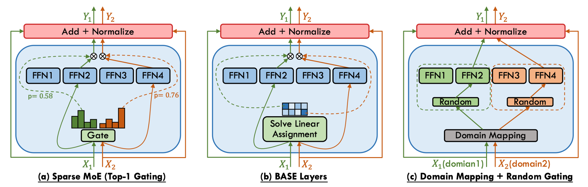

稠密 MoE的核心特征为**全专家激活**，对每个输入 token，门控网络生成所有专家的权重$G(x) \in \mathbb{R}^N$。优势是保留所有专家信息，无需处理负载均衡问题，适合需要细粒度融合的任务（如多模态），但劣势是计算成本随专家数量线性增长$O(N)$，难以扩展。稠密混合专家 MoE 模型广泛用在 EvoMoE、MoLE、LoRAMoE 和 DS-MoE 等研究。

稀疏 MoE的核心特征为条件计算，仅激活 **Top-K 专家**（通常 $K=1$ 或 $2$），其余专家权重置零。存在的问题是门控网络可能偏向少数专家，导致其他专家未被充分训练，需要通过负载均衡来解决，还需要添加可学习噪声（Noisy Top-K Gating）防止路由坍缩。稀疏混合专家 MoE 模型常见的有Switch Transformer、GShard和DeepSeekMoE等研究。

软 MoE 的核心特征为专家特征混合，不显式选择专家，而是将输入 token 与专家特征加权融合。优点是完全可微，适合端到端训练，避免路由离散性带来的梯度估计问题。劣势为计算成本与稠密 MoE 相当，专家专业化程度较低。典型的研究有Soft MoE、Expert Choice Routing等。

### MoE 激活的参数

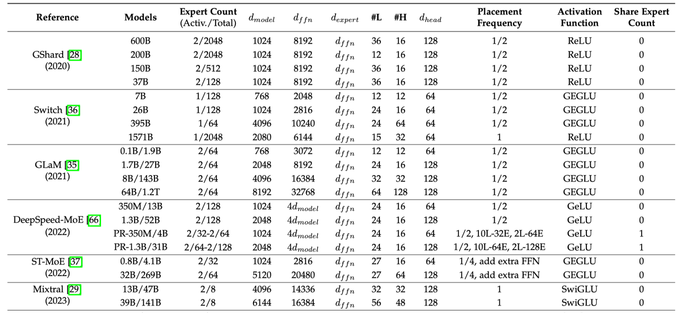

MoE 模型的参数量计算，不仅看总参数量，还看激活专家数量与总专家的数量对比。如DeepSeek-MoE 中，其参数量由稠密部分和稀疏专家部分共同决定，需分层计算。如上表所示，其中 $d_{\text{model}} $ 代表隐藏层的大小，$d_{ffn}$ 是 FFN 中间层大小，$d_{expert}$  专家中间层大小, #L 代表层数，#H 表示注意头数量，$d_{head}$ 表示注意头大小。

## 90 年代初期

在神经网络发展的早期阶段，Hinton与Jordan提出的《Adaptive Mixtures of Local Experts》首次实现了**监督学习与分治策略的系统性融合**。该架构由两类可微分组件构成：1）一组异构的专家网络（Experts），每个专家通过前馈结构建模输入空间的局部特征分布；2）可训练的门控网络（Gating Network），以输入依赖的softmax权重动态分配样本到专家子网络。其数学表述为：

$$
y = \sum_{i=1}^N g_i(\mathbf{x}; \mathbf{W}_g) \cdot E_i(\mathbf{x}; \mathbf{W}_i)
$$

其中门控输出$g_i(\mathbf{x}) = \text{softmax}(\mathbf{W}_g^T \mathbf{x})_i$满足概率单纯形约束。通过**EM算法框架下的竞争性学习**，专家网络自发形成输入空间的分区专业化（Partition Specialization），这一性质在原文Theorem 2中严格证明：当损失函数为负对数似然时，梯度下降优化会驱使各专家收敛至数据分布的不同模态区域。

该工作的深远影响体现在三方面：

1. **计算效率**：首次提出条件计算（Conditional Computation）思想，仅激活相关专家，为后续稀疏化MoE（如Switch Transformer的Top-2路由）奠定基础；
2. **概率解释**：将输出建模为混合密度网络（Mixture Density Network），启发了贝叶斯MoE等扩展；
3. **生物学合理性**：其模块化特性与大脑皮层的功能分区理论高度契合。

当代大规模MoE系统（如Google的GLaM模型）仍遵循这一范式，但通过引入负载均衡损失（如2017年Shazeer提出的辅助损失项）解决了原始版本中专家利用率不均的缺陷。Hinton-Jordan MoE的核心理念——**动态路由的模块化学习**，已成为突破单一模型 scaling law 的关键技术路径。

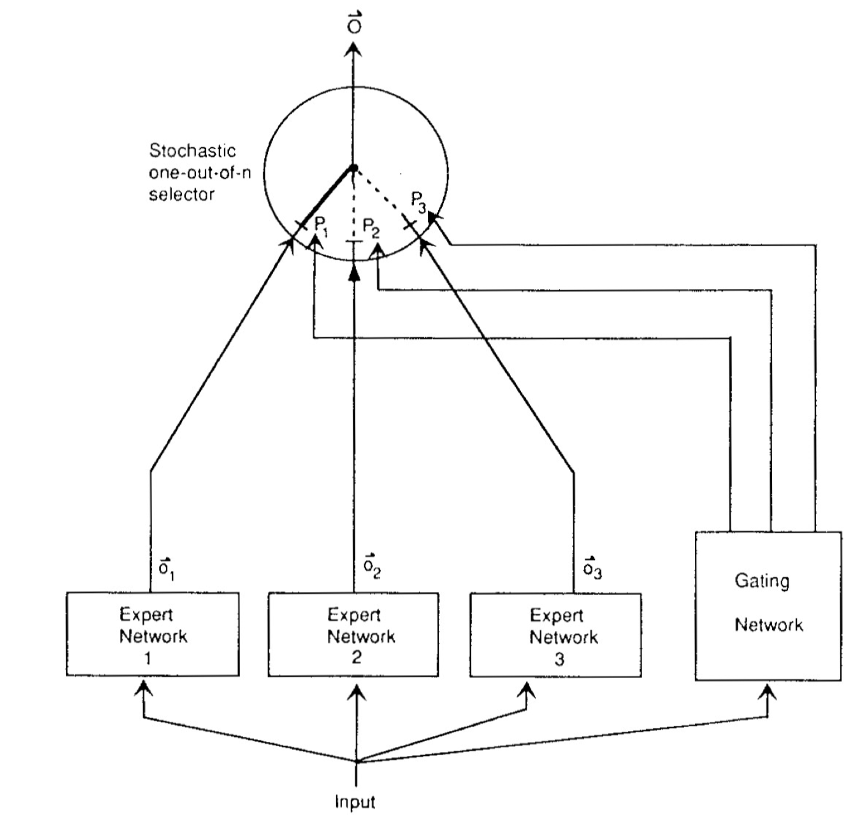

## RNN 时代

传统神经网络面临一个根本性矛盾：模型容量与计算效率之间的权衡。增加网络参数可以提升模型表达能力，但同时会导致计算成本呈线性甚至超线性增长。2017年前，即使最先进的LSTM模型也难以突破数十亿参数的规模。这是由于计算资源、内存瓶颈等限制。

2017年1月，Google研究团队在论文 “Outrageously Large Neural Networks: The Sparsely-Gated Mixture-of-Experts Layer” 中提出了一种突破性的神经网络架构——稀疏门控混合专家层。混合专家层(MoE)由N个专家网络(Expert)和一个门控网络(Gate)组成。传统MoE的问题是计算成本仍随专家数量线性增长，稀疏门控混合专家层保留前k个最大值并将其余置为-∞，这实现了每个样本仅激活k个专家(k≪N)，输入自适应的专家选择，通过softmax保持可微性的特点。这一工作不仅创造了当时最大规模神经网络记录(1370亿参数)，更开创了条件计算(Conditional Computation)在大规模语言模型中的应用先河。

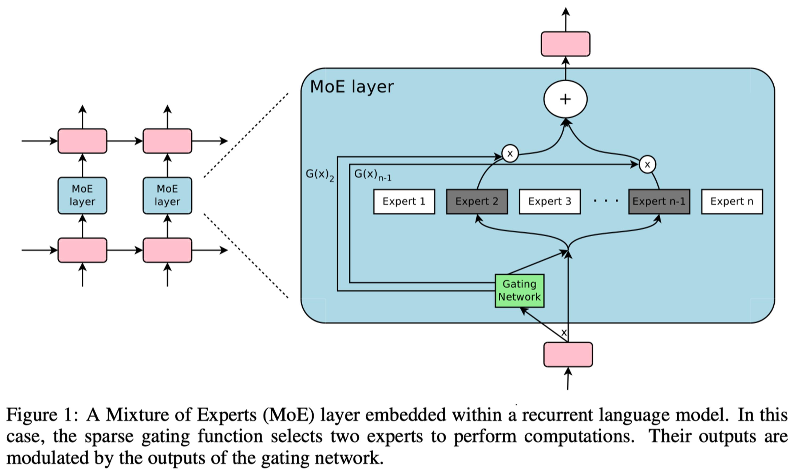

## Transformer 时代

Google在2020-2022年间实现了MoE技术的三大里程碑式突破：GShard首次将MoE成功集成至Transformer架构并实现6000亿参数规模；Switch Transformer通过简化路由策略突破万亿参数大关；ST-MoE系统性地解决了训练稳定性与迁移学习难题。


| 模型   | 发布时间 | 参数量 | 专家数  | 关键创新              |
| ------ | -------- | ------ | ------- | --------------------- |
| GShard | 2020.6   | 600B   | 2048    | Enc-Dec MoE, 自动分片 |
| Switch | 2021.1   | 1.6T   | 2048    | 单专家路由            |
| ST-MoE | 2022.2   | 269B   | 32B激活 | 稳定训练方案          |

2020年6月，GShard首次将MoE层整合进标准Transformer的Encoder-Decoder结构，采用**每两层替换一个FFN为MoE层**的策略，同时通过引入**随机性**防止路由决策固化。同时GShard提出**自动分片**技术实现6000亿参数训练。

$$
G(x) = \text{Softmax}(H(x) + \epsilon), \epsilon \sim \mathcal{N}(0, \sigma^2)
$$

其中噪声项ε在训练初期较大，随训练逐渐衰减。

同时定义专家容量 $ C = \frac{k \cdot B}{N} \cdot \mu$，其中：

* $k$：激活专家数
* $B$：批次大小
* $N$：专家总数
* $\mu$：容量因子(通常1.0-1.25)

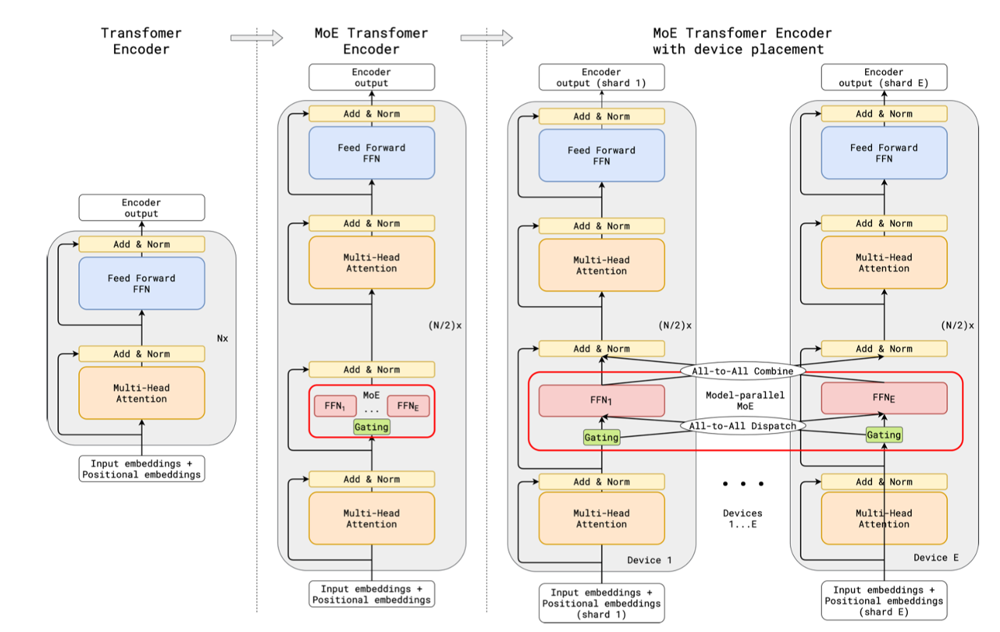

在2021 年 1 月，在T5（encoder-decoder）基础上，简化 routing 策略，实现 1.6T 参数量 switch transformer。其主要做出两大关键简化：1. 单专家路由 k=1，极大降低通信开销；2. 专家容量自适应，动态调整容量因子μ。同时Switch提出**蒸馏到稠密**策略，通过训练大型Switch Teacher，然后蒸馏到小型稠密Student，实现模型压缩与加速。展示了 MoE 在大模型中的潜力。

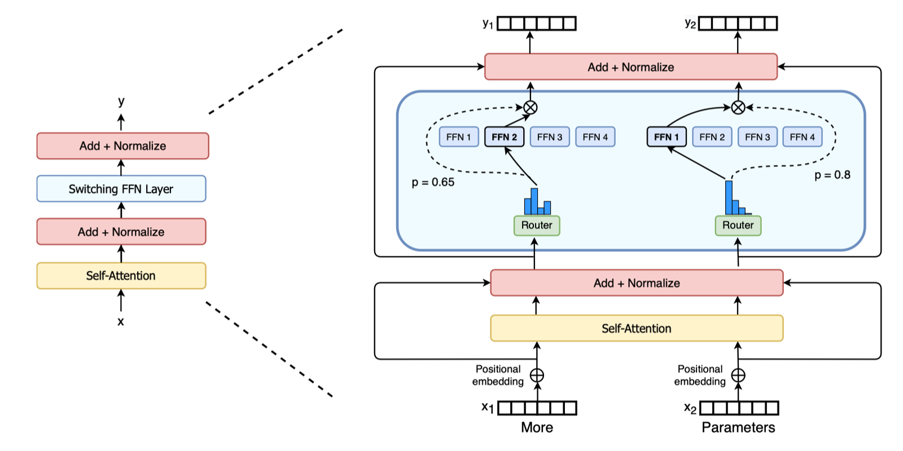

2022年2月，Google发布ST-MoE，基于 encoder-decoder 结构 MoE，最大 269B，32B 激活参数。解决 MoE 模型在训练和微调中的不稳定性问题，并提升其迁移学习能力。ST-MoE 通过引入梯度裁剪、噪声注入、路由器限制缓解 MoE 模型的训练不稳定性问题；优化微调策略，使ST-MoE 提升迁移学习能力，更好地适应下游任务，减少过拟合；

```
# 路由器特定裁剪
router_grad_norm = torch.nn.utils.clip_grad_norm_(
    router.parameters(), 
    max_norm=1.0,
    norm_type=2.0
)
```

在路由器logits添加**分类相关噪声**：

$$
\tilde{g}_i = g_i + \epsilon \cdot \text{Uniform}(-1,1)
$$

从GShard到ST-MoE的技术演进，标志着MoE从研究原型到生产级解决方案的成熟过程。

## GPT 时代

随着ChatGPT等应用的爆发，MoE技术将继续在效率与性能的平衡中扮演关键角色。GLaM作为首个万亿级decoder-only MoE模型，通过稀疏激活和条件计算实现了97B激活参数下的卓越性能；而DeepSeek MoE则通过专家共享和内存优化等创新，在保持模型性能的同时显著降低计算开销。

GLaM采用纯Decoder架构，采用稀疏 MoE，包含 1.2 万亿参数，实际激活参数 97B，最大为 1.2T 的 decoder-only 模型。它在每层FFN位置插入MoE模块：

```python
class GLaMBlock(nn.Module):
    def __init__(self, d_model, num_experts=64):
        self.attention = Attention(d_model)
        self.moe = MoE(
            experts=[Expert(d_model, d_ff) for _ in range(num_experts)],
            num_selected=2  # 关键设计：仅激活2个专家
        )
  
    def forward(self, x):
        x = x + self.attention(x)
        return x + self.moe(x)
```

GLaM的门控网络采用**软性Top-2选择**：每个输入 token 通过门控网络动态选择 2 个 Expert ，仅激活相关 Expert 进行计算。实现了条件计算，即模型根据输入动态调整计算路径，从而显著提高了计算效率。每个 MoE 层包含 64 个 Expert ，可以分布在多个计算设备上，实现跨设备扩展。

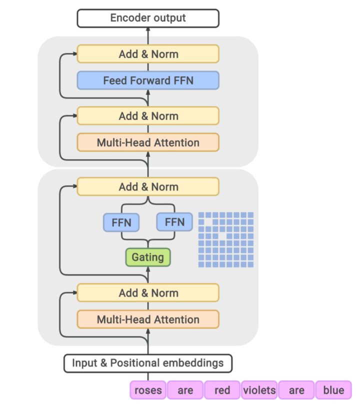

GLaM 展示 MoE 在 多任务学习 和 多语言处理 中优势，提升模型的泛化能力和效率。GLaM 稀疏激活和负载均衡机制被应用于 Mistral 8x7B，后续模型设计提供重要参考。

幻方量化在2024年1月发布了 “DeepSeek MoE: Towards Ultimate Expert Specialization in Mixture-of-Experts Language Models”，它有两大突破：1. 专家共享机制；2. 内存优化技术。

**Expert 共享机制**: 部分 Expert 在不同Tokens或层间共享参数，减少模型冗余，同时提高了参数效率。使得模型在保持高性能同时，计算开销降低 40%。

**横向共享（跨层）**

```python
class SharedMoELayer(nn.Module):
    def __init__(self, total_experts, shared_ratio=0.3):
        self.shared_experts = nn.ModuleList([
            Expert() for _ in range(int(total_experts*shared_ratio))
        ])  # 30%共享专家
        self.private_experts = nn.ModuleList([
            Expert() for _ in range(total_experts - len(shared_experts))
        ])
```

**纵向共享（跨token）**

采用**潜在专家**概念，相似token自动共享专家：

```python
Token A → [E1, E3]  
Token B → [E1, E4]  # E1被共享
```

**内存优化**：通过多头潜在注意力机制（MLA） 和键值缓存优化，减少生成任务中的浮点运算量，推理延迟降低了 35%。

$$
\text{MLA}(Q,K,V) = \sum_{i=1}^h \text{Softmax}(\frac{QW_i^Q(KW_i^K)^T}{\sqrt{d_k}})VW_i^V
$$

其中投影矩阵`${W_i}$在不同专家间共享，减少40%KV缓存。

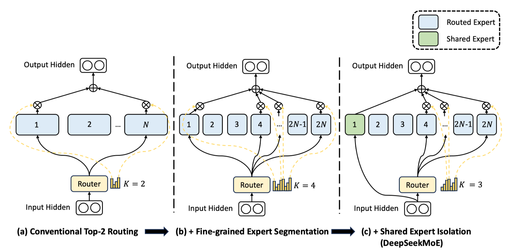

影响：

◦低成本与高性能：DeepSeek MoE 架构创新和系统优化，实现百倍性价比提升，打破传统大模型依赖算力范式，为资源受限场景下 AI 应用提供新思路。

◦开源与生态建设：DeepSeek MoE 开源版本在文本生成、代码编写和逻辑推理等任务中表现优异，推动了 MoE 技术普及和应用。

从GLaM到DeepSeek MoE的技术演进，标志着混合专家架构进入**效率驱动**的新阶段。GLaM证明了万亿参数模型的实际可行性，而DeepSeek MoE则通过专家共享和内存优化将技术民主化，使得资源受限的场景也能享受大模型的能力。未来随着算法创新与硬件协同设计的深入，MoE有望成为AGI系统的核心架构范式，其发展值得持续关注。

## Mixtral-MOE 可视化

Mixtral 8x7B采用**Decoder-Only Transformer**架构，关键创新在于将部分前馈网络（FFN）替换为**稀疏MoE层**。每层包含8个独立的专家网络（每个专家7B参数），但每个Token仅激活其中2个专家，总参数量46.7B，实际激活参数12.9B。

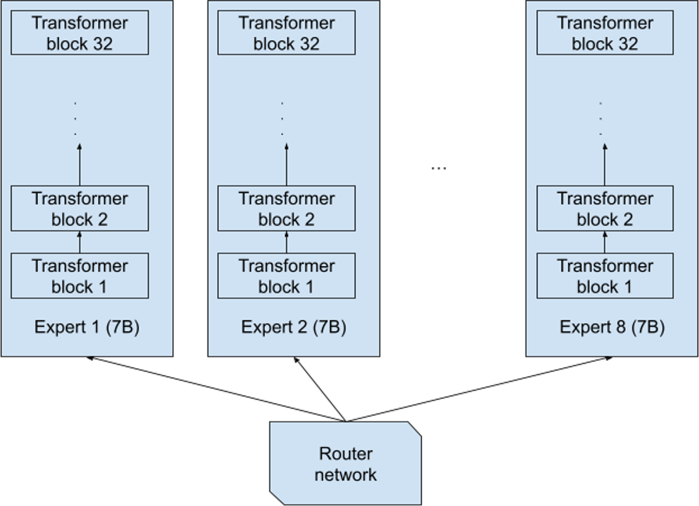

如上图所示，其有 8 个独立的专家网络。每个专家中包含 32 个 Transformer block。

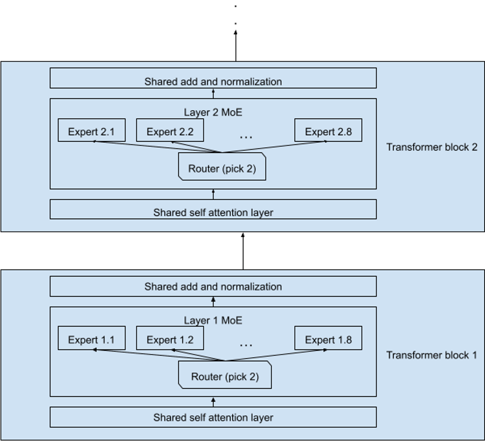

每个Transformer block中MoE层与标准前馈层交替排列，Attention机制参数跨专家共享。

MMLU 包括 57 个主题多项选择题，涵盖领域广泛，如抽象代数、信仰、解剖学、天文学等。使用 MMLU（ Massive Multitask Language Understanding）基准测试进行实验。以Mistral 8x7B 为例记录第 1 层、第 16 层和第 32 层 8 位 Expert 中每个 Expert 的激活情况。

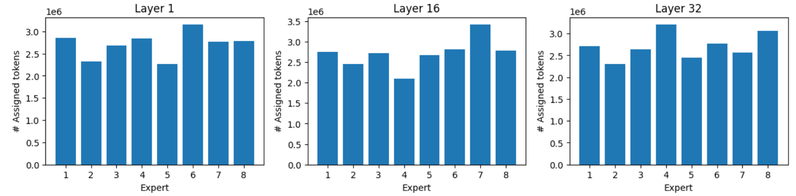

从上图可以看出，尽管存在负载均衡机制，**自然任务分布**导致不可避免的不均衡。但最忙碌Expert 仍可获得比最闲 Expert 多40%\~60% Tokens。

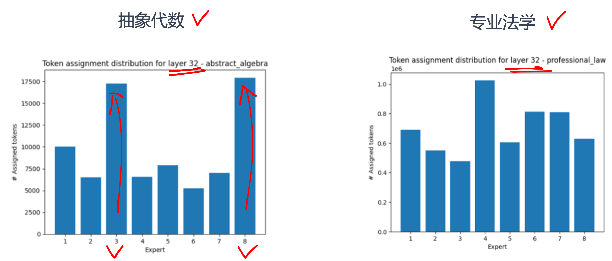

数学/逻辑类任务产生最强不均衡，某些领域比其他领域更能激活部分 Expert， Expert 能针对领域学习。如图所示，32层专家高度专业化激活。Expert 的负载分布倾向于在不同的主题范围内保持一致。但当所有样本都完全属于某个主题时，可能会出现很大概率的分布不平衡。

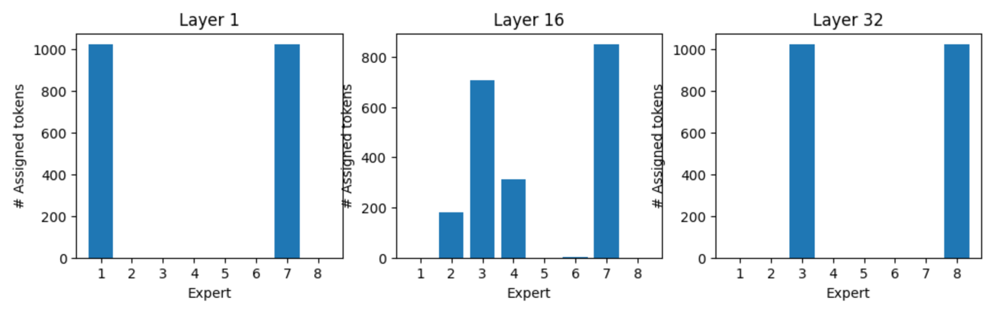

特定Token有自己的专家偏好。常见功能Token有**稳定专家偏好**（如":"偏好专家5，“Who”偏好专家 7），语义丰富Token的专家选择**依赖上下文**。专家专业化形成**层级结构**，如语法层专家和语义层专家。

## 思考与小结

MoE架构通过**稀疏激活**与**条件计算**的本质创新，彻底打破“模型规模=计算成本”的传统范式。历经三十年演进，其模块化设计和分布式扩展能力已支撑起万亿参数时代，未来将在边缘智能、多模态感知等场景持续释放变革性潜力。**规模与效率的协同进化，才是大模型的终极方向**。

## 本节视频

<html>
<iframe src="https://player.bilibili.com/player.html?isOutside=true&aid=114020342374120&bvid=BV1y7wZeeE96&cid=28445312974&p=1&as_wide=1&high_quality=1&danmaku=0&t=30&autoplay=0" width="100%" height="500" scrolling="no" border="0" frameborder="no" framespacing="0" allowfullscreen="true"> </iframe>
</html>
