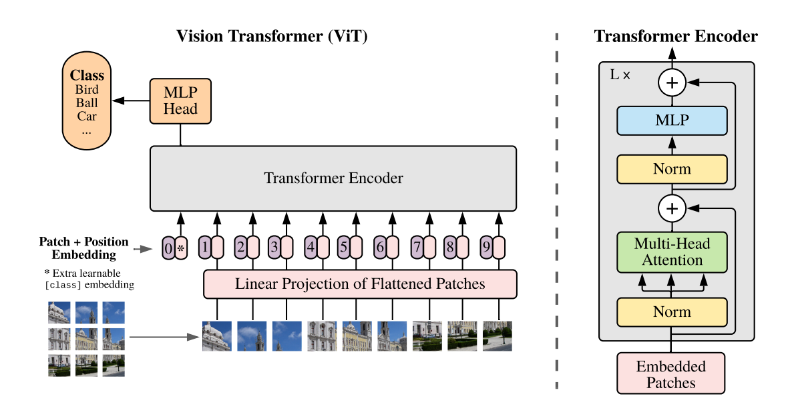
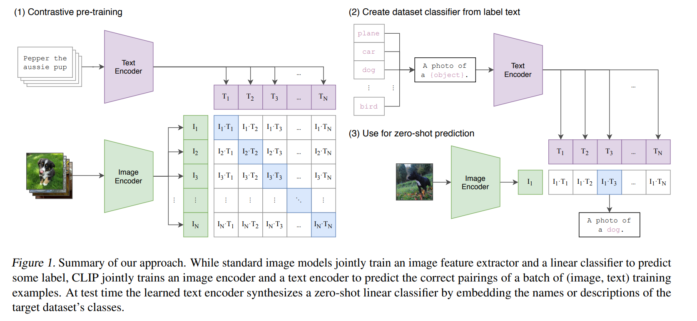
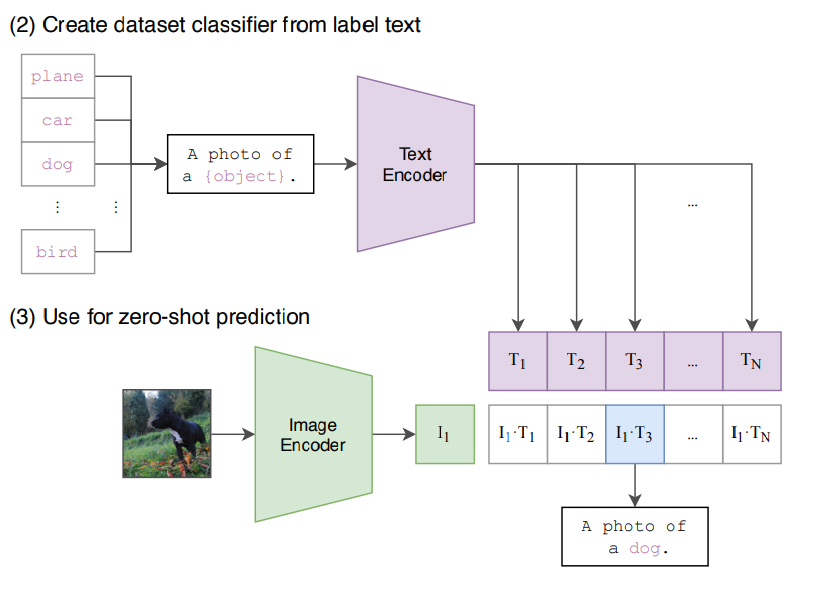

# CLIP 模型原理
Author by: 李佳函

## 引言：打破模态壁垒的开端

### 传统 AI 的局限

人工智能领域长期存在"数据孤岛"现象：图像识别依赖标注的像素数据，自然语言处理依赖分词与句法分析，两者在语义层面难以互通。这种割裂导致模型需要为每个任务单独训练，开发成本高昂且泛化能力有限。

### 多模态需求崛起

现实场景中，人类通过综合视觉、听觉、语言等多模态信息进行决策。例如，医生需要结合医学影像与病历描述诊断疾病，自动驾驶系统需融合摄像头画面与语音指令。这种需求推动了多模态学习的发展，而 CLIP（Contrastive Language-Image Pre-training）正是这一领域的里程碑式成果。

### CLIP 的里程碑意义

2021 年，**OpenAI 发布的 CLIP 首次实现了 zero-shot，即零样本迁移能力——无需微调即可将训练时学到的跨模态知识直接应用于新任务**。结合 Transformer、对比学习、“完形填空”等强大的自监督训练方式，使得 CLIP 可以在完全没有见过的分类中，正确预测结果。作者在超过 30 个数据集上做了测试，涵盖了 OCR、视频动作检测、坐标定位等等。最震撼的是，在没有使用 ImageNet 训练集任意一张照片的情况下，直接 zero-shot 做推理，可以和 ResNet-50 取得相同的效果。

它的这一突破标志着 AI 开始接近人类"理解"世界的方式，为后续多模态模型（如 DALL·E、Stable Diffusion）奠定了基础。

## 技术解构：CLIP 的原理解析

### 数据集制作：高质量图文对的构建

OpenAI 在开发 CLIP 的时候构建和使用了一个名为 WebImageText 的自定义数据集，数据集主要来源于**互联网上的大规模图像-文本对**，其主要特点包括：

+ **规模巨大**： 包含了大约 4 亿个图像-文本对。这个数量级对于训练像 CLIP 这样强大的模型至关重要。

+ **来源广泛**： 数据是通过爬取互联网上公开可用的资源收集的。主要来源包括：
    + 各种网站上的图片及其相关文本： 例如，图片的标题、替代文本、周围的描述性文字、网页标题等。
    + 已有的公开数据集： 可能整合了部分已有的、包含图文对的数据集（Conceptual Captions, YFCC100M 等是其前辈或同时期常用的数据集，但 CLIP 的数据集是独立构建且规模更大的）。
+ **配对形式**： 每个数据点就是一个（图像，文本描述）对。文本描述了图像的内容。
+ **数据构成**： 数据覆盖了极其广泛的视觉概念、物体、场景、风格和活动，几乎涵盖了人类视觉世界的大部分方面，这得益于互联网内容的多样性。
+ **预处理与过滤**：
    + 进行了一些基础的预处理和过滤，例如去重、去除明显无效或低质量的内容（如图片无法加载、文本极短或无意义）。
    + 重要特点： 为了最大化数据的多样性和覆盖面，并减少人为偏见干预模型学习，CLIP 数据集在构建时没有进行传统意义上的细粒度人工标注或严格的类别过滤。它包含了大量的“噪声”和不精确的配对（即文本描述可能不完美匹配图像，或者包含无关信息）。**模型正是通过在海量、有噪声的数据上进行对比学习，才获得了强大的泛化能力。**

**为什么使用这样的数据？**

+ **对比学习的需求**：因为 CLIP 的核心训练方法是对比学习。它不需要每个图像有精准的类别标签，而是判断一个图像和一个文本是否“匹配”。互联网上天然存在的图像及其伴随文本（标题、alt 文本等）正好提供了海量的这种潜在匹配对。
+ **规模与多样性**： 要训练一个能理解开放世界视觉概念的模型，需要覆盖几乎所有能想到（和想不到）的视觉内容。互联网是唯一能提供这种规模和多样性的数据源。

### 双塔结构设计

CLIP 的核心目标是将图像和文本映射到同一个语义空间中。使得图片和文本能够在共享的、课比较的向量语义空间进行有效的对比。

#### 图像编码器 Image Encoder

CLIP 的研究并非局限于单一架构，而是系统地探索了两种在当时代表不同技术路线的骨干网络。

+ **卷积神经网络**：使用了经过验证且高效的**ResNet**架构（特别是 ResNet-50, ResNet-101 以及更大的定制化 ResNet 变种，如`ResNet-50x4`, `ResNet-50x16`, `ResNet-50x64`，这里的乘数表示模型宽度和计算量的增加）。ResNet 通过残差连接有效缓解了深层网络的梯度消失问题，是计算机视觉领域的基石模型。
+ **Vision Transformer：** 大胆采用了当时相对较新、源于自然语言处理领域的**Vision Transformer**架构。ViT 彻底摒弃了卷积操作，将输入图像分割成固定大小的图像块（Patches），将这些图像块线性嵌入（Linear Projection）并添加位置编码（Position Embedding），然后送入标准的 Transformer 编码器进行处理。ViT 的核心优势在于其强大的全局建模能力和对大规模数据更好的可扩展性。
> **关键发现：** CLIP 的论文通过详实的实验得出了一个重要结论：**在 WebImageText 这样超大规模的数据集上训练时，Vision Transformer (ViT) 在计算效率和最终性能上显著优于同等计算成本的 ResNet 变体。** 这使得 ViT 成为了后续 CLIP 模型（特别是较大规模版本）的首选图像编码器架构，并极大地推动了 ViT 在计算机视觉领域的普及。

下面着重介绍一下 ViT 的核心处理流程。

对于一张输入图像（通常被预处理为固定分辨率，如`224x224`或`336x336`像素），ViT 图像编码器的处理步骤主要包括：
1.  **图像分块与线性嵌入：**
    *   将图像划分为 `N` 个固定大小的、不重叠的图像块（例如，`16x16`像素的块）。对于`224x224`图像和`16x16`分块，$N = (224/16)^2 = 196$。
    *   每个图像块 `(p1, p2, ..., pN)` 被展平为一个向量（长度为 `通道数 x 块高 x 块宽`，如 `3 x 16 x 16 = 768`）。
    *   每个展平后的块向量通过一个可学习的**线性投影层**（通常是一个全连接层），映射到一个较低维度的 `D` 维嵌入空间（例如 `D=768`）。这个投影层的输出称为**块嵌入**。
2.  **添加位置编码：**
    *   由于 Transformer 本身不具有空间位置信息，需要为每个块嵌入添加一个**可学习的位置嵌入向量**。这些位置嵌入编码了图像块在原始图像中的位置信息（1D 或 2D 编码均可）。
    *   块嵌入 + 位置嵌入 = 最终的输入序列。
3.  **添加[CLS] Token：**
    *   在输入序列的开头，额外添加一个特殊的、可学习的向量，称为 **[CLS] Token**。这个 Token 的设计初衷是在 Transformer 的输出序列中，其对应的状态能够汇聚整个图像的全局信息，常用于后续的分类任务。
4.  **Transformer 编码器处理：**
    *   将包含 `[CLS] Token + 块嵌入序列`（共 `N+1` 个向量）输入到标准的**Transformer 编码器**中。
    *   Transformer 编码器由 `L` 个相同的层堆叠而成。每一层包含：
        *   **多头自注意力机制：** 允许模型关注序列中不同位置（图像块）之间的依赖关系，捕捉全局和局部的视觉上下文。
        *   **前馈神经网络：** 对每个位置的特征进行非线性变换。
        *   **层归一化与残差连接：** 用于稳定训练和促进信息流动。
5.  **输出汇聚：**
    *   经过 $L$ 层 Transformer 处理后，输出一个 $(N+1) * D$ 的序列。
    *   **CLIP 采用[CLS] Token 对应的最终输出向量 `z_{[CLS]}` 作为整个图像的全局表示。** 这个 `D` 维向量（例如 768 维）汇聚了图像的整体语义信息。
6.  **线性投影与归一化：**
    *   将 $z_{[CLS]}$ 通过一个额外的**线性投影层**（有时也称为映射头或适配器层），将其维度投影到与**文本编码器输出**以及**共享嵌入空间维度** $d$ 相匹配（例如 512 维）。这个步骤确保图像和文本嵌入在同一维度空间进行比较。
    *   对投影后的 $d$ 维向量进行 **L2 归一化**，得到最终的图像嵌入向量 $I_i$，满足 $||I_i|| = 1$。归一化对于后续计算余弦相似度（点积）至关重要。

#### 文本编码器 Text Encoder

CLIP 的文本编码器是一个基于 Transformer 编码器架构的神经网络。它将输入的自然语言文本（经过分词、嵌入）转化为一个上下文感知的序列表示，并最终汇聚于 `[EOS]` 位置的输出向量作为整个文本的语义表示。该表示随后被线性投影到与图像嵌入维度相同的共享语义空间，并进行 L2 归一化，得到一个单位向量 $T_j$。

> 为什么选择[EOS]而非[CLS]？
> CLIP 的文本编码器基于 GPT 架构（Transformer 解码器），而 GPT 使用[EOS]作为序列终止符。在预训练中，[EOS]的位置天然学习到对整个序列的语义总结（因为需预测是否结束）。**[EOS]在 CLIP 中更适配开放式语义对齐任务，而[CLS]更适合封闭式分类任务。两者本质是不同优化目标下的技术选择。**

### 对比学习机制

在预训练的过程中，模型的输入是一个图片和文字的配对，比如如下图片画的是一条狗，配对的文字是`Pepper the aussie pup`。图片通过了图片编码器得到特征（ResNet 或 ViT）；句子通过文本编码器得到文本的特征。

假如一个 batch 里面有 n 个这样的文本对，那么就会得到 n 个图片特征和 n 个文本特征。

**对比学习非常灵活，只需要一个正样本和负样本的定义**。这里的正样本即是配对的本文对，即特征矩阵里面对角线上的。剩下非对角线的元素都是负样本。那么在该特征矩阵中有 $n$ 个正样本，$n^{2}-n$ 个负样本。

尽管如此，CLIP 只能获取到视觉和文本上的特征，但是并没有在分类的任务上做训练或者微调，所以是没有分类头的。那么没有分类如何做推理呢？作者于是想到了 prompt template。

#### 对比损失函数

CLIP 使用了一个对称的交叉熵损失（Symmetric Cross-Entropy Loss）来驱动学习：
+ 图像→文本损失 (Image-to-Text)： 对于每一个图像 $I_i$，将其视为一个“类别”，目标是将其对应的正文本 $T_i$ 的相似度 $S_{i,i}$ 尽可能提高，而将其与批次内所有其他负文本 $T_j (j≠i)$ 的相似度 $S_{i,j}$ 尽可能降低。这相当于一个以图像为查询、文本为类别的多分类问题，使用标准的交叉熵损失：$L_{i2t}(i) = -log [ exp(S_{i,i} / τ) / Σ_{k=1}^N exp(S_{i,k} / τ) ]$

+ 文本→图像损失 (Text-to-Image)： 对称地，对于每一个文本 $T_j$，将其视为一个“类别”，目标是将其对应的正图像 $I_j$ 的相似度 $S_{j,j}$ 尽可能提高，而将其与批次内所有其他负图像 $I_k (k≠j)$ 的相似度 $S_{k,j}$ 尽可能降低：$L_{t2i}(j) = -log [ exp(S_{j,j} / τ) / Σ_{k=1}^N exp(S_{k,j} / τ) ]$   

+ 总损失： 最终的批损失是上述两个方向损失的平均值：$$L_{total} = (1/2N) * [ Σ_{i=1}^N L_{i2t}(i) + Σ_{j=1}^N L_{t2i}(j) ]$$

温度参数 τ： 公式中的 τ 是一个可学习的温度参数（Temperature Parameter）。它对 $logits (S / τ)$ 进行缩放，控制着模型区分正负样本对的“难度”或“锐度”。一个合适的 τ 对于模型性能至关重要，它能调节概率分布的集中程度，防止模型过早地过度自信或学习停滞。

通过最小化 $L_{total}$，模型被训练去最大化正样本对 $(I_i, T_i)$ 的相似度，同时最小化所有可能的负样本对 $(I_i, T_j)$ 和 $(I_k, T_i) (i≠j, k≠i)$ 的相似度。这种“拉近正对，推远负对”的机制，迫使编码器学习到能够有效区分匹配与不匹配图-文对的鲁棒特征表示。

### Prompt Engineering and Ensembling

#### 提示工程（Prompt Engineering）

CLIP 先把 ImageNet 里面的 1000 个类，变成了一个句子，即`A photo of a {object}`，用类的名称替换掉 object。这里就会生成 1000 个句子。这 1000 个句子通过预训练好的文本编码器，生成 1000 个文本特征。此时，输入的一张图片进入图片编码器后，将图片特征与每一个文本特征做`cosine similarity`获取相似性，最终，最高相似性所对应的文本特征，就完成了分类的任务。

**为什么使用句子而不使用单词？**
> 在训练的时候，输入的是一个句子，而在推理时输入单词，这与训练时看到的文本不一样，效果会下降。此外，句子的泛化能力更强，可以有更多的内容特征。

在推理的时候，1000 个类的类别可以任意替换，图片也可以是任意图片。CLIP 甚至可以推理出没有训练过的类。例如，假设你训练时没有训练三轮车，但当你的 1000 个类别里面有三轮车的时候，你输入一张三轮车的图片，也可以分类出来。而如果采用以前的分类方法，最多把他判别成车或者自行车。因此，他的泛化能力特别强，CLIP 彻底摆脱了 categorical label。

#### 提示集成（Prompt Ensembling）

单一提示模板可能引入特定偏见或无法全面捕捉类别的所有方面。提示集成通过**为同一个类别构造多个不同的提示模板**，然后**聚合**这些不同提示生成的文本嵌入向量，来获得更鲁棒、更全面、偏差更小的类别表示。

例如，为类 别 y 设计 M 个不同的、有意义的提示模板：
+ `Prompt_1(y) = "a photo of a [y]."`
+ `Prompt_2(y) = "a picture of a [y]."`
+ `Prompt_3(y) = "an image of a [y]."`

## 能力全景：CLIP 的典型应用

CLIP 的主要应用场景包括以下几个方面：

+ 图像搜索：通过给定的文本描述，CLIP 可以在大量图像中找到与该描述最相关的图像。这个功能非常适合于视觉搜索、内容管理和推荐系统。

+ 图像分类：传统的图像分类需要预先定义类别标签，而 CLIP 则可以通过文本描述直接对图像进行分类，极大地减少了人工标注的工作。

+ 跨模态检索：CLIP 可以实现文本到图像、图像到文本的检索，适用于需要同时处理多模态数据的应用，如电商平台、社交媒体内容管理等。

+ 生成式 AI：CLIP 也为图像生成模型提供了有力的支持，例如结合 DALL-E 等模型生成符合文本描述的图像。这在创意产业和艺术生成中有广泛应用。

## 模型的不足与局限性

尽管 CLIP 的泛化性做的如此之好，但仍有以下的一些不足与局限性。

### 性能与效率局限性

1. 与 SOTA 模型存在显著差距

+ CLIP 的 Zero-Shot 性能虽优于基线模型（如 ResNet-50），但与当时的最先进模型（如 Noisy Student、Vision Transformer）相差 10-15 个百分点。例如，在 ImageNet 上 CLIP 准确率为 76.2%，而 SOTA 模型达 88%以上。弥补此差距需将训练计算量扩大 1000 倍，对 OpenAI 亦不可行。

+ 根源：模型规模和数据量的扩展未达收敛临界点。

2. 数据利用效率低下

+ 训练需消耗海量数据：128 亿张图像（32 个 epoch × 4 亿样本），相当于每秒处理 1 张图像需 405 年。与自监督学习相比，CLIP 的数据效率较低。

### 任务能力缺陷

3. 细粒度分类表现差

+ 在细粒度数据集（如 Oxford Pets 花卉、FGVC Aircraft 车型）上，CLIP 的 Zero-Shot 准确率显著低于监督学习模型，甚至部分类别准确率接近 0%。

+ 原因：短文本提示（有效长度<20 token）无法涵盖细节特征（如纹理、局部结构），导致视觉编码器忽略次要属性。

1. 抽象与复杂任务失效

+ 无法处理需逻辑推理的任务，如：

  + 物体计数（图中对象数量统计）
  + 空间关系判断（相邻车辆距离）
  + 异常检测（监控视频中的安全事件）。

+ 根源：模型仅学习模态对齐，缺乏因果推理能力。

5. 分布外泛化能力弱

+ 在偏离训练分布的数据上表现骤降：

    + MNIST 手写数字：准确率仅 88%，远低于简单逻辑回归模型的 99%。
    + 背景依赖：北极熊在雪地背景准确率 97.6%，在草地降至 70.9%。

### 架构与评估偏差

6. 生成能力缺失

+ CLIP 仅支持从预设类别中选择匹配结果，无法生成新概念描述（如自动生成图像标题）。论文建议未来结合对比学习与生成式目标（如 GPT），提升灵活性。

7. 评估过程隐含偏见

+ 研发中依赖 27 个数据集（如 ImageNet）反复调参，导致 Zero-Shot 评估非“纯粹”。作者呼吁构建专用评测集，避免过拟合现有数据集。
 

## 代码实现详解