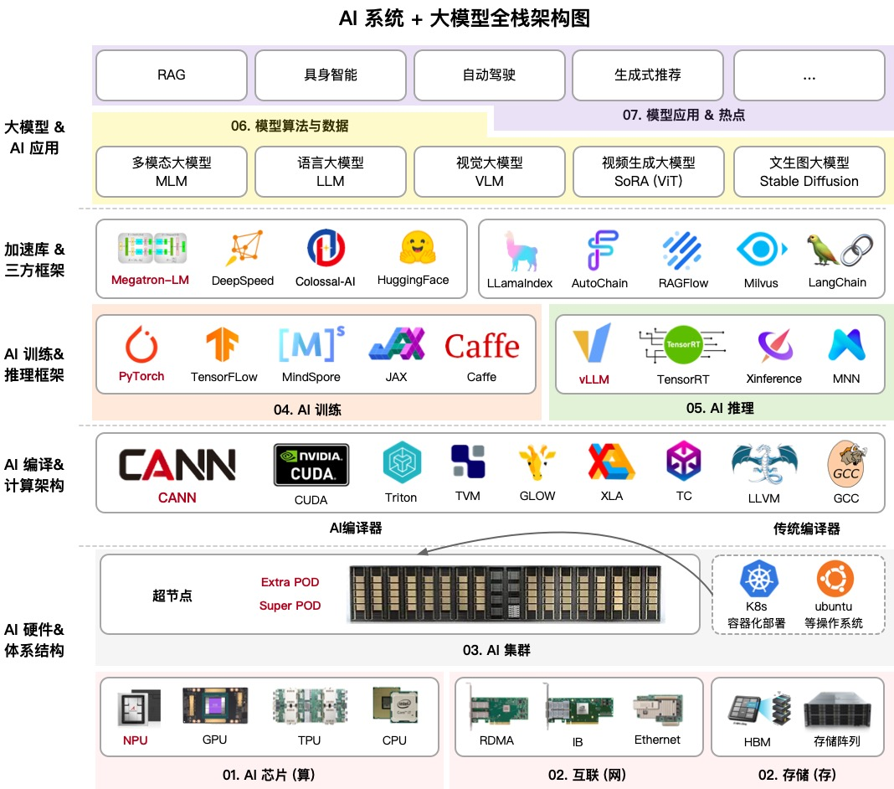

# AIInfra

文字课程内容正在一节节补充更新，尽可能抽空继续更新正在 [AIInfra](https://github.com/Infrasys-AI/AIInfra)，希望您多多鼓励和参与进来！！！

文字课程开源在 [AIInfra](https://infrasys-ai.github.io/aiinfra-docs)，系列视频托管[B 站 ZOMI 酱](https://space.bilibili.com/517221395)和[油管 ZOMI6222](https://www.youtube.com/@zomi6222/videos)，PPT 开源在 [AIInfra](https://github.com/Infrasys-AI/AIInfra)，欢迎取用！！！

## 课程背景

这个开源项目英文名字叫做**AIInfra**，中文名字叫做**AI 基础设施**。大模型是基于 AI 集群的全栈软硬件性能优化，通过最小的每一块 AI 芯片组成的 AI 集群，编译器使能到上层的 AI 框架，训练过程需要分布式并行、集群通信等算法支持，而且在大模型领域最近持续演进如智能体等新技术。

本开源课程主要是跟大家一起探讨和学习人工智能、深度学习的系统设计，而整个系统是围绕着 ZOMI 在工作当中所积累、梳理、构建 AI 大模型系统的基础软硬件栈，因此成为 AI 基础设施。希望跟所有关注 AI 开源课程的好朋友一起探讨研究，共同促进学习讨论。

与**AISystem**[https://github.com/Infrasys-AI/AISystem] 项目最大的区别就是 **AIInfra** 项目主要针对大模型，特别是大模型在分布式集群、分布式架构、分布式训练、大模型算法等相关领域进行深度展开。

## 课程内容大纲

课程主要包括以下模块，内容陆续更新中，欢迎贡献：

| 序列 | 教程内容 | 简介 | 地址 |
| --- | --------------- | ------------------------------------------------------------------------------------------------- | ---------------------------- |
| 00 | [大模型系统概述](#00-大模型系统概述) | 系统梳理了大模型关键技术点，涵盖 Scaling Law 的多场景应用、训练与推理全流程技术栈、AI 系统与大模型系统的差异，以及未来趋势如智能体、多模态、轻量化架构和算力升级。 | [Slides](./00Summary/) |
| 01 | [AI 计算集群](#01-ai-计算集群) | 大模型虽然已经慢慢在端测设备开始落地，但是总体对云端的依赖仍然很重很重，AI 集群会介绍集群运维管理、集群性能、训练推理一体化拓扑流程等内容。 | [Slides](./01AICluster/) |
| 02 | [通信与存储](#02-通信与存储) | 大模型训练和推理的过程中都严重依赖于网络通信，因此会重点介绍通信原理、网络拓扑、组网方案、高速互联通信的内容。存储则是会从节点内的存储到存储 POD 进行介绍。 | [Slides](./02StorComm/) |
| 03 | [集群容器与云原生](#03-集群容器与云原生) | 讲解容器与 K8S 技术原理及 AI 模型部署实践，涵盖容器基础、Docker 与 K8S 核心概念、集群搭建、AI 应用部署、任务调度、资源管理、可观测性、高可靠设计等云原生与大模型结合的关键技术点。 | [Slides](./03DockCloud/) |
| 04 | [分布式训练](#04-大模型训练) | 大模型训练是通过大量数据和计算资源，利用 Transformer 架构优化模型参数，使其能够理解和生成自然语言、图像等内容，广泛应用于对话系统、文本生成、图像识别等领域。 | [Slides](./04Train/) |
| 05 | [分布式推理](#05-大模型推理) | 大模型推理核心工作是优化模型推理，实现推理加速，其中模型推理最核心的部分是 Transformer Block。本节会重点探讨大模型推理的算法、调度策略和输出采样等相关算法。 | [Slides](./05Infer/) |
| 06 | [大模型算法与数据](#06-大模型算法与数据) | Transformer 起源于 NLP 领域，近期统治了 CV/NLP/多模态的大模型，我们将深入地探讨 Scaling Law 背后的原理。在大模型算法背后数据和算法的评估也是核心的内容之一，如何实现 Prompt 和通过 Prompt 提升模型效果。 | [Slides](./06AlgoData/) |
| 07 | [大模型应用](#07-大模型应用) | 当前大模型技术已进入快速迭代期。这一时期的显著特点就是技术的更新换代速度极快，新算法、新模型层出不穷。因此本节内容将会紧跟大模型的时事内容，进行深度技术分析。 | [Slides](./07Application/) |

## 课程细节

## 课程设立目的

本课程主要为本科生高年级、硕博研究生、AI 大模型系统从业者设计，帮助大家：

1. 完整了解 AI 的计算机系统架构，并通过实际问题和案例，来了解 AI 完整生命周期下的系统设计。

2. 介绍前沿系统架构和 AI 相结合的研究工作，了解主流框架、平台和工具来了解 AI 大模型系统。

## 课程部分

### **[00. 大模型系统概述](./00Summary/)**

大模型系统概述、Scaling Law 解读、训练推理流程、系统区别及未来趋势。

| 编号  | 名称       | 具体内容      |
|:---:|:--- |:--- |
| 1      | [Scaling Law 解读](./00Summary/01ScalingLaw) | Scaling Law 在不同场景下的应用与演进  |
| 2      | [训练推理全流程](./00Summary/02TrainInfer) | 大模型训练与推理全流程及软硬件优化  |
| 3      | [与 AI 系统区别](./00Summary/03Different) | AI 系统与大模型系统的通用性、资源与软件栈差异  |
| 3      | [大模型系统发展](./00Summary/04Develop) | 大模型系统未来趋势：技术演进、场景应用与算力生态升级  |

### **[01. AI 计算集群](./01AICluster/)**

AI 集群架构演进、万卡集群方案、性能建模与优化，GPU/NPU 精度差异及定位方法。

| 编号  | 名称       | 具体内容      |
|:---:|:--- |:--- |
| 1      | [计算集群之路](./01AICluster/01Roadmap/) |  高性能计算集群发展与万卡 AI 集群建设及机房基础设施挑战  |
| 2      | [集群建设之巅](./01AICluster/02TypicalRepresent/)   | 超节点计算集群架构演进与昇腾集群组网方案解析       |
| 3      | [集群性能分析](./01AICluster/03Analysis/)  | 集群性能指标分析、建模与常见问题定位方法解析   |

### **[02. 通信与存储](./02StorComm/)**

通信与存储篇：AI 集群组网技术、高速互联方案、集合通信原理与优化、存储系统设计及大模型挑战。

| 编号  | 名称       | 具体内容      |
|:---:|:--- |:--- |
| 1      | [集群组网之路](./02StorComm/01Roadmap/) | AI 集群组网架构设计与高速互联技术解析  |
| 2      | [网络通信进阶](./02StorComm/02NetworkComm/) | 网络通信技术进阶：高速互联、拓扑算法与拥塞控制解析  |
| 3      | [集合通信原理](./02StorComm/03CollectComm/) | 通信域、通信算法、集合通信原语  |
| 4      | [集合通信库](./02StorComm/04CommLibrary/)   | 集合通信库技术解析：MPI、NCCL 与 HCCL 架构及算法原理  |
| 5      | [集群存储之路](./02StorComm/05StorforAI/) | 数据存储、CheckPoint 梯度检查点等存储与大模型结合的相关技术  |

### **[03. 集群容器与云原生](./03DockCloud/)**

AI 集群云原生篇：容器技术、K8S 编排、AI 云平台与任务调度，提升集群资源管理与应用部署效率。

| 编号  | 名称       | 具体内容      |
|:---:|:--- |:--- |
| 1      | [容器时代](./03DockCloud/01Roadmap/) | 容器技术基础与云原生架构解析，结合分布式训练应用实践  |
| 2      | [容器初体验](./03DockCloud/02DockerK8s/) | Docker 与 K8S 基础原理及实战，涵盖容器技术与集群管理架构解析  |
| 3      | [深入 K8S](./03DockCloud/03DiveintoK8s/) |  K8S 核心机制深度解析：编排、存储、网络、调度与监控实践 |
| 4      | [AI 云平台](./03DockCloud/04CloudforAI/) |  AI 云平台演进与云原生架构解析，涵盖持续交付与智能化运维实践  |

### **[04. 分布式训练](./04Train/)**

大模型训练全解析：并行策略、加速算法、微调与评估，覆盖训练到优化的完整流程。

| 编号  | 名称       | 具体内容      |
|:---:|:--- |:--- |
| 1      | [分布式并行基础](./04Train/01ParallelBegin/) | 分布式并行的策略分类、模型适配与硬件资源优化对比  |
| 2      | [大模型并行进阶](./04Train/02ParallelAdv/) | Megatron、DeepSeed 架构解析、MoE 扩展与高效训练策略 |
| 3      | [大模型训练加速](./04Train/03TrainAcceler/) | 大模型训练加速在算法优化、内存管理与通算融合策略解析  |
| 4      | [后训练与强化学习](./04Train/04PostTrainRL/) |  后训练与强化学习算法对比、框架解析与工程实践  |
| 5      | [大模型微调 SFT](./04Train/05FineTune/) |  大模型微调算法原理、变体优化与多模态实践  |
| 6      | [大模型验证评估](./04Train/06VerifValid/) | 大模型评估、基准测试与统一框架解析   |

### **[05. 分布式推理](./05Infer/)**

大模型推理全解析：加速技术、架构优化、长序列处理与压缩方案，覆盖推理全流程与实战实践。

| 编号  | 名称       | 具体内容      |
|:---:|:--- |:--- |
| 1      | [基本概念](./05Infer/01Foundation) |  大模型推理流程、框架对比与性能指标解析 |
| 2      | [大模型推理加速](./05Infer/02InferSpeedUp) | 大模型推理加速中 KV 缓存优化、算子改进与高效引擎解析 |
| 3      | [架构调度加速](./05Infer/03SchedSpeedUp) | 架构调度加速中缓存优化、批处理与分布式系统调度解析 |
| 4      | [长序列推理](./05Infer/04LongInfer) | 长序列推理算法优化、并行策略与高效生成方法解析 |
| 5      | [输出采样](./05Infer/05OutputSamp) | 推理输出采样的基础方法、加速策略与 MOE 推理优化 |
| 6      | [大模型压缩](./05Infer/06CompDistill) | 低精度量化、知识蒸馏与高效推理优化解析 |
| 7      | [推理框架架构](./05Infer/07Framework) | 主流推理框架 vLLM、SGLang 等核心技术与部署实践 |
| 8      | [DeepSeek 开源](./05Infer/08DeepSeek) | DeepSeek 推理 FlashMLA、DeepEP 与高效算子加速解析 |

### **[06. 大模型算法与数据](./06AlgoData/)**

大模型算法与数据全览：Transformer 架构、MoE 创新、多模态模型与数据工程全流程实践。

| 编号  | 名称       | 具体内容      |
|:---:|:--- |:--- |
| 1      | [Transformer 架构](./06AlgoData/01Basic/) | Transformer 架构原理深度介绍 |
| 2      | [MoE 架构](./06AlgoData/02MoE/) | MoE(Mixture of Experts) 混合专家模型架构原理与细节实现 |
| 3      | [创新架构](./06AlgoData/03NewArch) | SSM、MMABA、RWKV、Linear Transformer、JPEA 等新大模型结构 |
| 4      | [图文生成与理解](./06AlgoData/04ImageTextGenerat) | 多模态对齐、生成、理解及统一多模态架构解析  |
| 5      | [视频大模型](./06AlgoData/05VideoGenerat) | 视频多模态理解与生成方法演进及 Flow Matching 应用 |
| 6      | [语音大模型](./06AlgoData/06AudioGenerat) | 语音多模态识别、合成与端到端模型演进及推理应用  |
| 7      | [数据工程](./06AlgoData/07DataEngineer) | 数据工程、Prompt Engine 等相关技术 |

### **[07. 大模型应用](./07Application/)**

大模型应用篇：AI Agent 技术、RAG 检索增强生成与 GraphRAG，推动智能体与知识增强应用落地。

| 编号  | 名称       | 具体内容      |
|:---:|:--- |:--- |
| 00     | [大模型热点](./07Application/00Others)   |  OpenAI、WWDC、GTC 等大会技术洞察   |
| 01     | [Agent 简单概念](./07Application/01Sample/)   | AI Agent 智能体的原理、架构   |
| 02     | [Agent 核心技术](./07Application/02AIAgent/)   | 深入 AI Agent 原理和核心   |
| 03     | [检索增强生成(RAG)](./07Application/03RAG/)   |  检索增强生成技术的介绍  |
| 04     | [自动驾驶](./07Application/04AutoDrive/)   |  端到端自动驾驶技术原理解析，萝卜快跑对产业带来的变化  |
| 05     | [具身智能](./07Application/05Embodied/)   |  关于对具身智能的技术原理、具身架构和产业思考  |
| 06     | [生成推荐](./07Application/06Remmcon/)   |  推荐领域的革命发展历程，大模型迎来了生成式推荐新的增长  |
| 07     | [AI 安全](./07Application/07Safe/)   |  隐私计算发展过程，隐私计算未来发展如何？  |
| 08     | [AI 历史十年](./07News/06History/)   |  过去十年 AI 大事件回顾，2012 到 2025 从模型、算法、芯片硬件发展  |

## 知识清单

## 备注

> 这个仓已经到达疯狂的 10G 啦（ZOMI 把所有制作过程、高清图片都原封不动提供），如果你要 git clone 会非常的慢，因此建议优先到  [Releases · chenzomi12/AIInfra](https://github.com/Infrasys-AI/AIInfra/releases) 来下载你需要的内容！

> 非常希望您也参与到这个开源课程中，B 站给 ZOMI 留言哦！
> 
> 欢迎大家使用的过程中发现 bug 或者勘误直接提交代码 PR 到开源社区哦！
> 
> 请大家尊重开源和 ZOMI 的努力，引用 PPT 的内容请规范转载标明出处哦！
